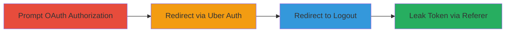

---
tags:
  - oauth
  - open-redirect
  - token-leak
  - account-takeover
type: attack_chain
tools: []
tactics:
  - '[[Initial Access]]'
  - '[[Lateral Movement]]'
commands: []
platforms:
  - Web
complexity: medium
procedures:
  - '[[procedures/Prompt-OAuth-Authorization-on-Facebook]]'
  - '[[procedures/Redirect-via-Uber-Auth-with-Next-URL]]'
  - '[[procedures/Redirect-to-Uber-Logout-Endpoint]]'
  - '[[procedures/Leak-Token-via-Referer-Based-Redirect]]'
step_count: 4
techniques:
  - '[[Exploit Public-Facing Application]]'
  - '[[Use Alternate Authentication Material]]'
description: >-
  Multi-stage attack exploiting OAuth misconfigurations and open redirects to
  leak victim's Uber Facebook OAuth token leading to account takeover
skill_level: intermediate
impact_level: high
id: 094bede6-ca89-48b7-943e-ee4d12285595
created_at: '2025-12-11T06:10:15.772Z'
updated_at: '2025-12-11T06:10:15.773Z'
verified: false
validated: true
submitted: true
mitre_tactics:
  - '[[TA0001]]'
  - '[[TA0008]]'
mitre_techniques:
  - '[[T1190]]'
  - '[[T1550]]'
---
# Chained OAuth Redirects to Leak Uber Facebook Token

Multi-stage attack chain demonstrating a complete attack workflow exploiting a misconfigured Facebook OAuth application for Uber, allowing arbitrary redirect URIs, chained with next_url parameter and Referer-based redirection on logout, resulting in OAuth token leakage and full account takeover of the victim's Uber account.

## Chain Metrics Dashboard

| Metric | Value |
|--------|-------|
| Chain Status | Unverified |
| Total Steps | 4 |
| Execution Time | ~5 minutes |
| Skill Level | Intermediate |
| Complexity | Medium |
| Impact Level | High |

## Attack Flow Visualization



## Prerequisites & Requirements

### Required Tools

- None (browser-based attack)

### Target Environment

- Web platform
- Services: Facebook OAuth, Uber Authentication (auth.uber.com, login.uber.com)
- Network access requirements: Public internet access to Uber and Facebook domains

### Initial Access Requirements

- Victim must be tricked into clicking a malicious link
- No prior credentials needed
- Victim must have an Uber account linked to Facebook

## Detailed Attack Procedures

### Step 1: Prompt OAuth Authorization - [[procedures/Prompt-OAuth-Authorization-on-Facebook]]

**Procedure**: [[procedures/Prompt-OAuth-Authorization-on-Facebook]]

**Objective**: Initiate the OAuth flow by directing the victim to authorize the Uber app on Facebook using a crafted redirect_uri.

**Expected Output**: Victim is prompted to authorize the app, and upon approval, redirects to the specified URI with authorization code.

**Success Indicators**:
- Victim sees Facebook authorization page
- Redirect occurs after authorization

To execute, craft and send the victim a link like:

```
https://www.facebook.com/v2.5/dialog/oauth?client_id=UBER_CLIENT_ID&redirect_uri=https://auth.uber.com/login?next_url=https://login.uber.com/logout&scope=profile%20email
```
(Replace UBER_CLIENT_ID with actual Uber app ID; ensure redirect_uri matches the vulnerable pattern.)

### Step 2: Redirect via Uber Auth with Next URL - [[procedures/Redirect-via-Uber-Auth-with-Next-URL]]

**Procedure**: [[procedures/Redirect-via-Uber-Auth-with-Next-URL]]

**Objective**: After authorization, Facebook redirects to the specified redirect_uri which includes the next_url parameter pointing to the logout endpoint.

**Expected Output**: Uber auth endpoint processes the request and redirects to the next_url.

**Success Indicators**:
- Seamless redirect from Facebook to Uber auth
- Next redirect to logout endpoint

The redirect from Facebook will hit:

```
https://auth.uber.com/login?next_url=https://login.uber.com/logout&code=AUTH_CODE
```
(Where AUTH_CODE is appended by Facebook.)

### Step 3: Redirect to Uber Logout Endpoint - [[procedures/Redirect-to-Uber-Logout-Endpoint]]

**Procedure**: [[procedures/Redirect-to-Uber-Logout-Endpoint]]

**Objective**: The auth.uber.com endpoint processes the next_url parameter and redirects to the logout page.

**Expected Output**: Redirect to the logout endpoint, setting up for the final Referer-based redirect.

**Success Indicators**:
- Redirect to https://login.uber.com/logout
- No errors in redirection chain

This step automatically occurs via the next_url parameter.

### Step 4: Leak Token via Referer-Based Redirect - [[procedures/Leak-Token-via-Referer-Based-Redirect]]

**Procedure**: [[procedures/Leak-Token-via-Referer-Based-Redirect]]

**Objective**: The logout endpoint redirects based on the Referer header set to the attacker's site, leaking the OAuth token in the process.

**Expected Output**: Token is leaked to attacker-controlled site via query parameters.

**Success Indicators**:
- Redirect to attacker site with token in URL
- Attacker receives the token for account takeover

Ensure the Referer header is set to the attacker site (e.g., https://attacker.com) during the chain; the logout will redirect there with the token appended.

## Attack Chain Summary

### Key Achievements

1. Exploited lax redirect_uri validation in OAuth
2. Chained internal redirects using next_url
3. Leaked token via unvalidated Referer redirect

## Technique & Tactic Coverage

### MITRE ATT&CK Techniques

- [[Exploit Public-Facing Application]]
- [[Use Alternate Authentication Material]]

### MITRE ATT&CK Tactics

- [[Initial Access]]
- [[Lateral Movement]]

*Last updated: 2023-10-01*
