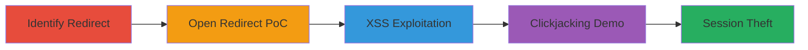

# Chained Open Redirect, Reflected XSS, and Clickjacking on dev.twitter.com

Multi-stage attack chain demonstrating exploitation of URI processing inconsistencies on dev.twitter.com, leading to arbitrary redirects, XSS execution, and clickjacking for potential session theft.

## Chain Metrics Dashboard

| Metric | Value |
|--------|-------|
| Chain Status | Unverified |
| Total Steps | 4 |
| Execution Time | ~5 minutes |
| Skill Level | Intermediate |
| Complexity | Medium |
| Impact Level | High |

## Attack Flow Visualization



## Prerequisites & Requirements

### Required Tools

- Browser (Chrome, Firefox, Opera for testing redirects)
- [[tools/Burp-Clickbandit]] for clickjacking PoC

### Target Environment

- Web platform
- Access to dev.twitter.com
- No authentication required

### Initial Access Requirements

- Public internet access
- No credentials needed
- Browser with developer tools for inspection

## Detailed Attack Procedures

### Step 1: Identify Redirect Mechanism
procedure: [[procedures/Identify-Redirect-Mechanism-on-dev-twitter-com]]

**Objective**: Understand the site's HTTP 302 redirect behavior and fallback page rendering to identify exploitation points.

**Instructions**: Navigate to dev.twitter.com and inspect responses using browser dev tools or a proxy like Burp Suite. Trigger a redirect by appending a path to the URL and observe the Location header and fallback HTML.

**Expected Output**: Confirmation of 302 redirect with Location header matching Request-URI and a fallback page with a clickable link if redirect fails.

**Success Indicators**:
- 302 status code observed
- Fallback page renders with target URL link

### Step 2: Craft Open Redirect Payload
procedure: [[procedures/Craft-Open-Redirect-Payload-on-dev-twitter-com]]

**Objective**: Exploit lack of URL validation to redirect users to arbitrary external sites.

**Instructions**: Construct a malformed URL like `https://dev.twitter.com/https:/%5cblackfan.ru/` and access it in Chrome, Firefox, or Opera. Use curl to verify the redirect:

```bash
curl -I 'https://dev.twitter.com/https:/%5cblackfan.ru/'
```

Inspect the Location header for the external domain.

**Expected Output**: 302 redirect to the external site (e.g., blackfan.ru).

**Success Indicators**:
- Redirect to external domain confirmed
- Works across multiple browsers

### Step 3: Exploit Reflected XSS via Malformed URI
procedure: [[procedures/Exploit-Reflected-XSS-via-Malformed-URI-in-Firefox]]

**Objective**: Leverage browser-specific rendering to create a clickable javascript: URI for XSS execution.

**Instructions**: In Firefox, access the URL `https://dev.twitter.com//x:1/:///%01javascript:alert(document.cookie)/`. The invalid port ':1' prevents auto-redirect, rendering a page with a link to `\x01javascript:alert(document.cookie)`. Click the link to execute.

Use curl to inspect the response:

```bash
curl 'https://dev.twitter.com//x:1/:///%01javascript:alert(document.cookie)/'
```

**Expected Output**: Page renders with clickable link; alert pops up showing cookies on click.

**Success Indicators**:
- No auto-redirect in Firefox
- javascript: URI executes on click
- Cookie theft possible

### Step 4: Demonstrate Clickjacking
procedure: [[procedures/Demonstrate-Clickjacking-on-dev-twitter-com]]

**Objective**: Embed the vulnerable page in an iframe and overlay elements to trick users into clicking the XSS link.

**Instructions**: Confirm absence of X-Frame-Options by attempting to iframe dev.twitter.com. Use [[tools/Burp-Clickbandit]] to generate a PoC HTML file with an invisible overlay on the XSS page.

Load the PoC in a browser and interact to simulate user click.

**Expected Output**: Iframe loads without restrictions; overlay tricks click to execute XSS.

**Success Indicators**:
- Page embeds in iframe
- Clickjacking PoC triggers XSS

## Attack Chain Summary

### Key Achievements

1. Arbitrary redirects to phishing sites
2. Reflected XSS for cookie theft via user interaction
3. Clickjacking escalation for automated exploitation

## Technique & Tactic Coverage

### MITRE ATT&CK Techniques

- [[Exploit Public-Facing Application]]
- [[JavaScript]]
- [[Steal Web Session Cookie]]

### MITRE ATT&CK Tactics

- [[Initial Access]]
- [[Execution]]
- [[Collection]]

---
*Last updated: 2023-10-01T00:00:00Z*
