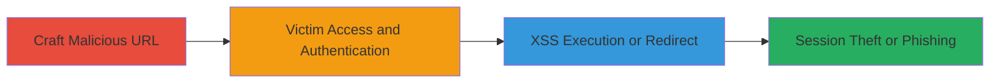

---
tags:
  - xss
  - open-redirect
  - reflected-xss
  - phishing
  - adobe
  - web-vulnerability
type: attack_chain
tools: []
tactics:
  - '[[Execution]]'
  - '[[Initial Access]]'
verified: false
platforms:
  - Web
submitted: true
complexity: medium
created_at: '2023-10-01T00:00:00Z'
procedures:
  - '[[procedures/Exploit-Reflected-XSS-in-return_url]]'
  - '[[procedures/Exploit-Open-Redirect-in-return_url]]'
step_count: 2
techniques:
  - '[[JavaScript]]'
  - '[[T1566.002]]'
updated_at: '2025-12-14T17:24:26.309Z'
description: >-
  Attack chain exploiting lack of validation in the return_url parameter to
  perform reflected XSS for session token theft or open redirect for phishing
  credential capture.
skill_level: intermediate
impact_level: high
id: 5b40b5be-29c5-41ee-bbc4-1c851bb09e56
validated: true
mitre_tactics:
  - '[[Execution]]'
  - '[[Initial Access]]'
mitre_techniques:
  - '[[JavaScript]]'
  - '[[T1566.002]]'
---
# Chained Open Redirect and Reflected XSS in Adobe Youth Voices return_url for Session Theft and Phishing

Multi-stage attack chain demonstrating exploitation of the return_url parameter in the Adobe Youth Voices community endpoint to achieve either JavaScript execution via reflected XSS or unauthorized redirects for phishing attacks. The chain begins with crafting a malicious URL and relies on victim interaction during registration or login to trigger the vulnerabilities, enabling attackers to steal session tokens or harvest credentials from phishing sites.

## Chain Metrics Dashboard

| Metric | Value |
|--------|-------|
| Chain Status | Unverified |
| Total Steps | 2 |
| Execution Time | ~5 minutes |
| Skill Level | Intermediate |
| Complexity | Medium |
| Impact Level | High |

## Attack Flow Visualization



## Prerequisites & Requirements

### Required Tools

- Browser for testing (e.g., Chrome Developer Tools)
- URL encoder if needed for payloads

### Target Environment

- Web platform
- Accessible Adobe Youth Voices community endpoint at http://youthvoices.adobe.com/community
- No specific ports or services beyond standard HTTP/HTTPS

### Initial Access Requirements

- No credentials required for crafting URL
- Victim must have network access to the target
- Social engineering to lure victim to malicious URL

## Detailed Attack Procedures

### Step 1: Craft Malicious URL
procedure: [[procedures/Exploit-Reflected-XSS-in-return_url]]

**Objective**: Construct a URL with a return_url payload to inject JavaScript that executes upon victim authentication, stealing session tokens.

**Instructions**: Append a javascript: payload to the return_url parameter. For testing, use a browser console or developer tools to simulate, but in practice, distribute via phishing email or link.

Example payload construction:

```url
http://youthvoices.adobe.com/community?return_url=javascript:alert(document.cookie)
```

**Expected Output**: Upon victim login, an alert box displays session cookies, or in a real attack, the payload sends data to attacker-controlled server.

**Success Indicators**:
- JavaScript executes in victim's browser
- Session tokens captured

### Step 2: Trigger Exploitation via Victim Interaction
procedure: [[procedures/Exploit-Open-Redirect-in-return_url]]

**Objective**: Lure the victim to the malicious URL, prompting registration or login, which processes the return_url to either execute XSS or perform an open redirect to a phishing site.

**Instructions**: Share the crafted URL with the victim. When they access it and authenticate, the application redirects or executes based on the payload type (XSS for theft, redirect for phishing).

For open redirect testing:

```url
http://youthvoices.adobe.com/community?return_url=//attacker-phishing-site.com/fake-login
```

**Expected Output**: Victim is redirected to attacker site post-login, or XSS triggers theft.

**Success Indicators**:
- Victim redirected to controlled domain
- Credentials harvested from phishing page

## Attack Chain Summary

### Key Achievements

1. Successful injection of malicious payloads into return_url without validation
2. Execution of arbitrary JavaScript to exfiltrate session data
3. Facilitation of phishing attacks via unauthorized redirects

## Technique & Tactic Coverage

### MITRE ATT&CK Techniques

- [[JavaScript]]
- [[T1566.002]]

### MITRE ATT&CK Tactics

- [[Execution]]
- [[Initial Access]]

---
*Last updated: 2023-10-01T00:00:00Z*
