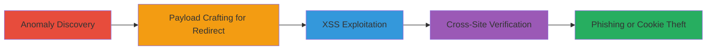

# Chained Open Redirect and Reflected XSS on Starbucks Websites

Multi-stage attack chain demonstrating a complete attack workflow exploiting open redirect and reflected XSS in Starbucks websites, including shop.starbucks.de, teavana.com, and store.starbucks.com, through manipulated GET parameters and root URLs.

## Chain Metrics Dashboard

| Metric | Value |
|--------|-------|
| Chain Status | Unverified |
| Total Steps | 4 |
| Execution Time | ~5 minutes |
| Skill Level | Intermediate |
| Complexity | Medium |
| Impact Level | High |

## Attack Flow Visualization

## Prerequisites & Requirements

### Required Tools

- Web browser (e.g., Chrome Developer Tools for payload testing)
- URL manipulation tools (manual or proxy like Burp Suite, but not required)

### Target Environment

- Web applications on shop.starbucks.de, teavana.com, store.starbucks.com
- Accessible via public internet
- No authentication required for initial testing

### Initial Access Requirements

- Public access to target websites
- No credentials needed
- Basic knowledge of URL encoding and JavaScript URIs

## Detailed Attack Procedures

### Step 1: Anomaly Discovery
procedure: [[procedures/Discover-Open-Redirect-Anomaly]]

**Objective**: Identify unexpected redirect behavior during parameter testing to uncover input handling flaws.

**Instructions**: Navigate to a target site like shop.starbucks.de and modify a GET parameter, such as appending ">cofee" to a parameter like ?prefn1=>cofee. Observe the redirect response in the browser's network tab.

**Expected Output**: Unusual redirect to a malformed URL instead of error handling.

**Success Indicators**:
- Redirect occurs to an unintended path
- No proper validation error is shown

### Step 2: Payload Crafting for Redirect
procedure: [[procedures/Craft-Open-Redirect-Payload]]

**Objective**: Construct payloads that bypass stripping to chain redirects to external sites.

**Instructions**: Test payloads like ?prefv1=<>//google.com on the root URL or parameters. The '<>' is stripped, leaving //google.com to trigger a protocol-relative redirect.

**Expected Output**: Browser redirects to google.com or the intended external site.

**Success Indicators**:
- Successful redirect to arbitrary external domain
- No blocking of protocol-relative URLs

### Step 3: XSS Exploitation
procedure: [[procedures/Exploit-Reflected-XSS-via-JavaScript-URI]]

**Objective**: Inject JavaScript via URIs in redirects or parameters to execute code in the victim's browser.

**Instructions**: Append payload <>javascript:alert(document.cookie); to root URL (e.g., https://shop.starbucks.de/<>javascript:alert(document.cookie);) or GET parameter like ?prefn1=<>javascript:alert('xss parameter');. After stripping, it executes the alert.

**Expected Output**: JavaScript alert pops up displaying cookies or payload message.

**Success Indicators**:
- Alert box appears with document cookies
- Script executes without sanitization errors

### Step 4: Cross-Site Verification
procedure: [[procedures/Verify-Vulnerabilities-Across-Sites]]

**Objective**: Confirm exploitability on multiple domains and parameters.

**Instructions**: Repeat payloads on shop.starbucks.de, teavana.com, store.starbucks.com, testing root URLs and various GET parameters (e.g., ?prefv1, ?prefn1). Exclude starbucks.* main domains.

**Expected Output**: Consistent redirects or XSS triggers across sites.

**Success Indicators**:
- Vulnerabilities confirmed on at least three sites
- Multiple injection points (parameters and root) exploitable

## Attack Chain Summary

### Key Achievements

1. Discovered chained open redirect via parameter stripping
2. Exploited reflected XSS using javascript: URIs for cookie theft
3. Verified impact across Starbucks ecosystem sites for phishing potential

## Technique & Tactic Coverage

### MITRE ATT&CK Techniques

- [[Exploit Public-Facing Application]] Exploit Public-Facing Application
- [[JavaScript]] JavaScript

### MITRE ATT&CK Tactics

- [[Initial Access]] Initial Access
- [[Execution]] Execution
- [[Collection]] Collection

---
*Last updated: 2023-10-01T00:00:00Z*
