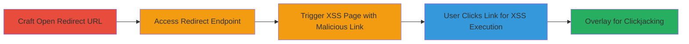

---
tags:
  - xss
  - open-redirect
  - clickjacking
  - web-vulnerability
type: attack_chain
tools:
  - '[[tools/Burp-Clickbandit]]'
tactics:
  - '[[Initial Access]]'
  - '[[Execution]]'
commands: []
platforms:
  - Web
complexity: medium
procedures:
  - '[[procedures/Exploit-Open-Redirect-on-dev.twitter.com]]'
  - '[[procedures/Trigger-Reflected-XSS-via-Malformed-URI]]'
  - '[[procedures/Execute-XSS-via-User-Click-Interaction]]'
  - '[[procedures/Demonstrate-Clickjacking-with-Burp-Clickbandit]]'
step_count: 4
techniques:
  - '[[Drive-by Compromise]]'
  - '[[JavaScript]]'
description: >-
  A multi-stage web attack exploiting inconsistencies in URI processing on
  dev.twitter.com to achieve open redirects, reflected XSS via clickable
  javascript: URIs, and clickjacking without frame protections.
skill_level: intermediate
impact_level: high
id: f160f6fc-ed16-4365-86f5-cf86d836f2b8
created_at: '2025-12-13T23:52:55.781Z'
updated_at: '2025-12-13T23:52:55.781Z'
verified: false
validated: true
submitted: true
mitre_tactics:
  - '[[Initial Access]]'
  - '[[Execution]]'
mitre_techniques:
  - '[[Drive-by Compromise]]'
  - '[[JavaScript]]'
---
# Chained Open Redirect and Reflected XSS on dev.twitter.com Leading to JavaScript Execution and Clickjacking

## Overview

This attack chain exploits vulnerabilities in the dev.twitter.com redirect endpoint, where inconsistent handling of the Request-URI allows for open redirects to external sites and reflected XSS through malformed URIs that render clickable javascript: links on the redirect page. Discovered via crafted payloads exploiting invalid ports and URI encoding, the chain enables phishing, arbitrary JavaScript execution (e.g., stealing cookies), and clickjacking due to missing X-Frame-Options headers. The vulnerability affects browsers like Firefox, Chrome, and Opera, leading to a $1,120 bounty on HackerOne before being fixed.

## Chain Metrics Dashboard

| Metric | Value |
|--------|-------|
| Chain Status | Unverified |
| Total Steps | 4 |
| Execution Time | ~5 minutes |
| Skill Level | Intermediate |
| Complexity | Medium |
| Impact Level | High |

## Attack Flow Visualization

## Prerequisites & Requirements

### Required Tools

- [[tools/Burp-Clickbandit]]

### Target Environment

- Web platform
- Accessible dev.twitter.com (public-facing)
- No specific ports or services beyond standard HTTPS (443)

### Initial Access Requirements

- Direct network access to dev.twitter.com
- No credentials needed (unauthenticated)
- Browser like Firefox for optimal XSS triggering

## Detailed Attack Procedures

### Step 1: Craft and Access Open Redirect URL
procedure: [[procedures/Exploit-Open-Redirect-on-dev.twitter.com]]

**Objective**: Redirect users to arbitrary external sites for phishing or malware distribution by exploiting insufficient URI validation.

**Instructions**: Construct a malformed URL using encoded payloads to bypass domain checks, then access it in a browser to trigger the 302 redirect via the Location header.

Example URL: `https://dev.twitter.com/https:/%5cblackfan.ru/`

**Expected Output**: Browser follows 302 to the external site (e.g., blackfan.ru).

**Success Indicators**:
- 302 response with Location header pointing to external domain
- Automatic redirect in Chrome/Opera/Firefox

### Step 2: Access XSS URL to Generate Redirect Page with Malicious Link
procedure: [[procedures/Trigger-Reflected-XSS-via-Malformed-URI]]

**Objective**: Exploit URI processing differences to render a page with a clickable javascript: URI, blocking auto-redirect and enabling reflected XSS setup.

**Instructions**: Craft a URL with invalid ports (e.g., :1/) and null bytes (%01) to manipulate how the Location header and displayed link are handled, then access it to receive the 302 response but view the intermediate page.

Example URL: `https://dev.twitter.com//x:1/:///%01javascript:alert(document.cookie)/`

**Expected Output**: Page displays 'You should be redirected automatically to target URL: <a href="\x01javascript:alert(document.cookie)">\x01javascript:alert(document.cookie)</a>' without auto-redirecting in Firefox due to invalid port.

**Success Indicators**:
- No automatic redirect (blocked by invalid port)
- Clickable link rendered with javascript: payload

### Step 3: User Interacts by Clicking the Link on the Redirect Page
procedure: [[procedures/Execute-XSS-via-User-Click-Interaction]]

**Objective**: Trigger arbitrary JavaScript execution upon user click, such as alerting cookies for session hijacking or phishing escalation.

**Instructions**: From the rendered redirect page, click the displayed malicious link to execute the javascript: payload directly in the browser context.

**Expected Output**: Alert box pops up showing document.cookie, confirming XSS execution.

**Success Indicators**:
- JavaScript executes (e.g., alert fires)
- Access to sensitive data like cookies

### Step 4: Demonstrate Clickjacking Using the XSS
procedure: [[procedures/Demonstrate-Clickjacking-with-Burp-Clickbandit]]

**Objective**: Trick users into clicking the XSS link invisibly by embedding the vulnerable page in an iframe and overlaying elements, exploiting lack of X-Frame-Options.

**Instructions**: Use Burp Clickbandit to create a proof-of-concept page that iframes the XSS-triggering URL and positions invisible overlays over the clickable link to capture clicks without user awareness.

**Expected Output**: User clicks on the overlay, triggering the XSS payload seamlessly.

**Success Indicators**:
- Successful click capture leading to XSS execution
- No frame-busting headers detected

## Attack Chain Summary

### Key Achievements

1. Achieved open redirect to external phishing sites
2. Executed reflected XSS via browser-specific URI handling flaws
3. Demonstrated clickjacking for stealthy payload delivery

## Technique & Tactic Coverage

### MITRE ATT&CK Techniques

- [[Drive-by Compromise]]
- [[JavaScript]]

### MITRE ATT&CK Tactics

- [[Initial Access]]
- [[Execution]]

---
*Last updated: 2023-10-01*
