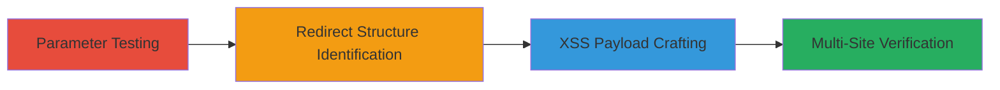

# Chained Open Redirect and Reflected XSS via Malformed GET Parameters in Starbucks Sites

Multi-stage attack chain demonstrating exploitation of input sanitization flaws in Starbucks websites to chain open redirects and execute reflected XSS payloads.

## Chain Metrics Dashboard

| Metric | Value |
|--------|-------|
| Chain Status | Unverified |
| Total Steps | 4 |
| Execution Time | ~5 minutes |
| Skill Level | Intermediate |
| Complexity | Medium |
| Impact Level | High |

## Attack Flow Visualization



## Prerequisites & Requirements

### Required Tools

- Web browser or [[tools/curl]]
- URL manipulation tools like Burp Suite

### Target Environment

- Web applications on shop.starbucks.de, teavana.com, store.starbucks.com
- Accessible via HTTP/HTTPS
- No authentication required for public pages

### Initial Access Requirements

- Public internet access
- No credentials needed
- Ability to craft and send HTTP GET requests

## Detailed Attack Procedures

### Step 1: Test Open Redirects in GET Parameters
procedure: [[procedures/Test-Open-Redirects-in-GET-Parameters]]

**Objective**: Identify unusual redirect behavior by modifying GET parameters to probe for open redirect vulnerabilities.

**Instructions**: Start by accessing a target URL and appending a malformed parameter, such as '>cofee' to an existing query string. Observe the browser's redirect response for anomalies.

Use a tool like curl to test:

```bash
curl -v "https://shop.starbucks.de/?param=>cofee" 2>&1 | grep Location
```

**Expected Output**: HTTP response showing a redirect (e.g., 302) to an unexpected location.

**Success Indicators**:
- Unusual redirect observed
- No validation on parameter values

### Step 2: Identify Chained Redirect Structure
procedure: [[procedures/Identify-Chained-Redirect-Structure]]

**Objective**: Uncover the specific payload structure that bypasses sanitization to trigger arbitrary redirects.

**Instructions**: Experiment with payloads like '<>//google.com' in GET parameters. Send the request and monitor the redirect chain.

Test with curl:

```bash
curl -v "https://shop.starbucks.de/?prefn1=<>//google.com" 2>&1 | grep Location
```

**Expected Output**: Redirect to google.com after apparent tag stripping.

**Success Indicators**:
- Successful redirect to external site
- Confirmation of chained logic post-sanitization

### Step 3: Exploit Partial Sanitization for XSS
procedure: [[procedures/Exploit-Partial-Sanitization-for-XSS]]

**Objective**: Leverage the same sanitization flaw to inject and execute JavaScript payloads for reflected XSS attacks.

**Instructions**: Craft an XSS payload using the '<>' prefix followed by 'javascript:alert(document.cookie);'. Inject into root URL or parameters.

Verify with curl or browser:

```bash
curl "https://shop.starbucks.de/<>javascript:alert(document.cookie);"
```

In a browser, the alert should pop up revealing cookies.

**Expected Output**: JavaScript execution, such as an alert box displaying cookies.

**Success Indicators**:
- Alert or script execution in victim browser
- Cookie data accessible

### Step 4: Verify Vulnerability Across Sites and Parameters
procedure: [[procedures/Verify-Vulnerability-Across-Sites-and-Parameters]]

**Objective**: Confirm the vulnerability's scope on multiple Starbucks sites and parameter types.

**Instructions**: Test the payloads on shop.starbucks.de, teavana.com, store.starbucks.com, using root URL and parameters like prefn1/prefv1. Exclude starbucks.* domains.

Example test:

```bash
curl -v "https://teavana.com/?prefv1=<>//example.com"
```

**Expected Output**: Consistent redirects or XSS across targets.

**Success Indicators**:
- Exploitation succeeds on multiple sites
- Broad parameter applicability confirmed

## Attack Chain Summary

### Key Achievements

1. Bypassed input sanitization using '<>' prefix for open redirects.
2. Chained redirects to external sites for phishing potential.
3. Executed reflected XSS to steal session cookies.
4. Verified impact across Starbucks ecosystem sites.

## Technique & Tactic Coverage

### MITRE ATT&CK Techniques

- [[Drive-by Compromise]]
- [[JavaScript]]

### MITRE ATT&CK Tactics

- [[Initial Access]]
- [[Execution]]
- [[Collection]]

---

*Last updated: 2023-10-01T00:00:00Z*
