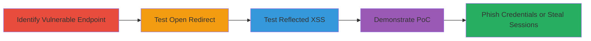

# Chained Open Redirect and Reflected XSS via return_url for Phishing and Session Theft in Adobe Youth Voices

Multi-stage attack chain demonstrating exploitation of unvalidated return_url parameter in Adobe Youth Voices community login/registration to enable phishing via open redirects or session theft via reflected XSS. The attack relies on social engineering to lure victims into clicking crafted URLs, leading to credential theft or data exfiltration post-authentication.

## Chain Metrics Dashboard

| Metric | Value |
|--------|-------|
| Chain Status | Unverified |
| Total Steps | 4 |
| Execution Time | ~5 minutes |
| Skill Level | Intermediate |
| Complexity | Medium |
| Impact Level | High |

## Attack Flow Visualization

## Prerequisites & Requirements

### Required Tools

- Browser for manual testing (e.g., Chrome Developer Tools)
- Optional: [[tools/Burp-Suite]] for intercepting and modifying requests

### Target Environment

- Web platform
- Adobe Youth Voices community site at http://youthvoices.adobe.com/community
- No specific ports or services beyond standard HTTP/HTTPS

### Initial Access Requirements

- No credentials required for initial testing
- Network access to the public-facing login/registration page
- Ability to craft and send URLs to victims for social engineering

## Detailed Attack Procedures

### Step 1: Identify Vulnerable Endpoint
procedure: [[procedures/Identify-Vulnerable-return_url-Endpoint]]

**Objective**: Locate and examine the login/registration endpoint that accepts a return_url parameter for post-authentication redirection.

**Instructions**: Navigate to the Adobe Youth Voices community page and inspect the URL structure. Append a benign return_url like ?return_url=/dashboard to observe if it's processed after login or registration.

**Expected Output**: Confirmation that the parameter influences post-authentication behavior without errors.

**Success Indicators**:
- Parameter is accepted and used for redirection
- No immediate validation errors

### Step 2: Test Open Redirect
procedure: [[procedures/Test-Open-Redirect-via-return_url]]

**Objective**: Verify if arbitrary external URLs can be injected into return_url to redirect users to attacker-controlled sites post-login/registration.

**Instructions**: Craft a URL with a protocol-relative payload: http://youthvoices.adobe.com/community?return_url=//www.google.com. Send this to a test user or simulate login. Observe the redirect after authentication.

**Expected Output**: User is redirected to the external site (e.g., Google) instead of an internal page.

**Success Indicators**:
- Successful redirect to external domain
- No blocking of protocol-relative URLs

### Step 3: Test Reflected XSS
procedure: [[procedures/Test-Reflected-XSS-via-return_url]]

**Objective**: Inject JavaScript payloads into return_url to execute arbitrary code in the victim's browser after login/registration.

**Instructions**: Modify the URL to include a JavaScript scheme: http://youthvoices.adobe.com/community?return_url=javascript:alert(1). Have the victim access it and complete login/registration. Check for alert popup execution.

**Expected Output**: JavaScript alert (or other payload) executes in the browser context post-authentication.

**Success Indicators**:
- Alert box appears
- Payload executes without sanitization

### Step 4: Demonstrate Proof-of-Concept
procedure: [[procedures/Demonstrate-Proof-of-Concept-for-Redirect-and-XSS]]

**Objective**: Capture and validate the exploits through recordings to confirm impact for reporting or further exploitation.

**Instructions**: Record videos of the login flow with payloads. For redirect, show navigation to fake phishing site; for XSS, demonstrate alert or data exfiltration (e.g., via alert(document.cookie)).

**Expected Output**: Video evidence of redirect to malicious site and XSS payload execution.

**Success Indicators**:
- Clear footage of exploits triggering
- Potential for session token theft or credential phishing demonstrated

## Attack Chain Summary

### Key Achievements

1. Identified unvalidated return_url parameter enabling arbitrary redirects and script execution.
2. Demonstrated phishing potential via open redirects to fake login pages.
3. Enabled session theft through reflected XSS post-authentication.
4. Provided PoC videos confirming high-impact risks.

## Technique & Tactic Coverage

### MITRE ATT&CK Techniques

- [[Exploit Public-Facing Application]] Exploit Public-Facing Application
- [[JavaScript]] JavaScript
- [[Phishing]] Phishing

### MITRE ATT&CK Tactics

- [[Initial Access]] Initial Access
- [[Execution]] Execution
- [[Collection]] Collection

---
*Last updated: 2023-10-01T00:00:00Z*
