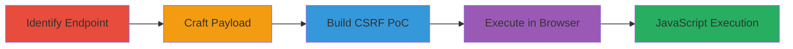

# Chained Reflected XSS and CSRF for Arbitrary JavaScript Execution in PHP Endpoint

Multi-stage attack chain demonstrating exploitation of a reflected XSS in the 'arg2' parameter of a POST request to a PHP endpoint, elevated to global scope via CSRF due to absent tokens. This allows arbitrary JavaScript execution in the victim's browser, enabling session hijacking, data theft, or keylogging when victims are tricked into opening a malicious HTML file.

## Chain Metrics Dashboard

| Metric | Value |
|--------|-------|
| Chain Status | Unverified |
| Total Steps | 4 |
| Execution Time | ~5 minutes |
| Skill Level | Intermediate |
| Complexity | Medium |
| Impact Level | High |

## Attack Flow Visualization

## Prerequisites & Requirements

### Required Tools

- [[tools/Notepad++]]
- [[tools/Firefox]]
- [[tools/Google-Chrome]]

### Target Environment

- Web platform with PHP backend
- Accessible POST endpoint at https://target/index.php
- No specific ports required beyond standard HTTP/HTTPS (80/443)

### Initial Access Requirements

- No credentials needed; targets authenticated users via social engineering
- Network access to the target domain
- Victim must be authenticated to the application

## Detailed Attack Procedures

### Step 1: Identify Vulnerable Endpoint
procedure: [[procedures/Identify-Vulnerable-XSS-Endpoint-in-PHP-Application]]

**Objective**: Locate the PHP endpoint and confirm lack of input sanitization in the 'arg2' parameter and absence of CSRF tokens.

**Instructions**: Examine POST requests to the target endpoint, such as https://target/index.php, with parameters like task=azrul_ajax, option=community, func=register,ajaxCheckEmail, no_html=1. Test 'arg2' for reflection without sanitization.

**Expected Output**: Unsanitized input reflected in response, confirming XSS potential; no CSRF token in form or headers.

**Success Indicators**:
- 'arg2' value echoes back unescaped
- POST request lacks anti-CSRF measures

### Step 2: Craft XSS Payload
procedure: [[procedures/Craft-Reflected-XSS-Payload-for-arg2-Parameter]]

**Objective**: Develop a JavaScript payload that executes on reflection in the 'arg2' parameter.

**Instructions**: Encode the payload to bypass basic filters, e.g., ["_d_","raygame2222%40af.miljvbi9lk2ko"], which decodes to include .

**Expected Output**: Payload triggers alert(1) when submitted and reflected in self-XSS test.

**Success Indicators**:
- JavaScript executes in browser console
- Alert popup appears on payload submission

### Step 3: Build CSRF PoC
procedure: [[procedures/Create-CSRF-PoC-HTML-File-for-XSS-Exploitation]]

**Objective**: Construct an auto-submitting HTML form to deliver the XSS payload via CSRF.

**Instructions**: Use [[tools/Notepad++]] to create an HTML file with a form posting to the endpoint, hidden inputs for all parameters including the malicious 'arg2', and JavaScript for auto-submit and history.pushState to mask the action.

**Expected Output**: HTML file ready for execution, simulating a malicious page.

**Success Indicators**:
- Form validates against endpoint parameters
- Auto-submit script functions without errors

### Step 4: Execute PoC
procedure: [[procedures/Execute-CSRF-XSS-PoC-in-Browser]]

**Objective**: Trigger the CSRF attack to execute the XSS payload in the victim's context.

**Instructions**: Open the HTML file in [[tools/Firefox]] or [[tools/Google-Chrome]], which auto-submits the form and executes the payload.

**Expected Output**: Alert(1) popup confirms XSS execution; potential for further actions like keylogging.

**Success Indicators**:
- Form submits successfully
- JavaScript alert or console error triggers execution

## Attack Chain Summary

### Key Achievements

1. Confirmed reflected XSS in 'arg2' parameter due to poor sanitization.
2. Exploited missing CSRF tokens to elevate self-XSS to victim-wide attack.
3. Demonstrated arbitrary JS execution via browser-based PoC, enabling session theft or data exfiltration.

## Technique & Tactic Coverage

### MITRE ATT&CK Techniques

- [[JavaScript]]
- [[Drive-by Compromise]]

### MITRE ATT&CK Tactics

- [[Initial Access]]
- [[Execution]]

---

*Last updated: 2023-10-01T00:00:00Z*
