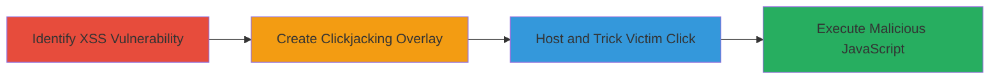

# Chained Reflected XSS and Clickjacking for Arbitrary JavaScript Execution on DoD Website

Multi-stage attack chain demonstrating a complete attack workflow exploiting a reflected XSS in a URL parameter, chained with clickjacking to execute arbitrary JavaScript in the victim's browser on a U.S. Department of Defense website.

## Chain Metrics Dashboard

| Metric | Value |
|--------|-------|
| Chain Status | Unverified |
| Total Steps | 3 |
| Execution Time | ~5 minutes |
| Skill Level | Intermediate |
| Complexity | Medium |
| Impact Level | High |

## Attack Flow Visualization

## Prerequisites & Requirements

### Required Tools

- Web browser for testing (e.g., Chrome Developer Tools)
- Local web server (e.g., Python's http.server) for hosting

### Target Environment

- Web platform
- Publicly accessible DoD website with vulnerable URL parameter
- No specific ports or services beyond standard HTTP/HTTPS

### Initial Access Requirements

- No credentials required
- Internet access to the target site
- Ability to host malicious content externally

## Detailed Attack Procedures

### Step 1: Identify Reflected XSS Vulnerability
procedure: [[procedures/Identify-Reflected-XSS-in-URL-Parameter]]

**Objective**: Discover and confirm a reflected XSS vulnerability in the target URL parameter by observing unsanitized input reflection.

**Instructions**: Navigate to the target URL https://███████?URL= and append a test payload like javascript:alert(document.domain)// followed by a decoy like https://google.com. Observe if the payload is reflected in the page source without sanitization, triggering an alert on load or interaction.

**Expected Output**: JavaScript alert box displaying the domain, confirming payload execution.

**Success Indicators**:
- Payload reflected in HTML without encoding
- Alert executes in browser

### Step 2: Create Clickjacking HTML Page
procedure: [[procedures/Create-Clickjacking-HTML-Page-to-Chain-with-XSS]]

**Objective**: Develop an invisible iframe overlay mimicking the legitimate site to chain clickjacking with the XSS payload, tricking the victim into clicking without awareness.

**Instructions**: Create an HTML file with CSS to position a div at top:200px; left:900px;, set body background image '1.png' at 300px 5px, and embed an iframe with src='https://███████?URL=javascript:alert(document.domain)//%0D%0A"https://google.com', id='xxx', width=100%, height=100%, opacity:0. Test locally by opening the HTML in a browser and verifying the iframe loads invisibly over the background.

**Expected Output**: Invisible iframe loads the vulnerable page, ready to capture clicks that trigger XSS.

**Success Indicators**:
- Iframe embeds without frame-busting errors
- Background mimics site, opacity hides iframe
- Click on overlay executes XSS alert

### Step 3: Host and Distribute Clickjacking Page
procedure: [[procedures/Host-and-Distribute-Clickjacking-Page-to-Victims]]

**Objective**: Deploy the clickjacking page and lure victims to interact, leading to XSS execution and potential session hijacking or data theft.

**Instructions**: Upload the HTML file and background image '1.png' to a web server. Generate a shareable link and distribute via email, social engineering, or phishing to target victims. Monitor for interactions that trigger the chained exploit.

**Expected Output**: Victim visits link, clicks on the mimicked area, executing JavaScript in their browser context on the DoD site.

**Success Indicators**:
- Page loads for victim
- Click triggers alert or further payload (e.g., cookie theft)
- Potential exfiltration of session data

## Attack Chain Summary

### Key Achievements

1. Identified and confirmed reflected XSS in URL parameter without sanitization.
2. Chained with clickjacking to bypass direct payload awareness using invisible iframe.
3. Enabled arbitrary JavaScript execution for session hijacking or data theft on a high-value DoD target.

## Technique & Tactic Coverage

### MITRE ATT&CK Techniques

- [[JavaScript]]
- [[Drive-by Compromise]]

### MITRE ATT&CK Tactics

- [[Initial Access]]
- [[Execution]]
- [[Collection]]

---
*Last updated: 2023-10-01T00:00:00Z*
