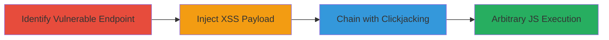

# Chained Reflected XSS and Clickjacking for Arbitrary JavaScript Execution

Multi-stage attack chain demonstrating exploitation of a reflected XSS vulnerability in a web application's URL parameter, chained with clickjacking to bypass CSRF protections and achieve arbitrary JavaScript execution on victims' browsers.

## Chain Metrics Dashboard

| Metric | Value |
|--------|-------|
| Chain Status | Unverified |
| Total Steps | 3 |
| Execution Time | ~10 minutes |
| Skill Level | Intermediate |
| Complexity | Medium |
| Impact Level | High |

## Attack Flow Visualization

## Prerequisites & Requirements

### Required Tools

- [[tools/Burp-Suite-Professional]]

### Target Environment

- Web application with user-controlled URL parameters for fetching external content
- Authenticated user session required for impact
- No specific ports; operates over HTTPS

### Initial Access Requirements

- Network access to the target web application (e.g., https://target.com)
- No prior credentials needed for discovery, but authenticated session for full impact
- Ability to host malicious HTML for clickjacking PoC

## Detailed Attack Procedures

### Step 1: Identify Vulnerable Endpoint
procedure: [[procedures/Identify-Vulnerable-Endpoint-for-User-Controlled-URL]]

**Objective**: Locate the web endpoint that accepts and processes user-supplied URLs without proper validation, enabling potential injection points for XSS or SSRF.

**Instructions**: Manually inspect the application's parameters using a proxy tool like Burp Suite to identify endpoints that fetch and render content from arbitrary URLs. Look for parameters like 'url' in GET requests that trigger server-side fetches.

**Expected Output**: Confirmation of a vulnerable endpoint, such as https://█████/████&url=, where the server renders the path from the supplied URL.

**Success Indicators**:
- Endpoint identified that accepts arbitrary URLs
- Server response includes fetched content without sanitization

### Step 2: Inject XSS Payload into URL Path
procedure: [[procedures/Inject-XSS-Payload-into-URL-Path]]

**Objective**: Exploit the lack of path sanitization to inject and execute malicious JavaScript in the rendered content.

**Instructions**: Craft a URL with an XSS payload in the path, such as http://galnagli.com/, and submit it via the vulnerable parameter. Observe the server fetching and rendering the payload, triggering the onerror event to execute the alert.

**Expected Output**: JavaScript execution in the browser, such as an alert box displaying the domain.

**Success Indicators**:
- Malicious script executes on page load
- No direct CSRF possible, but XSS confirmed

### Step 3: Chain with Clickjacking to Force Victim Interaction
procedure: [[procedures/Chain-with-Clickjacking-to-Force-Victim-Interaction]]

**Objective**: Bypass the limitation of non-interactive XSS by overlaying the target site in an iframe and tricking users into clicking to trigger the vulnerable endpoint.

**Instructions**: Use Burp Suite to generate a clickjacking PoC HTML page. Embed the target site in a transparent iframe, position a fake button over the vulnerable element, and load the malicious URL payload. Host this page and lure victims to interact with it, causing the click to submit the XSS payload via XMLHttpRequest.

**Expected Output**: Victim's browser executes the chained XSS, allowing arbitrary code on their behalf.

**Success Indicators**:
- Iframe loads without frame-busting
- Click triggers XSS execution
- Arbitrary JS runs in victim's authenticated session

## Attack Chain Summary

### Key Achievements

1. Identified and confirmed reflected XSS in URL path rendering
2. Chained with clickjacking to enable user interaction and bypass CSRF
3. Achieved arbitrary JavaScript execution, potentially leading to session hijacking or data exfiltration

## Technique & Tactic Coverage

### MITRE ATT&CK Techniques

- [[JavaScript]]
- [[Drive-by Compromise]]
- [[Exploit Public-Facing Application]]

### MITRE ATT&CK Tactics

- [[Initial Access]]
- [[Execution]]

---

*Last updated: 2023-10-01T00:00:00Z*
