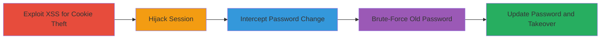

# Chained Reflected XSS and Rate Limiting Bypass for Account Takeover

Multi-stage attack chain demonstrating a complete workflow to compromise user accounts on Twitter Flight School by exploiting a reflected XSS vulnerability to steal session cookies and then brute-forcing the old password during changes due to absent rate limiting.

## Chain Metrics Dashboard

| Metric | Value |
|--------|-------|
| Chain Status | Unverified |
| Total Steps | 6 |
| Execution Time | ~5 minutes |
| Skill Level | Intermediate |
| Complexity | Medium |
| Impact Level | High |

## Attack Flow Visualization

## Prerequisites & Requirements

### Required Tools

- [[tools/Burp-Suite]]
- [[tools/Firefox]]

### Target Environment

- Web platform (Twitter Flight School)
- Required services/ports: HTTPS (443)
- Network access requirements: Internet access to https://www.twitterflightschool.com

### Initial Access Requirements

- Victim's logged-in session triggerable via shared link with malicious filter parameter
- No prior credentials needed for XSS; session hijacking provides access
- Burp Suite proxy configured on attacker's browser

## Detailed Attack Procedures

### Step 1: Exploit Reflected XSS to Steal Session Cookies
procedure: [[procedures/Exploit-Reflected-XSS-to-Steal-Session-Cookies]]

**Objective**: Inject XSS payload into the filter parameter to execute JavaScript and steal the victim's session cookies.

**Instructions**: Craft a URL with the payload in the filter parameter and trick the victim into visiting it. The payload reflects into a hidden input field and executes on focus.

**Expected Output**: Alert box displaying document.cookie, or exfiltrated cookies via network request.

**Success Indicators**:
- JavaScript execution confirmed (alert or network exfiltration)
- Session cookies obtained

### Step 2: Hijack Session and Navigate to Password Change
procedure: [[procedures/Hijack-Session-and-Navigate-to-Password-Change]]

**Objective**: Use stolen cookies to impersonate the victim and access the password change functionality.

**Instructions**: Import stolen cookies into your browser session and navigate to the profile edit page.

**Expected Output**: Successful navigation to the Change Password form as the victim.

**Success Indicators**:
- Logged-in view of victim's profile
- Access to password change interface

### Step 3: Intercept Password Change Request with Burp
procedure: [[procedures/Intercept-Password-Change-Request-with-Burp]]

**Objective**: Capture the POST request for password change to prepare for modification.

**Instructions**: Configure Burp proxy, enter a random new password, and submit to intercept the request.

**Expected Output**: Intercepted POST request with old_password and new_password fields.

**Success Indicators**:
- Request captured in Burp Proxy
- Fields visible for editing

### Step 4: Configure Burp Intruder for Brute-Force
procedure: [[procedures/Configure-Burp-Intruder-for-Brute-Force]]

**Objective**: Set up the Intruder tool to target the old_password field for payload insertion.

**Instructions**: Right-click the request in Burp and send to Intruder, marking §old_password§ as the payload position.

**Expected Output**: Intruder interface ready with marked position.

**Success Indicators**:
- Payload position highlighted in request
- Intruder tab active

### Step 5: Load Password Wordlist in Burp Intruder
procedure: [[procedures/Load-Password-Wordlist-in-Burp-Intruder]]

**Objective**: Prepare a list of potential passwords to brute-force the old password.

**Instructions**: In the Payloads tab, select Simple list and load a wordlist of common passwords.

**Expected Output**: Wordlist loaded into payloads.

**Success Indicators**:
- Payload count visible (e.g., thousands of entries)
- Ready to start attack

### Step 6: Execute Brute-Force Attack to Update Password
procedure: [[procedures/Execute-Brute-Force-Attack-to-Update-Password]]

**Objective**: Run the brute-force to find the correct old password and update it.

**Instructions**: Click Start Attack in Intruder; monitor responses for success (e.g., 200 OK with password update confirmation).

**Expected Output**: Successful response indicating password updated; account now controlled by attacker.

**Success Indicators**:
- Correct password identified (length change or success message)
- Account takeover confirmed by logging in with new password

## Attack Chain Summary

### Key Achievements

1. Session hijacking via reflected XSS without user interaction beyond visiting a link.
2. Unlimited brute-force of old password due to no rate limiting, succeeding in ~4 minutes for 1000+ attempts.
3. Full account takeover, allowing password reset and control of the victim's Twitter Flight School account.

## Technique & Tactic Coverage

### MITRE ATT&CK Techniques

- [[JavaScript]]
- [[Password Guessing]]

### MITRE ATT&CK Tactics

- [[Initial Access]]
- [[Credential Access]]

---
*Last updated: 2023-10-01T00:00:00Z*
