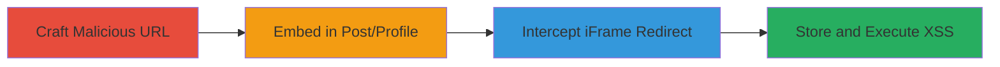

# Chained Reflected XSS to Stored XSS in Invision Community Forums

Multi-stage attack chain demonstrating a complete attack workflow exploiting vulnerabilities in Invision Community forums software, as used by PUBG, to transition from reflected XSS to stored XSS via iFrame embedding.

## Chain Metrics Dashboard

| Metric | Value |
|--------|-------|
| Chain Status | Unverified |
| Total Steps | 4 |
| Execution Time | ~10 minutes |
| Skill Level | Intermediate |
| Complexity | Medium |
| Impact Level | High |

## Attack Flow Visualization

## Prerequisites & Requirements

### Required Tools

- [[tools/Proxy]]

### Target Environment

- Web platform with Invision Community forums (e.g., forums.pubg.com)
- Required services: Forums software vulnerable to XSS in URL parameters and iFrame embedding
- Network access requirements: Ability to access the forum as a registered user for posting

### Initial Access Requirements

- Registered user account on the target forum
- Network position: External attacker with internet access
- Prior access needed: None, but ability to craft and host malicious URLs

## Detailed Attack Procedures

### Step 1: Craft Malicious URL
procedure: [[procedures/Craft-Malicious-URL-for-Reflected-XSS]]

**Objective**: Create a URL that triggers reflected XSS on the attacker's controlled page, exploiting insufficient sanitization in URL parameters.

**Instructions**: Identify a vulnerable endpoint in the Invision Community software, such as a search or profile parameter, and append a JavaScript payload like `javascript:alert('XSS')` to execute on load.

**Expected Output**: A URL that, when loaded, executes the JavaScript payload in the browser context.

**Success Indicators**:
- Payload executes without errors on the attacker's page
- No sanitization blocks the JavaScript scheme

### Step 2: Embed Link in Forum Post or Profile
procedure: [[procedures/Embed-Link-in-Forum-Post-or-Profile]]

**Objective**: Insert the malicious link into a forum post or user profile, leveraging the software's iFrame embedding feature for previews.

**Instructions**: Log in to the forum, create a new post or edit a profile, and paste the crafted URL as a link. The software will attempt to embed it in an iFrame for rich preview.

**Expected Output**: The link is saved in the post or profile, with the iFrame load initiated by the server-side processing.

**Success Indicators**:
- Link embeds without immediate rejection
- iFrame request is observable in network traffic

### Step 3: Intercept and Redirect iFrame
procedure: [[procedures/Intercept-and-Redirect-iFrame-via-Proxy]]

**Objective**: Use a proxy to capture the iFrame load request from the forum software and redirect it to the malicious RXSS URL, injecting the payload.

**Instructions**: Set up a proxy tool to intercept traffic between the forum server and the iFrame content. When the embed request occurs, redirect it to the crafted RXSS URL.

**Expected Output**: The iFrame loads the malicious content, storing the XSS payload in the forum's database.

**Success Indicators**:
- Proxy captures and modifies the iFrame request successfully
- Redirect leads to payload injection without detection

### Step 4: Store and Execute XSS Payload
procedure: [[procedures/Store-and-Execute-XSS-Payload]]

**Objective**: Confirm the payload is stored and executes arbitrary JavaScript when other users view the affected post or profile.

**Instructions**: Have a victim (or self in another session) view the post/profile. The stored iFrame content triggers the XSS on load.

**Expected Output**: JavaScript executes in the victim's browser, such as stealing cookies or session data.

**Success Indicators**:
- Arbitrary code runs on victim browsers
- Potential for account compromise or data exfiltration

## Attack Chain Summary

### Key Achievements

1. Exploited reflected XSS in URL parameters to craft injectable payloads
2. Chained to stored XSS via iFrame embedding manipulation
3. Enabled persistent JavaScript execution across user sessions, leading to high-impact browser compromises

## Technique & Tactic Coverage

### MITRE ATT&CK Techniques

- [[Exploit Public-Facing Application]]
- [[JavaScript]]

### MITRE ATT&CK Tactics

- [[Initial Access]]
- [[Execution]]

---
*Last updated: 2023-10-01T12:00:00Z*
