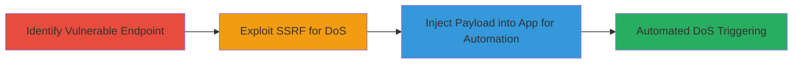

---
tags:
  - ssrf
  - dos
  - injection
  - iframe
  - vk.com
  - php
type: attack_chain
tools: []
tactics:
  - '[[Execution]]'
  - '[[Impact]]'
verified: false
platforms:
  - Web
submitted: true
complexity: medium
procedures:
  - '[[procedures/Identify-SSRF-Vulnerable-Endpoint-in-VK-Share-Service]]'
  - '[[procedures/Exploit-SSRF-for-DoS-via-Arbitrary-URL-Requests]]'
  - '[[procedures/Inject-SSRF-Payload-into-VK-App-via-Edit-Module]]'
step_count: 3
techniques:
  - '[[Exploit Public-Facing Application]]'
  - '[[Network Denial of Service]]'
description: >-
  A multi-stage attack exploiting SSRF in VK.com's share service to enable DoS
  via resource-intensive requests, chained with an injection vulnerability in
  the app editing module to automate triggering through malicious iframes in VK
  applications.
skill_level: intermediate
impact_level: high
id: 48bb15cf-89ba-4acb-b1a8-4e1f6b0e317d
created_at: '2025-12-14T04:39:18.699Z'
updated_at: '2025-12-14T04:39:18.699Z'
validated: true
mitre_tactics:
  - '[[Execution]]'
  - '[[Impact]]'
mitre_techniques:
  - '[[Exploit Public-Facing Application]]'
  - '[[Network Denial of Service]]'
---
# Chained SSRF and Iframe Injection for Automated DoS on VK.com Share Service

Multi-stage attack chain demonstrating exploitation of SSRF in VK.com's share service for DoS, chained with iframe injection in the app editing module to automate the attack via user interactions with malicious VK applications.

## Chain Metrics Dashboard

| Metric | Value |
|--------|-------|
| Chain Status | Unverified |
| Total Steps | 3 |
| Execution Time | ~5 minutes |
| Skill Level | Intermediate |
| Complexity | Medium |
| Impact Level | High |

## Attack Flow Visualization

## Prerequisites & Requirements

### Required Tools

- Browser developer tools for inspection
- curl or similar HTTP client for testing requests

### Target Environment

- VK.com web platform
- PHP-based services (VK Share Service and VK Applications)
- No specific ports required; operates over HTTPS

### Initial Access Requirements

- Public access to VK.com endpoints (no authentication needed for share service)
- Ability to create and edit VK applications (requires VK developer account)

## Detailed Attack Procedures

### Step 1: Identify Vulnerable Endpoint
procedure: [[procedures/Identify-SSRF-Vulnerable-Endpoint-in-VK-Share-Service]]

**Objective**: Analyze and confirm the SSRF vulnerability in the upload.php / parse_share endpoint by identifying lack of validation on authentication keys and headers.

**Instructions**: Inspect the endpoint behavior using browser tools or curl to send test requests and observe ignored parameters like hash and rhash, and unvalidated Content-* headers.

**Expected Output**: Confirmation that arbitrary URLs can be fetched without authentication.

**Success Indicators**:
- Requests succeed without hash/rhash validation
- Target URL parameter accepts external domains

### Step 2: Exploit SSRF for DoS
procedure: [[procedures/Exploit-SSRF-for-DoS-via-Arbitrary-URL-Requests]]

**Objective**: Leverage the SSRF to send resource-intensive requests to arbitrary URLs, exploiting long server-side timeouts to cause DoS through cyclic heavy loads.

**Instructions**: Use curl to repeatedly send GET requests to the endpoint with a target URL pointing to a resource-heavy site, monitoring server response times to confirm overload.

**Expected Output**: Server delays or errors due to timeout exhaustion.

**Success Indicators**:
- Increased response times on repeated requests
- Service degradation observed in VK share functionality

### Step 3: Chain with App Injection for Automation
procedure: [[procedures/Inject-SSRF-Payload-into-VK-App-via-Edit-Module]]

**Objective**: Inject the SSRF payload into an https-iframe within a VK application using the /editapp module, enabling automatic DoS triggering when users access the app.

**Instructions**: Edit a VK app via the /editapp endpoint to embed an iframe with the SSRF URL, then test by accessing the app to verify automatic request initiation.

**Expected Output**: Iframe loads and triggers SSRF request upon app visit.

**Success Indicators**:
- Malicious iframe successfully injected without validation
- DoS requests fire automatically on app access

## Attack Chain Summary

### Key Achievements

1. Identified and confirmed SSRF in unauthenticated share endpoint
2. Demonstrated DoS capability through cyclic resource-heavy requests
3. Automated attack propagation via app iframe injection

## Technique & Tactic Coverage

### MITRE ATT&CK Techniques

- [[Exploit Public-Facing Application]] Exploit Public-Facing Application
- [[Network Denial of Service]] Network Denial of Service

### MITRE ATT&CK Tactics

- [[Execution]] Execution
- [[Impact]] Impact

---
*Last updated: 2023-10-01*
