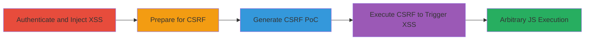

# Chained Stored XSS and Login CSRF for Arbitrary JavaScript Execution

Multi-stage attack chain demonstrating a complete attack workflow exploiting client-side validation bypass for stored XSS and lack of CSRF protection on login to achieve arbitrary JavaScript execution in a victim's browser.

## Chain Metrics Dashboard

| Metric | Value |
|--------|-------|
| Chain Status | Unverified |
| Total Steps | 5 |
| Execution Time | ~10 minutes |
| Skill Level | Intermediate |
| Complexity | Medium |
| Impact Level | High |

## Attack Flow Visualization

## Prerequisites & Requirements

### Required Tools

- [[tools/Burp-Suite]]

### Target Environment

- Web application with username change feature and login form
- No server-side validation on usernames
- No CSRF tokens on login

### Initial Access Requirements

- Valid attacker credentials for the target application
- Browser with developer tools
- Network access to the application

## Detailed Attack Procedures

### Step 1: Authenticate to Target Application
procedure: [[procedures/Authenticate-to-Target-Application]]

**Objective**: Gain access to the application to reach the username change feature.

**Instructions**: Visit the target application's login page and enter valid credentials to sign in.

**Expected Output**: Successful login, redirect to dashboard or profile page.

**Success Indicators**:
- User is authenticated and can access profile settings
- No errors during login

### Step 2: Inject Stored XSS into Username
procedure: [[procedures/Inject-Stored-XSS-into-Username]]

**Objective**: Bypass client-side validation to store an XSS payload in the username field.

**Instructions**: Navigate to the username change form, open browser developer tools, modify the maxlength attribute on the input fields to 100, enter the payload `">` in both new and confirm username fields, then submit.

**Expected Output**: Username updated successfully without errors.

**Success Indicators**:
- Payload stored in username
- No client-side validation errors

### Step 3: Sign Out to Prepare for CSRF
procedure: [[procedures/Sign-Out-to-Prepare-for-CSRF]]

**Objective**: Log out to test the login CSRF in a clean state.

**Instructions**: After username change, click the logout button to end the session.

**Expected Output**: Session terminated, redirected to login page.

**Success Indicators**:
- User is logged out
- Application returns to login state

### Step 4: Generate Login CSRF Proof-of-Concept
procedure: [[procedures/Generate-Login-CSRF-Proof-of-Concept]]

**Objective**: Create a malicious HTML file that forces login as the attacker using intercepted requests.

**Instructions**: Attempt to log in, intercept the request with [[tools/Burp-Suite]], use Burp's Engagement Tools to generate CSRF PoC HTML, and copy it.

**Expected Output**: HTML file with form that submits attacker credentials.

**Success Indicators**:
- CSRF PoC generated without errors
- PoC HTML contains valid login form action

### Step 5: Execute CSRF to Trigger XSS
procedure: [[procedures/Execute-CSRF-to-Trigger-XSS]]

**Objective**: Trick the victim into loading the PoC, forcing login and executing the stored XSS.

**Instructions**: Save the PoC HTML to a file, host or open it in the victim's browser to trigger login as attacker, then view the profile to execute XSS.

**Expected Output**: Victim logs in as attacker, alert pops with cookies.

**Success Indicators**:
- Victim authenticated as attacker
- XSS payload executes, showing confirm dialog with cookies

## Attack Chain Summary

### Key Achievements

1. Bypassed client-side username validation to store XSS payload
2. Exploited login CSRF to force victim authentication
3. Achieved arbitrary JavaScript execution in victim session for cookie theft

## Technique & Tactic Coverage

### MITRE ATT&CK Techniques

- [[JavaScript]]
- [[Drive-by Compromise]]

### MITRE ATT&CK Tactics

- [[Execution]]
- [[Initial Access]]

---
*Last updated: 2023-10-01T00:00:00Z*
