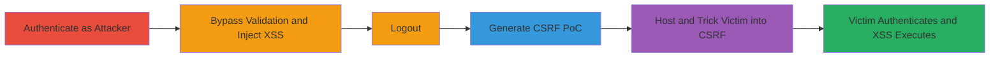

# Chained Stored XSS and Login CSRF for Session Hijacking

Multi-stage attack chain demonstrating a complete attack workflow exploiting a stored XSS vulnerability in the username change feature, bypassed via client-side manipulation, combined with a login CSRF to force victim authentication and execute arbitrary JavaScript, such as stealing session cookies.

## Chain Metrics Dashboard

| Metric | Value |
|--------|-------|
| Chain Status | Unverified |
| Total Steps | 6 |
| Execution Time | ~10 minutes |
| Skill Level | Intermediate |
| Complexity | Medium |
| Impact Level | High |

## Attack Flow Visualization

## Prerequisites & Requirements

### Required Tools

- [[tools/Burp-Suite]]

### Target Environment

- Web application with username change feature and login form
- No server-side validation on username length or input sanitization
- Login endpoint vulnerable to CSRF (no anti-CSRF tokens)
- Required services/ports: HTTP/HTTPS on standard ports (80/443)
- Network access requirements: Direct access to the web app from browser

### Initial Access Requirements

- Valid attacker credentials for the target application
- Network position: Same origin or ability to host malicious HTML
- Prior access needed: None, but victim must be tricked into visiting CSRF PoC

## Detailed Attack Procedures

### Step 1: Authenticate to Web Application
procedure: [[procedures/Authenticate-to-Web-Application]]

**Objective**: Gain authenticated access to the application to access the username change feature.

**Instructions**: Visit the login URL (e.g., https://target.com/login) and enter valid credentials to sign in.

**Expected Output**: Successful login redirect to dashboard or profile page.

**Success Indicators**:
- Authenticated session established (e.g., session cookie set)
- Access to user profile or settings

### Step 2: Bypass Client-Side Validation for Username Change
procedure: [[procedures/Bypass-Client-Side-Validation-for-Username-Change]]

**Objective**: Override browser-enforced length limits on the username input to allow longer payloads.

**Instructions**: Navigate to the username change page, open browser developer tools (Inspect Element), locate the new username input field, and modify the `max` attribute from 20 to 100.

**Expected Output**: Input field accepts longer text without validation errors.

**Success Indicators**:
- Form allows input beyond 20 characters
- No client-side errors on longer inputs

### Step 3: Inject Stored XSS Payload in Username
procedure: [[procedures/Inject-Stored-XSS-Payload-in-Username]]

**Objective**: Store a malicious JavaScript payload in the username that executes when profiles are viewed.

**Instructions**: In the new username and confirm username fields, enter the payload `">`, then submit the form.

**Expected Output**: Username updated successfully; payload stored in backend.

**Success Indicators**:
- Profile page reflects the injected payload without escaping
- Alert box shows cookies when viewing profile

### Step 4: Logout from Web Application
procedure: [[procedures/Logout-from-Web-Application]]

**Objective**: End the attacker's session to prepare for CSRF exploitation.

**Instructions**: Click the logout button or navigate to the logout endpoint to sign out.

**Expected Output**: Session terminated; redirect to login page.

**Success Indicators**:
- No longer authenticated
- Cannot access protected pages without re-login

### Step 5: Generate Login CSRF PoC with Burp Suite
procedure: [[procedures/Generate-Login-CSRF-POC-with-Burp-Suite]]

**Objective**: Create a malicious HTML file that forces a victim's browser to authenticate as the attacker.

**Instructions**: Attempt to log in, intercept the request in Burp Suite, right-click and select Action > Engagement Tools > Generate CSRF PoC, then copy the HTML code.

**Expected Output**: HTML snippet with a form that auto-submits login credentials.

**Success Indicators**:
- Valid CSRF PoC HTML generated
- PoC file opens and submits login when tested

### Step 6: Execute CSRF PoC to Trigger Stored XSS
procedure: [[procedures/Execute-CSRF-POC-to-Trigger-Stored-XSS]]

**Objective**: Trick the victim into running the CSRF, logging them in as attacker and triggering the XSS.

**Instructions**: Save the PoC HTML to a file (e.g., csrf.html), host it or send to victim, and have them open it in their browser while viewing the profile.

**Expected Output**: Victim's browser authenticates as attacker and executes XSS (e.g., cookie alert).

**Success Indicators**:
- Victim session hijacked
- Arbitrary JS executes in victim's context (e.g., cookies stolen)

## Attack Chain Summary

### Key Achievements

1. Bypassed client-side restrictions to store XSS payload
2. Generated CSRF PoC to force unauthorized login
3. Achieved session hijacking via chained vulnerabilities for cookie theft

## Technique & Tactic Coverage

### MITRE ATT&CK Techniques

- [[JavaScript]]
- [[Drive-by Compromise]]

### MITRE ATT&CK Tactics

- [[Execution]]
- [[Initial Access]]
- [[Collection]]

---

*Last updated: 2023-10-01T00:00:00Z*
