---
tags:
  - username-enumeration
  - brute-force
  - account-takeover
  - wordpress
  - authentication-bypass
type: attack_chain
tools:
  - '[[tools/Intercepting-Proxy]]'
  - '[[tools/InstagramBrandEnumerationExploit.rb]]'
  - '[[tools/InstagramBrandLoginBruteForce.rb]]'
tactics:
  - '[[Discovery]]'
  - '[[Credential Access]]'
verified: false
platforms:
  - Web
  - WordPress
submitted: true
complexity: medium
created_at: '2023-10-01T00:00:00Z'
procedures:
  - '[[procedures/Access-Resend-Verify-Endpoint-via-Signup]]'
  - '[[procedures/Intercept-and-Modify-Resend-Verify-Requests]]'
  - '[[procedures/Manual-Username-Enumeration-via-Resend-Verify]]'
  - '[[procedures/Automated-Username-Enumeration-with-Ruby-Script]]'
  - '[[procedures/Test-Login-Lockout-Effect]]'
  - '[[procedures/Automated-Brute-Force-Login-with-Ruby-Script]]'
step_count: 6
techniques:
  - '[[Account Discovery]]'
  - '[[Password Guessing]]'
updated_at: '2025-12-14T17:33:12.531Z'
description: >-
  This attack chain exploits two vulnerabilities in a WordPress-based site:
  unprotected username enumeration via the resend-verify endpoint and lack of
  rate limiting on the login endpoint, enabling automated discovery of valid
  accounts and brute-force password guessing for full account compromise.
skill_level: intermediate
impact_level: high
id: e1cc60df-766f-4693-8543-8a25f9273e38
validated: true
mitre_tactics:
  - '[[Discovery]]'
  - '[[Credential Access]]'
mitre_techniques:
  - '[[Account Discovery]]'
  - '[[Password Guessing]]'
---
# Chained Username Enumeration and Brute-Force Leading to Account Takeover on WordPress Site

Multi-stage attack chain demonstrating a complete workflow for enumerating valid usernames via an unprotected endpoint and brute-forcing logins without rate limiting, resulting in account takeover on a WordPress site like en.instagram-brand.com.

## Chain Metrics Dashboard

| Metric | Value |
|--------|-------|
| Chain Status | Unverified |
| Total Steps | 6 |
| Execution Time | ~20 minutes |
| Skill Level | Intermediate |
| Complexity | Medium |
| Impact Level | High |

## Attack Flow Visualization

```mermaid
graph LR
    A[Signup to Access Endpoint] --> B[Intercept Requests]
    B --> C[Manual Enumeration]
    C --> D[Automated Enumeration]
    D --> E[Test Lockout]
    E --> F[Automated Brute-Force]
    F --> G[Account Takeover]

    style A fill:#e74c3c
    style B fill:#f39c12
    style C fill:#f39c12
    style D fill:#3498db
    style E fill:#9b59b6
    style F fill:#e67e22
    style G fill:#27ae60
```



## Prerequisites & Requirements

### Required Tools

- [[tools/Intercepting-Proxy]]
- [[tools/InstagramBrandEnumerationExploit.rb]]
- [[tools/InstagramBrandLoginBruteForce.rb]]

### Target Environment

- WordPress-based web application
- Accessible registration and login endpoints (e.g., https://target.com/wp-json/brc/v1/)
- No CAPTCHA or rate limiting on resend-verify and login endpoints

### Initial Access Requirements

- Public internet access to the target site
- No prior credentials needed
- List of potential emails for enumeration
- Password list for brute-force

## Detailed Attack Procedures

### Step 1: Access Resend-Verify Endpoint via Signup
procedure: [[procedures/Access-Resend-Verify-Endpoint-via-Signup]]

**Objective**: Register a test account to unlock the resend-verify functionality and prepare for request interception.

**Instructions**: Navigate to the registration page and create a new account using any email address. This triggers access to the resend email button, which exposes the vulnerable endpoint.

**Expected Output**: Successful signup confirmation and visibility of the resend button on the page.

**Success Indicators**:
- Account created without issues
- Resend email option available

### Step 2: Intercept and Modify Resend-Verify Requests
procedure: [[procedures/Intercept-and-Modify-Resend-Verify-Requests]]

**Objective**: Use an intercepting proxy to capture the POST request to the resend-verify endpoint for modification and testing.

**Instructions**: Configure [[tools/Intercepting-Proxy]] (e.g., Burp Suite) as a proxy for your browser. Click the resend button to capture the request, then modify the email parameter with target payloads before forwarding.

**Expected Output**: Intercepted request visible in the proxy tool, ready for modification.

**Success Indicators**:
- Request captured successfully
- Proxy traffic routing confirmed

### Step 3: Manual Username Enumeration via Resend-Verify
procedure: [[procedures/Manual-Username-Enumeration-via-Resend-Verify]]

**Objective**: Test individual emails to identify valid usernames by observing response differences and side effects like email triggers.

**Instructions**: Execute the modified POST request using [[commands/resend-verify-post-request]] for each target email:

```bash
curl -X POST https://en.instagram-brand.com/wp-json/brc/v1/resend-verify \
  -H "User-Agent: Mozilla/5.0 (Windows NT 6.3; WOW64; rv:51.0) Gecko/20100101 Firefox/51.0" \
  -H "Accept: */*" \
  -H "Content-Type: application/x-www-form-urlencoded" \
  -H "Referer: https://en.instagram-brand.com/register/signup" \
  -d "email=target@example.com"
```

Replace `target@example.com` with the email to test. Valid emails trigger a verbose success response and send a verification email, locking the account temporarily.

**Expected Output**: JSON response with success message for valid emails (e.g., "Verification email sent") vs. error for invalid.

**Success Indicators**:
- Distinct responses for valid/invalid emails
- Unwanted verification emails sent to valid owners

### Step 4: Automated Username Enumeration with Ruby Script
procedure: [[procedures/Automated-Username-Enumeration-with-Ruby-Script]]

**Objective**: Scale enumeration by automating requests against a list of emails using a custom Ruby script.

**Instructions**: Prepare `emails.txt` with a list of target emails. Run [[commands/run-enumeration-ruby-script]]:

```bash
ruby InstagramBrandEnumerationExploit.rb
```

The script sends requests to the resend-verify endpoint, logging valid emails. It can handle 1001 attempts in 10 minutes without lockout.

**Expected Output**: Console output listing valid emails discovered within seconds.

**Success Indicators**:
- Valid usernames enumerated
- No rate limiting encountered

### Step 5: Test Login Lockout Effect
procedure: [[procedures/Test-Login-Lockout-Effect]]

**Objective**: Verify how enumeration-triggered emails prevent victim logins, adding a denial-of-service element.

**Instructions**: Using an enumerated valid email, attempt login at the signin page (https://en.instagram-brand.com/register/signin). The site will require email verification, blocking access even for verified accounts if emails are triggered.

**Expected Output**: Login prompt for verification code, preventing direct access.

**Success Indicators**:
- Victim account locked out temporarily
- Harassment via unwanted emails confirmed

### Step 6: Automated Brute-Force Login with Ruby Script
procedure: [[procedures/Automated-Brute-Force-Login-with-Ruby-Script]]

**Objective**: Use enumerated emails to brute-force passwords on the login endpoint for account takeover.

**Instructions**: Edit the script to set the target email on line 7. Prepare `passlist.txt` with passwords. Run [[commands/run-brute-force-ruby-script]]:

```bash
ruby InstagramBrandLoginBruteForce.rb
```

The script attempts logins at https://en.instagram-brand.com/wp-json/brc/v1/login/, achieving 1020 attempts in 10 minutes single-threaded.

**Expected Output**: Successful login credentials if password is guessed, or failure logs.

**Success Indicators**:
- Valid credentials discovered
- Account access gained (e.g., session tokens)

## Attack Chain Summary

### Key Achievements

1. Enumerated valid usernames from email lists without restrictions
2. Triggered account lockouts and harassment via verification emails
3. Performed high-volume brute-force attacks leading to full account compromise

## Technique & Tactic Coverage

### MITRE ATT&CK Techniques

- [[Account Discovery]] Account Discovery
- [[Password Guessing]] Brute Force: Password Guessing

### MITRE ATT&CK Tactics

- [[Discovery]] Discovery
- [[Credential Access]] Credential Access

---

*Last updated: 2023-10-01T00:00:00Z*
