---
tags:
  - ssrf
  - information-disclosure
  - authentication-bypass
  - idor
  - dom-xss
  - privilege-escalation
  - android-reverse
  - css-exfiltration
  - osint
type: attack_chain
tools:
  - '[[tools/Amass]]'
  - '[[tools/Dirsearch]]'
  - '[[tools/Curl]]'
  - '[[tools/Burp-Suite]]'
  - '[[tools/MobSF]]'
  - '[[tools/Genymotion]]'
  - '[[tools/ADB]]'
  - '[[tools/Custom-B64search-Script]]'
tactics:
  - '[[Reconnaissance]]'
  - '[[Initial Access]]'
  - '[[Discovery]]'
  - '[[Privilege Escalation]]'
  - '[[Credential Access]]'
  - '[[Impact]]'
verified: false
platforms:
  - Web
  - Android
  - Linux
submitted: true
complexity: high
created_at: '2023-10-01T00:00:00Z'
procedures:
  - '[[procedures/Reconnaissance-and-Exposed-Git-Discovery]]'
  - '[[procedures/Credential-Leak-Analysis-and-Initial-Login]]'
  - '[[procedures/API-SSRF-Exploitation-for-Internal-Access]]'
  - '[[procedures/Android-APK-Reverse-Engineering]]'
  - '[[procedures/Staff-Account-Takeover-via-OSINT-and-IDOR]]'
  - '[[procedures/Privilege-Escalation-to-Admin-via-CSS-and-Array-Injection]]'
  - '[[procedures/CEO-Takeover-and-Final-2FA-Bypass]]'
  - '[[procedures/Impact-Bounty-Approval]]'
step_count: 8
techniques:
  - '[[File and Directory Discovery]]'
  - '[[Exploit Public-Facing Application]]'
  - '[[Unsecured Credentials]]'
  - '[[JavaScript]]'
  - '[[Steal Web Session Cookie]]'
  - '[[Valid Accounts]]'
updated_at: '2025-12-14T17:32:58.247Z'
description: >-
  A multi-stage attack exploiting exposed Git repositories, SSRF, insecure
  logging, Android APK weaknesses, IDOR, DOM XSS, and CSS exfiltration to
  achieve complete CEO account takeover and bounty approval.
skill_level: advanced
impact_level: critical
id: 43db3349-2676-490c-a611-ad114ba44084
validated: true
mitre_tactics:
  - '[[Reconnaissance]]'
  - '[[Initial Access]]'
  - '[[Discovery]]'
  - '[[Privilege Escalation]]'
  - '[[Credential Access]]'
  - '[[Impact]]'
mitre_techniques:
  - '[[File and Directory Discovery]]'
  - '[[Exploit Public-Facing Application]]'
  - '[[Unsecured Credentials]]'
  - '[[JavaScript]]'
  - '[[Steal Web Session Cookie]]'
  - '[[Valid Accounts]]'
---
# Chained Vulnerabilities for Full Account Takeover in BountyPay Platform

Multi-stage attack chain exploiting multiple vulnerabilities in the BountyPay platform, starting from reconnaissance and leading to full CEO account takeover and unauthorized bounty approvals.

## Chain Metrics Dashboard

| Metric | Value |
|--------|-------|
| Chain Status | Unverified |
| Total Steps | 8 |
| Execution Time | ~120 minutes |
| Skill Level | Advanced |
| Complexity | High |
| Impact Level | Critical |

## Attack Flow Visualization

```mermaid
graph LR
    A[Reconnaissance] --> B[Credential Access]
    B --> C[Lateral Movement via SSRF]
    C --> D[Android Reverse Engineering]
    D --> E[Staff Takeover]
    E --> F[Privilege Escalation]
    F --> G[CEO Takeover]
    G --> H[Impact: Bounty Approval]

    style A fill:#e74c3c
    style B fill:#f39c12
    style C fill:#3498db
    style D fill:#9b59b6
    style E fill:#e67e22
    style F fill:#1abc9c
    style G fill:#34495e
    style H fill:#27ae60
```



## Prerequisites & Requirements

### Required Tools

- [[tools/Amass]]
- [[tools/Dirsearch]]
- [[tools/Curl]]
- [[tools/Burp-Suite]]
- [[tools/MobSF]]
- [[tools/Genymotion]]
- [[tools/ADB]]
- [[tools/Custom-B64search-Script]]

### Target Environment

- Web platform (PHP, JavaScript)
- Android APK
- API services (REST)
- Network access to bountypay.h1ctf.com and subdomains

### Initial Access Requirements

- No prior credentials needed
- Public internet access
- Local setup for Android emulation

## Detailed Attack Procedures

### Step 1: Reconnaissance and Exposed Git Discovery
procedure: [[procedures/Reconnaissance-and-Exposed-Git-Discovery]]

**Objective**: Identify subdomains and discover exposed .git repository.

**Instructions**: Enumerate subdomains using [[commands/amass-enum-passive]]:

```bash
amass enum --passive -d bountypay.h1ctf.com
```

Brute force directories on app subdomain with [[commands/dirsearch-brute-app]]:

```bash
python3 ~/dirsearch/dirsearch.py -u https://app.bountypay.h1ctf.com/ -e php,asp,aspx,jsp,html,zip,jar -b -w ~/dirsearch/db/dicc.txt -t 200 -x 502,503 -H 'X-FORWARDED-FOR: 127.0.0.1'
```

Retrieve .git config using [[commands/curl-git-config]]:

```bash
curl -sk https://app.bountypay.h1ctf.com/.git/config
```

**Expected Output**: Subdomains like app.bountypay.h1ctf.com; .git/config revealing GitHub repo.

**Success Indicators**:
- Subdomains enumerated
- .git directory discovered

### Step 2: Credential Leak Analysis and Initial Login
procedure: [[procedures/Credential-Leak-Analysis-and-Initial-Login]]

**Objective**: Analyze leaked logs for credentials and bypass initial 2FA.

**Instructions**: Manually analyze logger.php from GitHub repo. Download trace log with [[commands/curl-trace-log]]:

```bash
curl -sk https://app.bountypay.h1ctf.com/bp_web_trace.log
```

Decode base64 entries to get credentials. Login and intercept 2FA with Burp Suite, replacing challenge_hash with MD5 of answer.

**Expected Output**: Credentials brian.oliver:V7h0inzX and 2FA answer bD83Jk27dQ.

**Success Indicators**:
- Successful login
- 2FA bypassed

### Step 3: API SSRF Exploitation for Internal Access
procedure: [[procedures/API-SSRF-Exploitation-for-Internal-Access]]

**Objective**: Explore API and exploit SSRF to access internal subdomains.

**Instructions**: Trigger statements endpoint to decode cookie. Manipulate base64 cookie for SSRF (e.g., account_id with ../../redirect?url=https://software.bountypay.h1ctf.com/). Brute force directories via SSRF using [[commands/b64search-brute-ssrf]]:

```bash
cat common.txt | xargs -P 30 -n 1 ./b64search.sh
```

**Expected Output**: Access to /uploads on software subdomain.

**Success Indicators**:
- Internal paths discovered
- APK downloadable

### Step 4: Android APK Reverse Engineering
procedure: [[procedures/Android-APK-Reverse-Engineering]]

**Objective**: Bypass APK activities to extract API token.

**Instructions**: Download APK from /uploads. Analyze with MobSF on Genymotion. Bypass activities using [[commands/adb-bypass-part1]]:

```bash
adb shell am start -a android.intent.action.VIEW -d "one://part?start=PartTwoActivity" -n bounty.pay/.PartOneActivity
```

[[commands/adb-bypass-part2]]:

```bash
adb shell am start -a android.intent.action.VIEW -d "two://part?two=light&switch=on" -n bounty.pay/.PartTwoActivity
```

[[commands/adb-bypass-part3]]:

```bash
adb shell am start -a android.intent.action.VIEW -d "three://part?three=UGFydFRocmVlQWN0aXZpdHk=&switch=b24=&header=X-Token" -n bounty.pay/.PartThreeActivity
```

Extract prefs with [[commands/adb-extract-prefs]]:

```bash
adb shell cat ./data/data/bounty.pay/shared_prefs/user_created.xml
```

**Expected Output**: API token 8e9998ee3137ca9ade8f372739f062c1.

**Success Indicators**:
- Token extracted

### Step 5: Staff Account Takeover via OSINT and IDOR
procedure: [[procedures/Staff-Account-Takeover-via-OSINT-and-IDOR]]

**Objective**: Use token for staff list, OSINT for ID, and IDOR for credentials.

**Instructions**: GET /api/staff with token. OSINT Twitter for Sandra's ID STF:8FJ3KFISL3. POST /api/staff with ID to get credentials.

**Expected Output**: Credentials sandra.allison / s4ndra!b00typay.

**Success Indicators**:
- Staff login successful

### Step 6: Privilege Escalation to Admin via CSS and Array Injection
procedure: [[procedures/Privilege-Escalation-to-Admin-via-CSS-and-Array-Injection]]

**Objective**: Inject CSS classes and array params to trigger admin upgrade.

**Instructions**: Update profile avatar class to 'upgradeToAdmin tab2'. Inject ?template[]=login&template[]=ticket&ticket_id=3582&username=sandra.allison#tab2. Report to admins.

**Expected Output**: Admin access granted.

**Success Indicators**:
- Admin panel accessible

### Step 7: CEO Takeover and Final 2FA Bypass
procedure: [[procedures/CEO-Takeover-and-Final-2FA-Bypass]]

**Objective**: Retrieve CEO creds and bypass 2FA with CSS exfiltration.

**Instructions**: View admin panel for marten.mickos / m1ck0sBountyP@y. Login as CEO, trigger 2FA. Exploit app_style SSRF for CSS keylogger on collaborator server. Brute force last char with Burp Intruder.

**Expected Output**: 2FA code h1ctf{736c635d8842751b8aafa556154eb9f3}.

**Success Indicators**:
- CEO account controlled

### Step 8: Impact Bounty Approval
procedure: [[procedures/Impact-Bounty-Approval]]

**Objective**: Approve all pending bounties.

**Instructions**: Enter 2FA code to approve bounties.

**Expected Output**: All bounties approved.

**Success Indicators**:
- Bounties processed

## Attack Chain Summary

### Key Achievements

1. Full reconnaissance and exposure discovery
2. Multiple account takeovers via leaks and bypasses
3. Internal access and reverse engineering
4. Privilege escalation to CEO level
5. Unauthorized bounty approvals

## Technique & Tactic Coverage

### MITRE ATT&CK Techniques

- [[File and Directory Discovery]] File and Directory Discovery
- [[Exploit Public-Facing Application]] Exploit Public-Facing Application
- [[Unsecured Credentials]] Unsecured Credentials
- [[JavaScript]] JavaScript (for DOM XSS)
- [[Steal Web Session Cookie]] Data from Information Repositories (IDOR)
- [[Valid Accounts]] Valid Accounts (bypass)

### MITRE ATT&CK Tactics

- [[Reconnaissance]] Reconnaissance
- [[Initial Access]] Initial Access
- [[Discovery]] Discovery
- [[Privilege Escalation]] Privilege Escalation
- [[Credential Access]] Credential Access
- [[Impact]] Impact

---

*Last updated: 2023-10-01T00:00:00Z*
