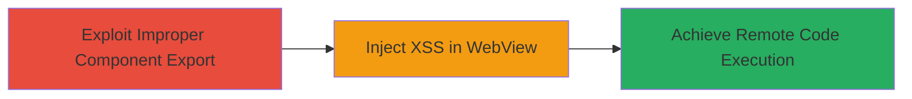

---
id: ac-tiktok-rce-chain-2020
name: Chained XSS and Improper Component Export Leading to RCE in TikTok Android App
type: attack_chain
description: A multi-vulnerability chain exploiting improper export of Android components and XSS in WebView to achieve remote code execution on TikTok Android devices.
verified: false
submitted: false
step_count: 2
created_at: 2023-10-01T00:00:00Z
updated_at: 2023-10-01T00:00:00Z
procedures: [[procedures/Exploit-Improper-Export-of-Android-Components-in-TikTok]], [[procedures/Inject-XSS-in-TikTok-Android-WebView-for-RCE]]
techniques: [[T1417]], [[JavaScript]]
tactics: [[Initial Access]], [[Execution]]
tags: xss, rce, android, webview, tiktok, mobile
platforms: Android
---

# Chained XSS and Improper Component Export Leading to RCE in TikTok Android App

Multi-stage attack chain demonstrating a complete attack workflow exploiting vulnerabilities in the TikTok Android application, discovered and reported in 2020.

## Chain Metrics Dashboard

| Metric | Value |
|--------|-------|
| Chain Status | Unverified |
| Total Steps | 2 |
| Execution Time | ~30 minutes |
| Skill Level | Intermediate |
| Complexity | Medium |
| Impact Level | High |

## Attack Flow Visualization

## Prerequisites & Requirements

### Required Tools

- Android Debug Bridge (ADB)
- APK decompiler (e.g., JADX or APKTool)

### Target Environment

- Target OS/Platform: Android devices running TikTok app (versions affected as per 2020 report)
- Required services/ports: Local ADB access or sideloaded APK
- Network access requirements: Ability to install and run modified APK on device

### Initial Access Requirements

- Credential requirements: Root or debug-enabled device
- Network position: Local device access
- Prior access needed: Installed TikTok APK for analysis

## Detailed Attack Procedures

### Step 1: Exploit Improper Component Export
procedure: [[procedures/Exploit-Improper-Export-of-Android-Components-in-TikTok]]

**Objective**: Gain unauthorized access to sensitive Android application components in TikTok by leveraging improperly exported activities or services, enabling further exploitation like XSS injection.

**Instructions**: Decompile the TikTok APK using a tool like JADX to inspect manifest and identify exported components without proper permissions. Launch the exported component via ADB to bypass normal app restrictions and access WebView interfaces.

**Expected Output**: Successful invocation of the exported component, allowing interaction with internal app features.

**Success Indicators**:
- Component launches without authentication
- Access to WebView or sensitive data confirmed

### Step 2: Inject XSS in WebView for RCE
procedure: [[procedures/Inject-XSS-in-TikTok-Android-WebView-for-RCE]]

**Objective**: Inject malicious JavaScript via the vulnerable WebView to execute arbitrary code, chaining with the prior access to achieve remote code execution on the device.

**Instructions**: Using the access from Step 1, craft and inject XSS payload into WebView content handling. Monitor for JavaScript execution that manipulates the app's runtime environment to run shell commands or load native code.

**Expected Output**: JavaScript alert or console log confirming execution, followed by RCE indicators like file creation or process spawn.

**Success Indicators**:
- XSS payload executes in WebView
- Arbitrary code runs on device, e.g., system command output

## Attack Chain Summary

### Key Achievements

1. Unauthorized access to TikTok's internal components via export flaws
2. Successful XSS injection in WebView
3. Chained exploitation resulting in full RCE on Android device

## Technique & Tactic Coverage

### MITRE ATT&CK Techniques

- [[T1417]] (Improper Export of Android Components)
- [[JavaScript]] (JavaScript for XSS in WebView)

### MITRE ATT&CK Tactics

- [[Initial Access]] (Initial Access via component exploitation)
- [[Execution]] (Execution via XSS chaining)

---
*Last updated: 2023-10-01T00:00:00Z*
