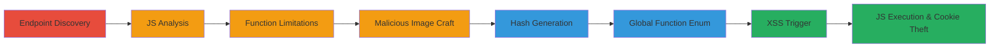

# Chained XSS via Callback Eval and Image Proxy in VK.com Upload

Multi-stage attack chain demonstrating a complete XSS workflow in VK.com's upload system, leading to arbitrary JavaScript execution for session hijacking.

## Chain Metrics Dashboard

| Metric | Value |
|--------|-------|
| Chain Status | Unverified |
| Total Steps | 7 |
| Execution Time | ~30 minutes |
| Skill Level | Intermediate |
| Complexity | Medium |
| Impact Level | High |

## Attack Flow Visualization



## Prerequisites & Requirements

### Required Tools

- [[tools/imagejs]]

### Target Environment

- Web platform (VK.com)
- Non-mobile user agents supporting requestAnimationFrame
- Access to VK.com graffiti upload functionality

### Initial Access Requirements

- Valid VK.com session for authenticated requests
- Browser developer tools access
- Network access to VK.com endpoints

## Detailed Attack Procedures

### Step 1: Endpoint Discovery

procedure: [[procedures/Discover-VK-Upload-Endpoint-for-Graffiti]]

**Objective**: Identify the vulnerable upload endpoint used for graffiti uploads to documents.

**Instructions**: Observe the upload endpoint in VK.com's graffiti upload flow, noting the transport act and callback parameter.

**Expected Output**: Endpoint URL like https://pu.vk.com/c415824/upload.php?act=transport&to_act=add_doc&hash=...&callback=getUploadSvg.

**Success Indicators**:
- Endpoint identified with eval on line 25
- sendData function observed

### Step 2: JavaScript Analysis

procedure: [[procedures/Analyze-JavaScript-for-Cross-Domain-Callback]]

**Objective**: Examine the JavaScript code for cross-domain setup and callback invocation patterns.

**Instructions**: Review the code setting document.domain and invoking parent.{callback} with an anonymous function calling sendData.

**Expected Output**: Understanding of callback regex /^[a-zA-Z0-9]*$/ and cross-domain execution.

**Success Indicators**:
- Cross-domain script execution confirmed
- Callback limitations noted

### Step 3: SendData Behavior Identification

procedure: [[procedures/Identify-SendData-Function-Limitations]]

**Objective**: Determine how sendData handles POST requests and eval responses, including mobile UA skips.

**Instructions**: Analyze sendData's use of XMLHttpRequest for POST with dataUrl, skipping for mobile UAs, and eval on success.

**Expected Output**: Confirmation that non-mobile responses are evaluated via eval.

**Success Indicators**:
- Mobile UA bypass identified
- Eval on untrusted response confirmed

### Step 4: Malicious Image Crafting

procedure: [[procedures/Craft-Malicious-Image-with-ImageJS]]

**Objective**: Embed JavaScript into a valid image to create a malicious payload for proxying.

**Instructions**: Use [[tools/imagejs]] to embed JS like alert(document.cookie) into a GIF image, then proxy via upload.php?act=proxy_img.

**Expected Output**: Valid image file returning executable JS when proxied.

**Success Indicators**:
- Image remains valid
- JS executes when served

### Step 5: Hash Generation

procedure: [[procedures/Generate-Valid-Hashes-via-Upload-Fails-Bypass]]

**Objective**: Obtain valid hashes for proxy_img by bypassing sanitization in upload_fails.php.

**Instructions**: Pass parameters to upload_fails.php with role=share, adding dots to parameter names to evade sanitization.

**Expected Output**: Valid hash for authenticated proxy requests.

**Success Indicators**:
- Hashes generated successfully
- Proxy endpoint accessible

### Step 6: Global Function Enumeration

procedure: [[procedures/Enumerate-Global-Window-Functions-for-Callback-Abuse]]

**Objective**: Find a global function accepting callbacks to abuse the callback parameter.

**Instructions**: In browser console, execute [[commands/enumerate-window-globals]] to list window properties and identify requestAnimationFrame.

```javascript
for (let prop in window) { console.log(prop); }
```

**Expected Output**: List including requestAnimationFrame and vendor prefixes.

**Success Indicators**:
- requestAnimationFrame identified
- Callback acceptance confirmed

### Step 7: XSS Trigger

procedure: [[procedures/Trigger-XSS-via-RequestAnimationFrame-Callback]]

**Objective**: Set callback to requestAnimationFrame and trigger upload to execute embedded JS.

**Instructions**: Modify callback to 'requestAnimationFrame', upload the malicious image via proxy, leading to POST and eval execution.

**Expected Output**: alert(document.cookie) or similar JS execution in victim browser.

**Success Indicators**:
- JS executes in non-mobile browsers
- Cookies accessible for hijacking

## Attack Chain Summary

### Key Achievements

1. Discovered eval-based callback vulnerability in upload transport.
2. Bypassed proxy sanitization with image-embedded JS.
3. Abused global function for arbitrary execution, enabling session theft.

## Technique & Tactic Coverage

### MITRE ATT&CK Techniques

- [[JavaScript]]
- [[Drive-by Compromise]]

### MITRE ATT&CK Tactics

- [[Execution]]
- [[Collection]]

---
*Last updated: 2023-10-01T00:00:00Z*
