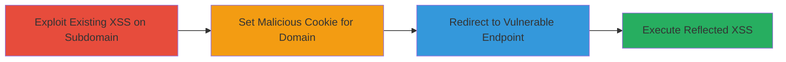

# Chained XSS via Cookie Manipulation for Reflected XSS Execution

Multi-stage attack chain demonstrating a complete attack workflow exploiting chained XSS vulnerabilities across subdomains to achieve code execution in an authenticated environment.

## Chain Metrics Dashboard

| Metric | Value |
|--------|-------|
| Chain Status | Unverified |
| Total Steps | 2 |
| Execution Time | ~5 minutes |
| Skill Level | Intermediate |
| Complexity | Medium |
| Impact Level | High |

## Attack Flow Visualization



## Prerequisites & Requirements

### Required Tools

- Browser with developer tools (e.g., Chrome DevTools)

### Target Environment

- Web platform with ASP.NET
- Access to a subdomain with known XSS (e.g., https://example.mil/kc/main/pop_up_frm.asp)
- Target domain .af.mil with vulnerable endpoint

### Initial Access Requirements

- No credentials required for initial XSS exploitation
- Network access to .mil subdomains
- Prior knowledge of existing XSS on subdomain

## Detailed Attack Procedures

### Step 1: Exploit Existing XSS to Set Malicious Cookie
procedure: [[procedures/Set-Malicious-Cookie-Using-Existing-XSS]]

**Objective**: Use an existing XSS vulnerability on a subdomain to inject JavaScript that sets a cookie with a malicious payload, scoped to the parent domain for cross-subdomain visibility.

**Instructions**: Navigate to the vulnerable subdomain endpoint with a JavaScript payload in the 'loc' parameter. Execute the following JavaScript to set the cookie:

```javascript
document.cookie = 'zzz<script>alert(document.domain)</script>=zzz;path=/;domain=.af.mil';
```

This sets a cookie named 'zzz<script>alert(document.domain)</script>' visible to all .af.mil subdomains.

**Expected Output**: Cookie set successfully, verifiable in browser dev tools under Application > Cookies.

**Success Indicators**:
- Cookie appears in dev tools for the target domain
- No errors in console during execution

### Step 2: Redirect to Vulnerable Endpoint to Trigger XSS
procedure: [[procedures/Trigger-Reflected-XSS-via-Cookie-Name-Reflection]]

**Objective**: Redirect the browser to the Registration.aspx endpoint, where the unsanitized reflection of the first cookie name triggers JavaScript execution in the context of the authenticated site.

**Instructions**: After setting the cookie, execute a redirect using JavaScript:

```javascript
window.top.location.href = 'https://www2.petersons.af.mil/nssi/core/dot_stu_reg/Registration.aspx';
```

The endpoint reflects the cookie name without sanitization, executing the payload (e.g., alert(document.domain)).

**Expected Output**: Alert box pops up showing the document domain, confirming XSS execution.

**Success Indicators**:
- JavaScript alert executes on the target page
- Payload runs in the context of the authenticated session

## Attack Chain Summary

### Key Achievements

1. Chained an existing XSS to propagate a malicious cookie across subdomains
2. Achieved reflected XSS execution on an authenticated endpoint handling sensitive operations like login and registration
3. Demonstrated potential for unauthorized user interactions, such as course management on behalf of victims

## Technique & Tactic Coverage

### MITRE ATT&CK Techniques

- [[JavaScript]]
- [[Exploit Public-Facing Application]]

### MITRE ATT&CK Tactics

- [[Execution]]
- [[Initial Access]]

---
*Last updated: 2023-10-01T00:00:00Z*
