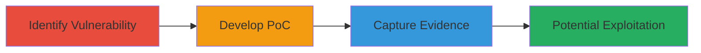

---
tags:
  - clickjacking
  - ui-redressing
  - iframe
  - web-vulnerability
type: attack_chain
tools: []
tactics:
  - '[[Initial Access]]'
verified: false
platforms:
  - Web
submitted: true
complexity: low
created_at: '2023-10-01T00:00:00Z'
procedures:
  - '[[procedures/Test-for-ClickJacking-Susceptibility-on-Webpage]]'
  - '[[procedures/Develop-ClickJacking-Proof-of-Concept]]'
  - '[[procedures/Capture-Vulnerability-Evidence-with-Screenshot]]'
step_count: 3
techniques:
  - '[[Drive-by Compromise]]'
updated_at: '2025-12-14T17:28:04.598Z'
description: >-
  A simple attack chain demonstrating the discovery and exploitation of a
  ClickJacking vulnerability on Yelp's homepage, allowing iframe embedding
  without frame-busting protections to trick users into unintended interactions.
skill_level: beginner
impact_level: medium
id: f7c48ddf-7e69-4849-9504-23deb1e05cc9
validated: true
mitre_tactics:
  - '[[Initial Access]]'
mitre_techniques:
  - '[[Drive-by Compromise]]'
---
# ClickJacking Attack on Yelp Homepage via Unprotected Iframe Embedding

Multi-stage attack chain demonstrating the identification, proof-of-concept development, and evidence capture for a ClickJacking vulnerability on Yelp's homepage. This vulnerability allows attackers to overlay invisible iframes of the site on malicious pages, tricking users into performing actions like form submissions or data entry without awareness.

## Chain Metrics Dashboard

| Metric | Value |
|--------|-------|
| Chain Status | Unverified |
| Total Steps | 3 |
| Execution Time | ~5 minutes |
| Skill Level | Beginner |
| Complexity | Low |
| Impact Level | Medium |

## Attack Flow Visualization

## Prerequisites & Requirements

### Required Tools

- Web browser (e.g., Chrome, Firefox)
- Text editor for HTML

### Target Environment

- Target Platform: Web
- Required services/ports: HTTP/HTTPS on port 80/443
- Network access requirements: Internet access to https://www.yelp.com/

### Initial Access Requirements

- No credentials required
- Public network access
- No prior access needed

## Detailed Attack Procedures

### Step 1: Identify ClickJacking Susceptibility
procedure: [[procedures/Test-for-ClickJacking-Susceptibility-on-Webpage]]

**Objective**: Determine if the target webpage can be embedded in an iframe without restrictions, indicating lack of frame-busting protections like X-Frame-Options.

**Instructions**: Open a web browser and attempt to load the target URL (https://www.yelp.com/) in an iframe using a simple test HTML file. Check browser developer tools for any blocking headers or errors.

**Expected Output**: The Yelp homepage loads fully within the iframe without denial or restrictions.

**Success Indicators**:
- No X-Frame-Options or Content-Security-Policy headers blocking framing
- Iframe renders the page content successfully

### Step 2: Develop ClickJacking Proof-of-Concept
procedure: [[procedures/Develop-ClickJacking-Proof-of-Concept]]

**Objective**: Create a malicious HTML page that embeds the vulnerable site in an iframe, overlaying it with interactive elements to simulate tricking user clicks or inputs.

**Instructions**: Use a text editor to create an HTML file with an iframe sourcing https://www.yelp.com/ at 500x500 pixels, positioned absolutely behind a semi-transparent overlay with decoy text like "Click here to continue". Host or open the file locally in a browser to test.

**Expected Output**: A webpage where the Yelp homepage is hidden beneath overlay elements, allowing potential click hijacking.

**Success Indicators**:
- Iframe loads without issues
- Overlay hides the embedded content, enabling UI redressing

### Step 3: Capture Vulnerability Evidence
procedure: [[procedures/Capture-Vulnerability-Evidence-with-Screenshot]]

**Objective**: Document the PoC in action to provide visual proof of the vulnerability for reporting or validation.

**Instructions**: Load the PoC HTML in a browser, ensure the iframe is embedded and overlaid, then take a screenshot showing the setup, including the hidden Yelp page and any interaction elements.

**Expected Output**: A clear screenshot displaying the embedded iframe and overlay, confirming the ClickJacking potential.

**Success Indicators**:
- Screenshot captures the PoC rendering correctly
- Evidence shows lack of framing protections

## Attack Chain Summary

### Key Achievements

1. Confirmed absence of X-Frame-Options on Yelp homepage
2. Built a functional PoC demonstrating UI redressing
3. Gathered visual evidence for vulnerability disclosure

## Technique & Tactic Coverage

### MITRE ATT&CK Techniques

- [[Drive-by Compromise]]

### MITRE ATT&CK Tactics

- [[Initial Access]]

---
*Last updated: 2023-10-01T00:00:00Z*
