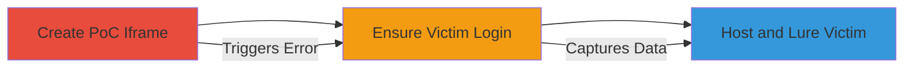

# ClickJacking Khan Academy Alerta Login to Steal Google OAuth Credentials

Multi-stage attack chain demonstrating a complete attack workflow exploiting ClickJacking on the Khan Academy Alerta login page at https://alerta.khanacademy.org/. The attack leverages the absence of frame-busting protections to embed the login page in an iframe, tricking logged-in Google users into triggering an error that exposes sensitive OAuth data like email, access tokens, and client IDs.

## Chain Metrics Dashboard

| Metric | Value |
|--------|-------|
| Chain Status | Unverified |
| Total Steps | 3 |
| Execution Time | ~5 minutes |
| Skill Level | Intermediate |
| Complexity | Medium |
| Impact Level | High |

## Attack Flow Visualization



## Prerequisites & Requirements

### Required Tools

- [[tools/Burp-Suite]]

### Target Environment

- Web platform
- Google OAuth service
- No specific ports required; attack occurs over HTTPS

### Initial Access Requirements

- Victim must be persistently logged into Google
- Attacker needs ability to host a malicious HTML page
- No prior credentials needed for the target

## Detailed Attack Procedures

### Step 1: Create ClickJacking PoC
procedure: [[procedures/Create-and-Execute-ClickJacking-PoC]]

**Objective**: Develop an HTML proof-of-concept that iframes the Alerta login page to overlay and capture the error popup displaying sensitive Google auth information.

**Instructions**: Use [[tools/Burp-Suite]] to intercept and craft the iframe. Create an HTML file named clickjacked.html with the following structure:

```html
<!DOCTYPE html>
<html>
<head><title>Click Here</title></head>
<body>
  <iframe src="https://alerta.khanacademy.org/" style="opacity:0.5; position:absolute; top:0; left:0; width:100%; height:100%;"></iframe>
  <div style="position:absolute; top:50%; left:50%;">Click to proceed</div>
</body>
</html>
```

Position the iframe to overlay a fake button, tricking the user into interacting with the login attempt.

**Expected Output**: A hosted HTML page that loads the target login in an invisible or semi-transparent iframe.

**Success Indicators**:
- Iframe successfully embeds without frame-busting errors
- Error popup from OAuth flow is visible in the iframe

### Step 2: Ensure Victim Google Authentication
procedure: [[procedures/Create-and-Execute-ClickJacking-PoC]]

**Objective**: Verify the victim is already authenticated with Google to enable automatic OAuth flow without prompts.

**Instructions**: No direct command; socially engineer or assume the victim is logged in (common for Google services). If needed, direct the victim to a benign Google page first to confirm session persistence.

**Expected Output**: Victim's browser has active Google session cookies.

**Success Indicators**:
- No additional Google login prompt when the iframe loads
- OAuth error triggers immediately showing user data

### Step 3: Host PoC and Lure Victim
procedure: [[procedures/Create-and-Execute-ClickJacking-PoC]]

**Objective**: Host the PoC page and trick the victim into visiting it, capturing the exposed OAuth data.

**Instructions**: Host clickjacked.html on a web server (e.g., using Python's SimpleHTTPServer or any hosting service). Lure the victim via phishing email or link sharing to visit the page. Upon load and interaction, the iframe attempts login, hits the error, and displays email, access token, and client ID in a popup that the attacker can screenshot or automate capture via JavaScript.

**Expected Output**: Exposed sensitive data: e.g., "Error: Unauthorized access for user@example.com with token abc123 and client ID xyz456".

**Success Indicators**:
- Victim loads the page and interacts
- Attacker observes or captures the error message with credentials

## Attack Chain Summary

### Key Achievements

1. Successful embedding of login page via iframe due to missing X-Frame-Options
2. Capture of Google OAuth error exposing user email, token, and client ID
3. Easy credential theft without direct phishing for passwords

## Technique & Tactic Coverage

### MITRE ATT&CK Techniques

- [[Drive-by Compromise]]
- [[Credentials In Files]]

### MITRE ATT&CK Tactics

- [[Initial Access]]

---
*Last updated: 2023-10-01T12:00:00Z*
