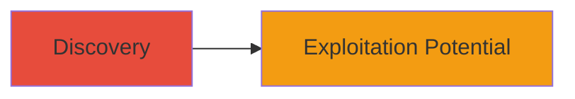

# ClickJacking UI Redressing on OWOX Inc Website

Multi-stage attack chain demonstrating a complete attack workflow.

## Chain Metrics Dashboard

| Metric | Value |
|--------|-------|
| Chain Status | Unverified |
| Total Steps | 1 |
| Execution Time | ~5 minutes |
| Skill Level | Beginner |
| Complexity | Low |
| Impact Level | Medium |

## Attack Flow Visualization



## Prerequisites & Requirements

### Required Tools

- Browser developer tools
- Text editor for HTML

### Target Environment

- Web platform
- Publicly accessible website (e.g., OWOX Inc)
- No specific ports or services required beyond HTTP/HTTPS

### Initial Access Requirements

- Internet access
- No credentials needed for discovery
- Public network position

## Detailed Attack Procedures

### Step 1: Vulnerability Discovery
procedure: [[procedures/Test-for-ClickJacking-Vulnerability]]

**Objective**: Identify if the target website lacks frame protection headers, making it susceptible to ClickJacking attacks that enable UI redressing.

**Instructions**: Create a simple HTML test page to embed the target site in an iframe and check if it loads without restrictions. Open the HTML file in a browser and inspect the network response for headers like X-Frame-Options.

Use a text editor to create an HTML file with the following content, replacing 'https://owox.com' with the target URL:

```html
<!DOCTYPE html>
<html>
<head>
    <title>ClickJacking Test</title>
</head>
<body>
    <iframe src="https://owox.com" width="800" height="600"></iframe>
    <div style="position: absolute; top: 100px; left: 100px; width: 100px; height: 100px; background: red; opacity: 0.5;">
        Click here to perform action
    </div>
</body>
</html>
```

Open the file in a browser and attempt to load it. If the iframe embeds successfully without errors, the site is vulnerable.

**Expected Output**: The target website loads inside the iframe, allowing overlay elements to trick user clicks.

**Success Indicators**:
- Iframe loads without browser blocking (no X-Frame-Options: DENY or SAMEORIGIN)
- Ability to overlay transparent elements over clickable parts of the site

## Attack Chain Summary

### Key Achievements

1. Identified missing frame protection headers on OWOX Inc website
2. Demonstrated potential for UI redressing to hijack user interactions
3. Highlighted risk of unauthorized actions via tricked clicks

## Technique & Tactic Coverage

### MITRE ATT&CK Techniques

- [[Exploit Public-Facing Application]]

### MITRE ATT&CK Tactics

- [[Initial Access]]

---
*Last updated: 2023-10-01T12:00:00Z*
