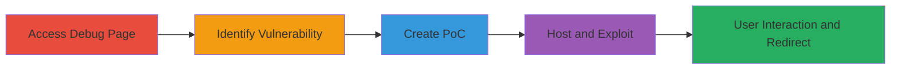

---
tags:
  - clickjacking
  - ui-redressing
  - weblate
  - iframe
type: attack_chain
tools: []
tactics:
  - '[[Initial Access]]'
verified: false
platforms:
  - Web
submitted: true
complexity: low
created_at: '2024-01-01T00:00:00Z'
procedures:
  - '[[procedures/Access-and-Identify-ClickJacking-Vulnerability]]'
  - '[[procedures/Create-ClickJacking-PoC-HTML]]'
  - '[[procedures/Host-Malicious-PoC-Page]]'
  - '[[procedures/Exploit-via-User-Interaction]]'
step_count: 4
techniques:
  - '[[Drive-by Compromise]]'
updated_at: '2025-12-14T17:28:04.897Z'
description: >-
  Multi-stage exploitation of a ClickJacking vulnerability on the Weblate debug
  page, allowing UI redressing to manipulate user clicks and perform unintended
  actions.
skill_level: beginner
impact_level: low
id: e943a879-c2ac-4239-8f45-4a556bdd2716
validated: true
mitre_tactics:
  - '[[Initial Access]]'
mitre_techniques:
  - '[[Drive-by Compromise]]'
---
# ClickJacking on Weblate Debug Page to Trick User Interactions

Multi-stage attack chain demonstrating the exploitation of a ClickJacking vulnerability on the Weblate debug page at https://debug.weblate.org/. The attack leverages the absence of frame-busting protections to embed the page in an iframe on a malicious site, overlay deceptive UI elements, and trick users into performing unintended actions on the debug interface.

## Chain Metrics Dashboard

| Metric | Value |
|--------|-------|
| Chain Status | Unverified |
| Total Steps | 4 |
| Execution Time | ~5 minutes |
| Skill Level | Beginner |
| Complexity | Low |
| Impact Level | Low |

## Attack Flow Visualization

## Prerequisites & Requirements

### Required Tools

- Web browser for testing
- Local web server (e.g., Python's http.server) for hosting PoC

### Target Environment

- Web platform
- Access to https://debug.weblate.org/
- No specific ports or services beyond standard HTTP/HTTPS

### Initial Access Requirements

- Public internet access
- No credentials required
- Ability to host a malicious webpage

## Detailed Attack Procedures

### Step 1: Access the Debug Page
procedure: [[procedures/Access-and-Identify-ClickJacking-Vulnerability]]

**Objective**: Directly access the target debug page to confirm its existence and response.

**Instructions**: Open a web browser and navigate to the debug page URL. Observe the forbidden response, which indicates the page loads but restricts direct access.

**Expected Output**: A "Forbidden" error page from https://debug.weblate.org/.

**Success Indicators**:
- Page loads with a 403 Forbidden status
- No authentication prompts

### Step 2: Identify ClickJacking Vulnerability
procedure: [[procedures/Access-and-Identify-ClickJacking-Vulnerability]]

**Objective**: Verify the absence of frame-busting protections, confirming the page can be iframed.

**Instructions**: Use browser developer tools to inspect HTTP headers for X-Frame-Options or Content-Security-Policy frame-ancestors. Attempt to embed the page in a test HTML iframe locally to check if it loads without restrictions.

**Expected Output**: No X-Frame-Options header present; iframe successfully embeds the debug page.

**Success Indicators**:
- Iframe loads the debug page without errors
- Headers confirm lack of frame protections

### Step 3: Create and Host PoC Malicious Page
procedure: [[procedures/Create-ClickJacking-PoC-HTML]]
procedure: [[procedures/Host-Malicious-PoC-Page]]

**Objective**: Develop an HTML PoC that iframes the debug page and overlays deceptive elements to trick clicks.

**Instructions**: Create an HTML file (poc.html) with an iframe sourcing https://debug.weblate.org/ and an overlay div with a clickable button labeled "Report to CIA". Host the file on a local server and access it via browser.

**Expected Output**: Malicious page loads with overlaid UI on the iframed debug page.

**Success Indicators**:
- Overlay button appears over the iframe
- Clicking the button interacts with the debug page

### Step 4: Exploit via User Interaction and Redirect
procedure: [[procedures/Exploit-via-User-Interaction]]

**Objective**: Simulate user deception to perform actions on the debug page and redirect to a malicious site.

**Instructions**: Lure a user to the hosted PoC page. Upon clicking the overlay, JavaScript triggers an action in the iframe (e.g., form submission) and redirects the top window to a malicious site like MaliciousSite.com.

**Expected Output**: Unintended action executed on debug page; browser redirects.

**Success Indicators**:
- User click performs debug page interaction
- Redirect to external site occurs

## Attack Chain Summary

### Key Achievements

1. Confirmed ClickJacking vulnerability due to missing X-Frame-Options
2. Created functional PoC for UI redressing
3. Demonstrated potential for unauthorized debug interactions
4. Highlighted low-severity impact resolved by redirection

## Technique & Tactic Coverage

### MITRE ATT&CK Techniques

- [[Drive-by Compromise]]

### MITRE ATT&CK Tactics

- [[Initial Access]]

---
*Last updated: 2024-01-01T00:00:00Z*
