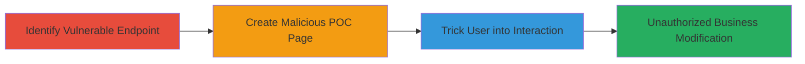

---
tags:
  - clickjacking
  - ui-redressing
  - yelp
  - web
  - iframe
type: attack_chain
tools:
  - '[[tools/Bootstrap]]'
  - '[[tools/jQuery]]'
tactics:
  - '[[Initial Access]]'
  - '[[Execution]]'
verified: false
platforms:
  - Web
submitted: true
complexity: medium
created_at: '2023-10-01T00:00:00Z'
procedures:
  - '[[procedures/Identify-Vulnerable-Yelp-Endpoint-for-ClickJacking]]'
  - '[[procedures/Create-Proof-of-Concept-Malicious-Page-for-ClickJacking]]'
  - '[[procedures/Demonstrate-ClickJacking-Attack-on-Yelp]]'
step_count: 3
techniques:
  - '[[Exploit Public-Facing Application]]'
  - '[[JavaScript]]'
updated_at: '2025-12-14T17:28:04.391Z'
description: >-
  A multi-stage attack exploiting ClickJacking on Yelp's business attribute
  editing page to trick authenticated users into unauthorized changes to
  business information.
skill_level: intermediate
impact_level: high
id: c06cbad6-8eef-4811-a3f3-a23847b7f03b
validated: true
mitre_tactics:
  - '[[Initial Access]]'
  - '[[Execution]]'
mitre_techniques:
  - '[[Exploit Public-Facing Application]]'
  - '[[JavaScript]]'
---
# ClickJacking on Yelp Business Attribute Editing for Unauthorized Modifications

Multi-stage attack chain demonstrating a complete attack workflow exploiting ClickJacking (UI Redressing) on Yelp's business attribute editing page. The attack allows embedding the page in an iframe without restrictions, overlaying fake UI elements to trick authenticated users into modifying business details like name, email, address, city, website, and hours, leading to misinformation, customer loss, or traffic diversion.

## Chain Metrics Dashboard

| Metric | Value |
|--------|-------|
| Chain Status | Unverified |
| Total Steps | 3 |
| Execution Time | ~5 minutes |
| Skill Level | Intermediate |
| Complexity | Medium |
| Impact Level | High |

## Attack Flow Visualization

## Prerequisites & Requirements

### Required Tools

- [[tools/Bootstrap]]
- [[tools/jQuery]]

### Target Environment

- Web platform
- Access to Yelp business editing endpoint
- Authenticated user session on Yelp

### Initial Access Requirements

- Valid Yelp account with business editing permissions
- Ability to host a malicious HTML page (e.g., on a web server)
- Network access to load external iframes

## Detailed Attack Procedures

### Step 1: Identify Vulnerable Endpoint
procedure: [[procedures/Identify-Vulnerable-Yelp-Endpoint-for-ClickJacking]]

**Objective**: Locate the Yelp business attribute editing page that lacks iframe restrictions, confirming it can be embedded externally.

**Instructions**: Test the endpoint https://www.yelp.com/biz_attribute?biz_id=RIyHYSf3lyJcFb4El9T4tQ by attempting to load it in an iframe on a local HTML page. If it loads without errors (e.g., no X-Frame-Options denial), the vulnerability is confirmed.

**Expected Output**: The Yelp page renders inside the iframe, allowing form interactions.

**Success Indicators**:
- Iframe loads the editing page without blocking
- Business details form is visible and editable within the iframe

### Step 2: Create Proof-of-Concept Malicious Page
procedure: [[procedures/Create-Proof-of-Concept-Malicious-Page-for-ClickJacking]]

**Objective**: Build an HTML page that embeds the vulnerable Yelp endpoint in a hidden iframe and overlays fake UI elements to mimic a legitimate survey or form.

**Instructions**: Create an HTML file incorporating Bootstrap for styling and jQuery for scripting. Embed the iframe with opacity: 0, position it absolutely, and overlay visible fake inputs (e.g., for restaurant name, location, website) and a submit button aligned to trigger the hidden form's submission.

**Expected Output**: A webpage that appears as a fake survey but interacts with the hidden Yelp form.

**Success Indicators**:
- Fake elements overlay the iframe correctly
- Clicking fake submit triggers Yelp form submission

### Step 3: Demonstrate the Attack
procedure: [[procedures/Demonstrate-ClickJacking-Attack-on-Yelp]]

**Objective**: Simulate user interaction to show how an authenticated victim can be tricked into submitting changes to business information.

**Instructions**: Host the POC page and lure a victim (with Yelp authentication) to interact with it. Position the fake submit button (e.g., at margin-top: 1311px) to align with the iframe's submit action, causing unauthorized updates to business details like address or website.

**Expected Output**: Business information on Yelp is modified without the user's awareness.

**Success Indicators**:
- Victim's clicks result in form submission in the iframe
- Yelp business page reflects unauthorized changes (e.g., altered website URL diverting traffic)

## Attack Chain Summary

### Key Achievements

1. Confirmed ClickJacking vulnerability on Yelp's editing endpoint due to missing X-Frame-Options.
2. Developed a realistic POC using overlaid UI to deceive users.
3. Demonstrated high-impact consequences like business misinformation and traffic diversion.

## Technique & Tactic Coverage

### MITRE ATT&CK Techniques

- [[Exploit Public-Facing Application]]
- [[JavaScript]]

### MITRE ATT&CK Tactics

- [[Initial Access]]
- [[Execution]]

---

*Last updated: 2023-10-01T00:00:00Z*
