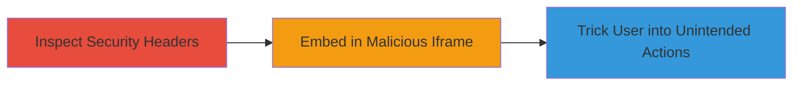

# Clickjacking Attack on GlassWire via Missing X-Frame-Options Header

Multi-stage attack chain demonstrating a complete attack workflow.

## Chain Metrics Dashboard

| Metric | Value |
|--------|-------|
| Chain Status | Unverified |
| Total Steps | 1 |
| Execution Time | ~2 minutes |
| Skill Level | Beginner |
| Complexity | Low |
| Impact Level | Medium |

## Attack Flow Visualization



## Prerequisites & Requirements

### Required Tools

- Browser developer tools or [[commands/curl-check-headers]]

### Target Environment

- Web platform
- Publicly accessible website (e.g., www.glasswire.com)
- No specific services/ports required beyond HTTP/HTTPS (80/443)

### Initial Access Requirements

- Internet access to the target website
- No credentials needed for header inspection
- No prior access required

## Detailed Attack Procedures

### Step 1: Inspect Security Headers for Clickjacking Vulnerability
procedure: [[procedures/Inspect-Website-for-Missing-X-Frame-Options-Header]]

**Objective**: Identify the absence of the X-Frame-Options header, which enables clickjacking by allowing the site to be framed in iframes from malicious origins.

**Instructions**: Use [[commands/curl-check-headers]] to fetch and examine the HTTP response headers from the target website:

```bash
curl -I https://www.glasswire.com
```

Look for the absence of `X-Frame-Options` in the output. If missing, the site can be embedded in an iframe. To demonstrate potential exploitation, create a simple HTML page with an iframe embedding the target and overlay invisible elements to trick clicks.

**Expected Output**: HTTP headers without `X-Frame-Options: DENY` or `SAMEORIGIN`, confirming vulnerability.

**Success Indicators**:
- No X-Frame-Options header present in response
- Ability to successfully load the site in an iframe on a local test page

## Attack Chain Summary

### Key Achievements

1. Discovered missing X-Frame-Options header on nearly all pages of www.glasswire.com
2. Identified potential for UI redressing attacks, such as tricking users into adding arbitrary tasks
3. Highlighted quick remediation by adding the header

## Technique & Tactic Coverage

### MITRE ATT&CK Techniques

- [[Exploit Public-Facing Application]]

### MITRE ATT&CK Tactics

- [[Initial Access]]

---
*Last updated: 2023-10-01T00:00:00Z*
