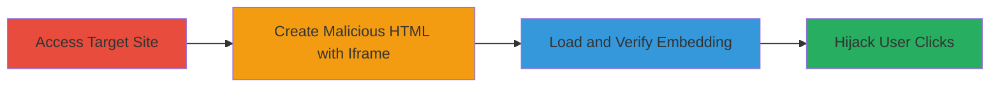

# Clickjacking Attack on Gratipay Website Allowing User Interaction Hijacking

Multi-stage attack chain demonstrating a complete clickjacking workflow on the Gratipay site at https://grtp.co/, exploiting the absence of X-Frame-Options headers or frame-busting JavaScript to embed the site in an iframe and hijack user interactions.

## Chain Metrics Dashboard

| Metric | Value |
|--------|-------|
| Chain Status | Unverified |
| Total Steps | 3 |
| Execution Time | ~2 minutes |
| Skill Level | Beginner |
| Complexity | Low |
| Impact Level | Medium |

## Attack Flow Visualization



## Prerequisites & Requirements

### Required Tools

- Web browser (e.g., Chrome, Firefox)
- Text editor for HTML creation

### Target Environment

- Web platform
- Publicly accessible website without frame protections
- No specific ports or services required beyond HTTP/HTTPS

### Initial Access Requirements

- Internet access
- No credentials needed
- Attacker controls a malicious webpage or local file

## Detailed Attack Procedures

### Step 1: Access the Target Website
procedure: [[procedures/Test-Clickjacking-Vulnerability-via-Iframe-Embedding]]

**Objective**: Verify the target site's accessibility and lack of basic protections.

**Instructions**: Open the target URL in a browser to confirm it loads normally. No special commands are needed; simply navigate to https://grtp.co/ and observe the page content, noting minimal user interactions like buttons or forms that could be hijacked.

**Expected Output**: The Gratipay homepage loads without errors, displaying elements that could be targeted for clickjacking.

**Success Indicators**:
- Site loads successfully
- No immediate frame-busting alerts or blocks

### Step 2: Embed the Target URL in an Iframe
procedure: [[procedures/Test-Clickjacking-Vulnerability-via-Iframe-Embedding]]

**Objective**: Create a malicious HTML page that embeds the target site in an iframe to test framing permissions.

**Instructions**: Use a text editor to create an HTML file with an iframe sourcing the target URL. Save it as clickjacking-test.html with the following content:

```html
<html>
<head>
<title>Clickjacking GRTP</title>
</head>
<body>
<p>Website is vulnerable to clickjacking!</p>
<iframe src="https://grtp.co/" width="500" height="500"></iframe>
</body>
</html>
```

**Expected Output**: The HTML file is created and ready for loading in a browser.

**Success Indicators**:
- HTML file saved without errors
- Iframe code includes the correct src attribute

### Step 3: Load the HTML Page and Observe the Iframe
procedure: [[procedures/Test-Clickjacking-Vulnerability-via-Iframe-Embedding]]

**Objective**: Confirm the vulnerability by loading the malicious page and verifying the target site embeds without restrictions.

**Instructions**: Open the created HTML file in a web browser. Observe if the Gratipay site content appears inside the iframe without any blocking messages or refusals.

**Expected Output**: The iframe displays the full Gratipay site content, allowing potential overlay for click hijacking.

**Success Indicators**:
- Target site loads in iframe
- No X-Frame-Options denial or JavaScript busting occurs
- Attacker can interact with embedded elements

## Attack Chain Summary

### Key Achievements

1. Confirmed absence of frame protections on https://grtp.co/
2. Successfully embedded the site in an external iframe
3. Demonstrated potential for user click hijacking leading to unauthorized actions

## Technique & Tactic Coverage

### MITRE ATT&CK Techniques

- [[Drive-by Compromise]]

### MITRE ATT&CK Tactics

- [[Initial Access]]

---
*Last updated: 2023-10-01T00:00:00Z*
