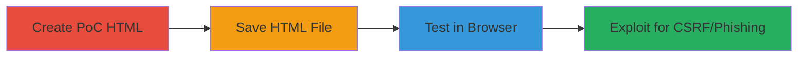

# Clickjacking Attack on LeaseWeb via Missing X-Frame-Options Header

Multi-stage attack chain demonstrating a complete attack workflow for exploiting a clickjacking vulnerability on the LeaseWeb NOC site (http://leasewebnoc.com/) due to the absence of the X-Frame-Options HTTP response header.

## Chain Metrics Dashboard

| Metric | Value |
|--------|-------|
| Chain Status | Unverified |
| Total Steps | 3 |
| Execution Time | ~5 minutes |
| Skill Level | Beginner |
| Complexity | Low |
| Impact Level | Medium |

## Attack Flow Visualization

## Prerequisites & Requirements

### Required Tools

- [[tools/Notepad]]

### Target Environment

- Web platform
- Target URL: http://leasewebnoc.com/
- No specific ports or services required beyond HTTP access

### Initial Access Requirements

- Public access to the target website
- Local browser for testing
- No credentials needed

## Detailed Attack Procedures

### Step 1: Create Proof-of-Concept HTML
procedure: [[procedures/Create-and-Test-Clickjacking-Proof-of-Concept]]

**Objective**: Build an HTML page that embeds the target site in a semi-transparent iframe to overlay malicious elements, demonstrating how users can be tricked into interactions.

**Instructions**: Use [[tools/Notepad]] to create the HTML file with an iframe sourcing 'http://leasewebnoc.com/', styled with CSS for absolute positioning and semi-transparency, plus a JavaScript onbeforeunload prompt to simulate user engagement.

**Expected Output**: A raw HTML file ready for saving.

**Success Indicators**:
- HTML code includes iframe and overlay elements
- No syntax errors in the code

### Step 2: Save the HTML File
procedure: [[procedures/Create-and-Test-Clickjacking-Proof-of-Concept]]

**Objective**: Save the PoC as an executable web page to prepare for browser testing.

**Instructions**: In [[tools/Notepad]], save the file with a .html extension, such as 'clickjacking-poc.html', ensuring it's in a location accessible by the browser.

**Expected Output**: A .html file on the local filesystem.

**Success Indicators**:
- File saved without errors
- Extension is .html for browser execution

### Step 3: Test the Vulnerability in Browser
procedure: [[procedures/Create-and-Test-Clickjacking-Proof-of-Concept]]

**Objective**: Load the PoC in a browser to verify the target site can be iframed, confirming the clickjacking risk for phishing or CSRF.

**Instructions**: Open the saved HTML file in a web browser (e.g., Chrome or Firefox). The iframe should load the LeaseWeb site transparently, allowing overlaid elements to capture clicks or form data.

**Expected Output**: Target site embedded in iframe without frame-busting errors; user interactions redirected to malicious overlays.

**Success Indicators**:
- No X-Frame-Options denial in browser console
- Iframe loads successfully, enabling UI overlay

## Attack Chain Summary

### Key Achievements

1. Confirmed absence of X-Frame-Options header on http://leasewebnoc.com/
2. Created and tested a PoC demonstrating iframe embedding
3. Highlighted risks including information theft, phishing, and CSRF via tricked user actions

## Technique & Tactic Coverage

### MITRE ATT&CK Techniques

- [[Drive-by Compromise]]

### MITRE ATT&CK Tactics

- [[Initial Access]]

---
*Last updated: 2023-10-01T00:00:00Z*
