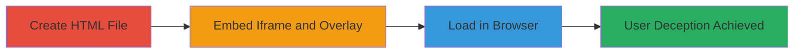

---
tags:
  - clickjacking
  - x-frame-options
  - web-vulnerability
type: attack_chain
tools: []
tactics:
  - '[[Initial Access]]'
verified: false
platforms:
  - Web
submitted: true
complexity: low
created_at: '2023-10-01T00:00:00Z'
procedures:
  - '[[procedures/Create-Malicious-HTML-File-for-Clickjacking]]'
  - '[[procedures/Embed-Nextcloud-Site-in-Iframe-with-Deceptive-Overlay]]'
  - '[[procedures/Demonstrate-Clickjacking-by-Loading-HTML-in-Browser]]'
step_count: 3
techniques:
  - '[[Drive-by Compromise]]'
updated_at: '2025-12-14T17:28:04.455Z'
description: >-
  A demonstration of exploiting a clickjacking vulnerability on nextcloud.com by
  creating a malicious HTML page that embeds the site in an iframe and overlays
  deceptive elements to trick users into unintended actions.
skill_level: novice
impact_level: high
id: 50620f5d-b70d-4cbf-b7b1-129f463d6116
validated: true
mitre_tactics:
  - '[[Initial Access]]'
mitre_techniques:
  - '[[Drive-by Compromise]]'
---
# Clickjacking Attack on Nextcloud.com via Missing X-Frame-Options Header

Multi-stage attack chain demonstrating a complete clickjacking workflow on nextcloud.com.

## Chain Metrics Dashboard

| Metric | Value |
|--------|-------|
| Chain Status | Unverified |
| Total Steps | 3 |
| Execution Time | ~5 minutes |
| Skill Level | Novice |
| Complexity | Low |
| Impact Level | High |

## Attack Flow Visualization

## Prerequisites & Requirements

### Required Tools

- Text editor (e.g., Notepad, VS Code)
- Web browser (e.g., Chrome, Firefox)

### Target Environment

- Web platform
- Access to nextcloud.com
- Local file system for HTML creation

### Initial Access Requirements

- No credentials required
- Public internet access to nextcloud.com
- No prior access needed

## Detailed Attack Procedures

### Step 1: Prepare Malicious HTML Page
procedure: [[procedures/Create-Malicious-HTML-File-for-Clickjacking]]

**Objective**: Set up a basic HTML structure to host the clickjacking payload targeting nextcloud.com.

**Instructions**: Use a text editor to create a new file named clickjack.html. This file will serve as the malicious page that embeds the vulnerable site.

**Expected Output**: An empty HTML file ready for payload insertion.

**Success Indicators**:
- HTML file created successfully
- File saved locally without errors

### Step 2: Configure Clickjacking Payload
procedure: [[procedures/Embed-Nextcloud-Site-in-Iframe-with-Deceptive-Overlay]]

**Objective**: Insert an iframe embedding nextcloud.com and overlay deceptive elements to align with clickable parts of the site, exploiting the lack of X-Frame-Options.

**Instructions**: Edit the clickjack.html file to include the iframe and overlay. The iframe sources nextcloud.com without restrictions, and a transparent overlay with a visible button tricks the user.

**Expected Output**: Updated HTML file with functional clickjacking elements.

**Success Indicators**:
- Iframe code inserted correctly
- Overlay button positioned to align with target elements on nextcloud.com

### Step 3: Execute and Verify Attack
procedure: [[procedures/Demonstrate-Clickjacking-by-Loading-HTML-in-Browser]]

**Objective**: Load the malicious page in a browser to confirm the clickjacking works, simulating how an attacker deceives users into unintended actions.

**Instructions**: Open the clickjack.html file in a web browser. Interact with the overlaid button to verify it triggers actions on the embedded nextcloud.com site.

**Expected Output**: The browser renders the iframe with nextcloud.com embedded, and clicking the overlay performs hidden actions on the site.

**Success Indicators**:
- Site loads in iframe without frame-busting
- Overlay click results in unintended interaction on nextcloud.com
- No X-Frame-Options blocking observed

## Attack Chain Summary

### Key Achievements

1. Confirmed absence of X-Frame-Options header on nextcloud.com
2. Created a functional clickjacking PoC using a simple HTML page
3. Demonstrated potential for user deception leading to unauthorized actions

## Technique & Tactic Coverage

### MITRE ATT&CK Techniques

- [[Drive-by Compromise]]

### MITRE ATT&CK Tactics

- [[Initial Access]]

---
*Last updated: 2023-10-01T00:00:00Z*
