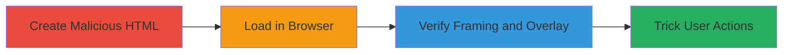

---
tags:
  - clickjacking
  - x-frame-options
  - ui-redressing
  - web-vulnerability
type: attack_chain
tools: []
tactics:
  - '[[Initial Access]]'
verified: false
platforms:
  - Web
submitted: true
complexity: medium
created_at: '2023-10-01T00:00:00Z'
procedures:
  - '[[procedures/Create-HTML-Frameset-to-Embed-Multiple-Semrush-Pages]]'
  - '[[procedures/Verify-Clickjacking-by-Loading-HTML-in-Browser]]'
  - '[[procedures/Reproduce-Clickjacking-Using-Iframe-for-Single-URL]]'
step_count: 3
techniques:
  - '[[Drive-by Compromise]]'
updated_at: '2025-12-14T17:28:12.674Z'
description: >-
  Demonstrates clickjacking vulnerability on multiple Semrush pages by embedding
  them in framesets or iframes without X-Frame-Options protection, enabling UI
  redressing attacks.
skill_level: intermediate
impact_level: high
id: f128363c-2c62-471a-b3ce-777d87b1ba25
validated: true
mitre_tactics:
  - '[[Initial Access]]'
mitre_techniques:
  - '[[Drive-by Compromise]]'
---
# Clickjacking Attack on Semrush via Missing X-Frame-Options Header

Multi-stage attack chain demonstrating a complete clickjacking workflow on Semrush website pages.

## Chain Metrics Dashboard

| Metric | Value |
|--------|-------|
| Chain Status | Unverified |
| Total Steps | 3 |
| Execution Time | ~5 minutes |
| Skill Level | Intermediate |
| Complexity | Medium |
| Impact Level | High |

## Attack Flow Visualization

## Prerequisites & Requirements

### Required Tools

- Web browser (Firefox v56 or Google Chrome)
- Text editor for HTML creation

### Target Environment

- Web platform
- Access to Semrush URLs: https://www.semrush.com/, https://www.semrush.com/academy/, etc.
- No specific ports or services required beyond standard HTTP/HTTPS

### Initial Access Requirements

- Public internet access to Semrush site
- No credentials needed
- Local file system access to save and open HTML files

## Detailed Attack Procedures

### Step 1: Create Malicious HTML Frameset
procedure: [[procedures/Create-HTML-Frameset-to-Embed-Multiple-Semrush-Pages]]

**Objective**: Build an HTML file using frameset to embed vulnerable Semrush pages, simulating a malicious site that can frame the targets.

**Instructions**: Use a text editor to create an HTML file with a frameset layout embedding multiple Semrush URLs. Save the file as frameset.html.

**Expected Output**: An HTML file that, when opened, displays Semrush pages side-by-side in frames without any blocking.

**Success Indicators**:
- HTML file created successfully
- Frameset structure includes cols='25%,*,25%' with frame sources pointing to Semrush URLs

### Step 2: Load and Verify in Browser
procedure: [[procedures/Verify-Clickjacking-by-Loading-HTML-in-Browser]]

**Objective**: Open the HTML file in a browser to confirm that Semrush pages load within the frames, proving the lack of frame protection.

**Instructions**: Open the saved frameset.html file in Firefox v56 or Google Chrome. Observe if the Semrush pages render fully without errors or restrictions.

**Expected Output**: Semrush pages visible and interactive within the browser frames, no X-Frame-Options denial messages.

**Success Indicators**:
- Pages load without blocking
- Frames display content from multiple Semrush URLs

### Step 3: Alternative Iframe Reproduction
procedure: [[procedures/Reproduce-Clickjacking-Using-Iframe-for-Single-URL]]

**Objective**: Demonstrate the vulnerability using a simpler iframe for a single Semrush URL, showing frameability for targeted attacks.

**Instructions**: Create a new HTML file with an iframe element sourcing a Semrush URL, such as https://semrush.com/, with specified width and height. Save as iframe.html and open in a browser.

**Expected Output**: The Semrush homepage loads inside the iframe without restrictions, allowing potential overlay for clickjacking.

**Success Indicators**:
- Iframe renders the target page
- No cross-origin framing errors

## Attack Chain Summary

### Key Achievements

1. Successfully embedded multiple Semrush pages in a frameset, exposing UI redressing risk.
2. Verified lack of X-Frame-Options protection in browsers.
3. Demonstrated alternative iframe method for single-page clickjacking.

## Technique & Tactic Coverage

### MITRE ATT&CK Techniques

- [[Drive-by Compromise]]

### MITRE ATT&CK Tactics

- [[Initial Access]]

---

*Last updated: 2023-10-01T00:00:00Z*
